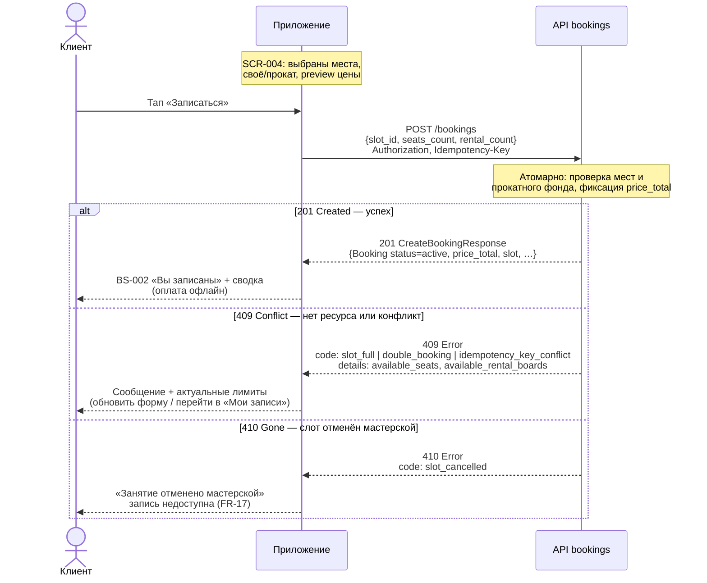

# Sequence-диаграмма API-взаимодействия

> Этап 4. Проектирование. Критичный сценарий **создания брони** для гончарной мастерской
> «Глина»: ветки ответов **201 / 409 / 410**.
>
> **Источники:**
> [domain-description.md](../1-elicitation/domain-description.md) ·
> [use-cases.md](../2-requirements/use-cases.md) UC-1 ·
> [data-model.md](data-model.md) ·
> [bookings/api.yaml](../api/bookings/api.yaml) ·
> [common/models.yaml](../api/common/models.yaml)

> **Скоуп:** клиентское приложение ↔ API бронирований. Расписание и отмена слота
> мастерской выполняются в **существующей инфраструктуре** (вне этой диаграммы).

---

## Сценарий: Создание брони (`createBooking`, UC-1)

**Поток UI:** [SCR-004 Оформление записи](../3-design-brief/SCR-004-booking.md) →
`POST /bookings` → [BS-002 «Вы записаны»](../3-design-brief/BS-002-booking-success.md).

**Тело запроса:** `slot_id`, `seats_count`, `rental_count` (число мест с прокатом инструментов
и фартука). Итог `price_total` считает **сервер** (FR-18).

**Заголовки:** `Authorization: Bearer <token>`; `Idempotency-Key: <uuid>` (безопасный повтор
при сетевом сбое — детали в ТЗ/API, на диаграмме не раскрываются).

---

## Разбор веток HTTP

### 201 Created — бронь создана

| Поле ответа | Значение | Действие приложения |
| :-- | :-- | :-- |
| `status` | `active` | Бронь активна |
| `price_total` | int (RUB) | Показать на BS-002 без пересчёта |
| `seats_count`, `rental_count` | как в запросе | Сводка брони |
| `slot` | вложенный Slot | Дата, программа, мастер |
| `is_first_booking` | boolean | При `true` — запрос push (FR-20, Should) |

**Эффект на слот (сервер):** `free_seats` и `free_rental_kits` уменьшены на величины брони.

---

### 409 Conflict — операция отклонена, ресурс занят или конфликт

Общий тип ответа — [`Conflict`](../api/common/models.yaml). Тело — `Error` с полем `code`.

| `code` | Когда | `details` (если есть) | UI (UC-1) |
| :-- | :-- | :-- | :-- |
| `slot_full` | Не хватает мест **или** прокатных комплектов | `available_seats`, `available_rental_boards` | E1/E2: показать актуальные N/M, предложить уменьшить места или выбрать «Своё» |
| `double_booking` | У клиента уже есть активная бронь на этот слот | `booking_id` | Переход в «Мои записи» |
| `idempotency_key_conflict` | Тот же Idempotency-Key, но другое тело запроса | — | Сообщение об ошибке; новый ключ для новой попытки |

> **409 vs 410:** 409 — слот **ещё существует**, но ресурса не хватило или логический конфликт.
> 410 — слот **снят** мастерской (`Slot.status = cancelled`).

---

### 410 Gone — слот отменён мастерской

| Поле | Значение |
| :-- | :-- |
| HTTP | 410 |
| `code` | `slot_cancelled` |
| Смысл | Повторная запись на этот слот **запрещена** (FR-17, R-008) |

**UI:** CTA «Записаться» неактивна; сообщение «Занятие отменено мастерской». Если у клиента
уже была бронь — она переходит в `club_cancelled` + push (UC-4, FR-16, FR-19) — отдельный
поток инициируется инфраструктурой, не этим POST.

---

## Сводная таблица исходов `createBooking`

| HTTP | `Error.code` (если ошибка) | Источник | FR / UC |
| :--: | :-- | :-- | :-- |
| **201** | — | bookings/api.yaml | FR-6, UC-1 |
| **409** | `slot_full` | common/models.yaml | FR-11, UC-1 E1–E2 |
| **409** | `double_booking` | common/models.yaml | NFR-3 |
| **409** | `idempotency_key_conflict` | bookings/api.yaml | — |
| **410** | `slot_cancelled` | common/models.yaml | FR-17, UC-1 E4 |
| 400 / 422 | `bad_request` / бизнес-правило | — | Валидация тела |
| 401 | `unauthorized` | — | Нет сессии → SCR-001 |

---

## Связанные сценарии (кратко)

### Отмена брони (`cancelBooking`, UC-03)

`POST /bookings/{bookingId}/cancel` → **200** с `status: cancelled`, если до старта **> 10 мин**
(FR-14). При **≤ 10 мин** → **422** `cancellation_too_late`. Конфликты: **409** `already_cancelled`, **422**
`slot_started`.

### Чтение слотов (`listSlots`, `getSlot`)

`GET /slots` — **только чтение**; изменений на сервере нет (FR-2–FR-5). Слоты, программы и
мастера клиент **не** создаёт.

---

## Трассировка

| Артефакт | Связь |
| :-- | :-- |
| [data-model.md](data-model.md) | Booking, Slot, инварианты мест/проката |
| [UC-1](../2-requirements/use-cases.md) | Основной и альтернативные потоки E1–E4 |
| [FR-6–FR-11](../2-requirements/functional-requirements.md) | Запись и лимиты |
| [NFR-3](../2-requirements/non-functional-requirements.md) | 0 двойных броней |
