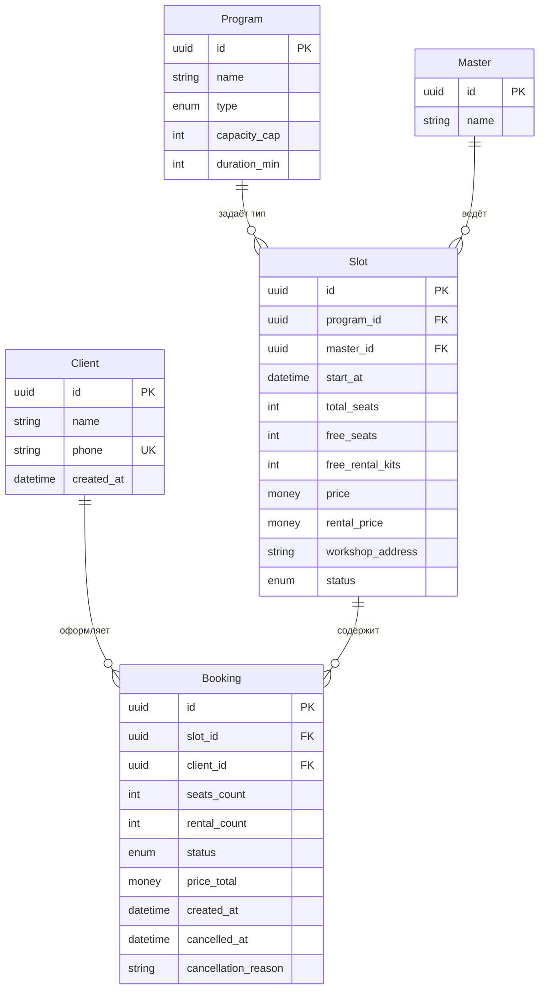
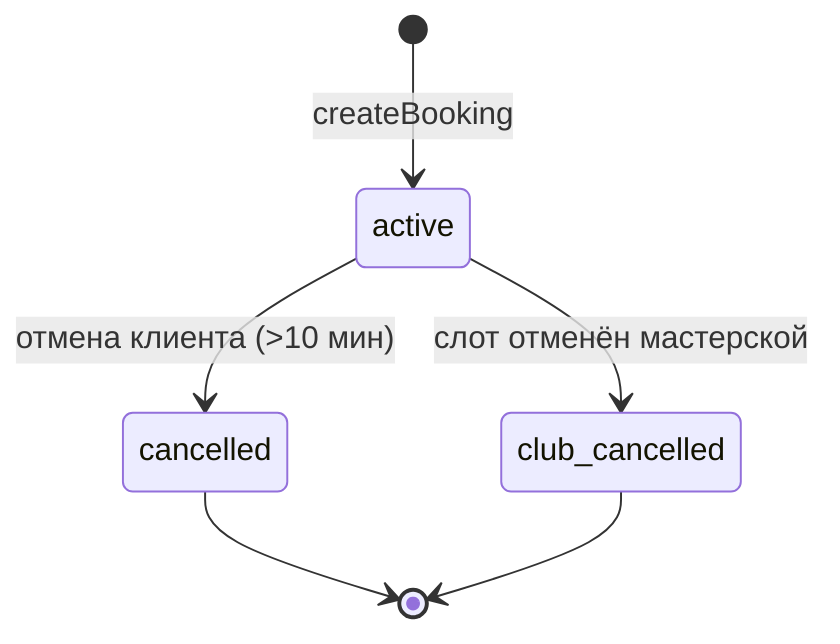
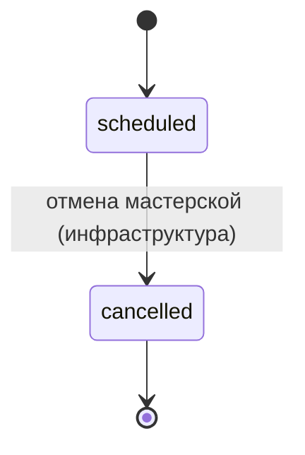

# Модель данных

> Этап 4. Проектирование. Ресурсная модель клиентского API для гончарной мастерской
> **«Глина»**: сущности, атрибуты, связи, жизненные циклы и инварианты.
>
> **Источники:**
> [domain-description.md](../1-elicitation/domain-description.md) ·
> [functional-requirements.md](../2-requirements/functional-requirements.md) ·
> [OpenAPI](../api/redocly.yaml)

> **Скоуп — клиентское приложение и API для него.** Это **модель ресурсов API** (что клиент
> читает и изменяет), а не схема БД бэкенда. Хранение и администрирование расписания —
> **существующая инфраструктура** (вне скоупа клиента).

---

## Доступ клиентского приложения к сущностям

| Сущность | Клиентское приложение | Кто создаёт / изменяет данные | Операции клиента (концептуально) |
| :-- | :-- | :-- | :-- |
| **Program** (программа) | **Только чтение** | Существующая инфраструктура | Список / вложение в слот |
| **Master** (мастер) | **Только чтение** | Существующая инфраструктура | Список / вложение в слот; фильтр |
| **Slot** (мастер-класс / слот) | **Только чтение** | Существующая инфраструктура | Список, карточка, фильтрация |
| **Client** (клиент) | **Чтение и запись** | Клиент через auth/profile API | Регистрация, вход, имя (FR-1) |
| **Booking** (бронь) | **Чтение и запись** | Клиент через bookings API | Создание, список, детали, отмена (FR-6–FR-16) |
| **PushToken** (регистрация устройства) | **Запись** | Клиент после разрешения push | Регистрация / снятие токена (FR-19, FR-20) |

> **В модели клиента:** оценка мастера (`master_rating`), лояльность (`loyalty_level` в Client).
> **Вне модели клиента:** расписание, отмена слота мастерской, явка,
> онлайн-оплата — существующая инфраструктура ([domain-description §Границы скоупа](../1-elicitation/domain-description.md)).

### Соответствие терминов домена и полей OpenAPI

Контракт API (`01-analysis/api/`) исторически использует имена домена SUP-клуба; для
«Глины» семантика та же, имена в JSON — как в OpenAPI:

| Домен «Глина» | Схема OpenAPI | Примечание |
| :-- | :-- | :-- |
| Программа | `Route` | тип: `novice` ≈ лепка для новичков, `experienced` ≈ работа на круге |
| Мастер | `Instructor` | ведёт занятие; `photo_url` — фото в UI (Q8) |
| Доступность отмены | `can_cancel` | true/false — read-only в `Booking` (BS-003) |
| Прокатный фонд инструментов | `free_rental_boards`, `rental_count` | в API поле `*_boards`, в домене — комплект инструментов/фартука |
| Отменено мастерской | `club_cancelled` | в UI — «Отменено мастерской» (FR-16) |
| Адрес мастерской | `meeting_point` | текстовый адрес (R-015) |

---

## Сущности и атрибуты

### Client (Клиент) — **чтение и запись**

| Атрибут | Тип | Описание |
| :-- | :-- | :-- |
| id | UUID (PK) | Идентификатор клиента |
| name | string | Имя (как обращаться) |
| phone | string (unique, E.164) | Телефон — логин (FR-1) |
| created_at | datetime | Дата регистрации |

**Клиентское приложение:** регистрация и вход по имени и телефону (FR-1); чтение своего
профиля после авторизации. OTP/сессия — транспорт auth API, отдельной сущности в модели нет.

---

### Program (Программа) — **только чтение**

Справочник типов занятий. Потолок мест задаётся программой (новичковая — **≤ 6**,
работа на круге — с учётом **10 гончарных кругов** в мастерской).

| Атрибут | Тип | Описание |
| :-- | :-- | :-- |
| id | UUID (PK) | Идентификатор программы |
| name | string | Название («Лепка для новичков», «Работа на круге») |
| description | string? | Описание программы (опционально) |
| type | enum | `novice` / `experienced` (маппинг на два вида занятий) |
| capacity_cap | int | Потолок мест программы (6 или 10 — из данных, не хардкод в UI) |
| duration_min | int | Длительность занятия, мин (~120–150) |

**OpenAPI:** `Route` в [`instructors/models.yaml`](../api/instructors/models.yaml).

**Клиентское приложение:** только отображение в списке и карточке слота; фильтр по программе (FR-4).

---

### Master (Мастер) — **только чтение**

| Атрибут | Тип | Описание |
| :-- | :-- | :-- |
| id | UUID (PK) | Идентификатор мастера |
| name | string | Имя мастера |
| photo_url | string (uri)? | URL фото для UI (Q8); null → placeholder |

**OpenAPI:** `Instructor` в [`instructors/models.yaml`](../api/instructors/models.yaml).

**Клиентское приложение:** отображение в слоте; фильтр по мастеру (FR-4).

---

### Slot (Мастер-класс / слот) — **только чтение**

Конкретное групповое занятие в расписании. Создаётся и редактируется в существующей
инфраструктуре; клиент **не** создаёт и **не** меняет слоты.

| Атрибут | Тип | Описание |
| :-- | :-- | :-- |
| id | UUID (PK) | Идентификатор слота |
| program_id | FK → Program | Программа занятия (в API: вложенный `route`) |
| master_id | FK → Master | Назначенный мастер (в API: вложенный `instructor`) |
| start_at | datetime (UTC) | Дата и время старта; источник истины по времени — сервер |
| total_seats | int | Всего мест в группе |
| free_seats | int | Свободно мест (денормализованный счётчик) |
| free_rental_kits | int | Свободно прокатных комплектов (API: `free_rental_boards`) |
| max_seats_per_booking | int | Максимум мест в одной брони (расчёт сервера, SCR-004) |
| price | money (RUB) | Цена за одно место |
| rental_price | money (RUB) | Тариф проката за один комплект «своё→прокат» |
| workshop_address | string | Адрес мастерской (API: `meeting_point`, R-015) |
| status | enum | `scheduled` / `cancelled` |

> **«Прошедшее» занятие** — не статус: вычисляется по `start_at < now` на клиенте для
> группировки «Предстоящие / Прошедшие» (FR-12).

**OpenAPI:** `Slot`, `SlotSummary` в [`slots/models.yaml`](../api/slots/models.yaml).

**Клиентское приложение:** список на 7 дней по умолчанию (FR-2), фильтры (FR-4), карточка (FR-5).

---

### Booking (Запись / бронь) — **чтение и запись**

| Атрибут | Тип | Описание |
| :-- | :-- | :-- |
| id | UUID (PK) | Идентификатор брони |
| slot_id | FK → Slot | Слот |
| client_id | FK → Client | Клиент, оформивший бронь |
| needs_rental | bool | Переключатель «Нужен прокат инструментов и фартука» (FR-8) |
| status | enum | см. [жизненный цикл](#booking-запись--бронь) |
| price_total | money (RUB), read-only | Итог от сервера; клиент не пересчитывает (FR-18) |
| can_cancel | bool, read-only | true, если до старта > 10 мин (FR-14) |
| master_rating | int? (1–5) | Оценка мастера после занятия; null — не оценено (FR-21) |
| created_at | datetime | Время создания |
| cancelled_at | datetime? | Время отмены |
| cancellation_reason | string? | Причина при `club_cancelled` («Отменено мастерской», FR-16) |

**OpenAPI:** `Booking`, `BookingSummary`, `CreateBookingRequest` в [`bookings/models.yaml`](../api/bookings/models.yaml).

**Клиентское приложение:**
- **Создание** — `createBooking` (FR-6, FR-8–FR-11)
- **Чтение** — список и детали своих броней (FR-12)
- **Отмена** — `cancelBooking` (FR-13, FR-14)
- **Оценка** — `rateMaster` (FR-21)
- **Не удаляет** бронь при отмене мастерской — меняется статус (FR-16)

---

## ERD

**Легенда доступа:**

| Связь | Чтение клиентом | Изменение клиентом |
| :-- | :--: | :--: |
| Client → Booking | ✓ (только свои) | ✓ (создание через бронь) |
| Slot → Booking | ✓ | ✗ |
| Program / Master → Slot | ✓ | ✗ |

---

## Модель состояний

### Booking (Запись / бронь)

`status ∈ { active, cancelled, club_cancelled }`

| UI (домен) | API `status` | Кто инициирует |
| :-- | :-- | :-- |
| Активна | `active` | Создание брони клиентом |
| Отменена клиентом | `cancelled` | Клиент (>10 мин до старта); место **освобождается** (FR-14) |
| Отменено мастерской | `club_cancelled` | Инфраструктура (форс-мажор); push клиенту (FR-16, FR-19) |

> Отмена клиентом доступна, если до `slot.start_at` **> 10 минут** (FR-14).
> При **≤ 10 минут** — заблокирована (422 `cancellation_too_late`).

| Из | Событие | В | Эффект на слот |
| :-- | :-- | :-- | :-- |
| — | `createBooking` успех | `active` | `free_seats −= 1`; при needs_rental — `free_rental_kits −= 1` |
| `active` | Отмена клиента | `cancelled` | Место и прокат **возвращаются** |
| `active` | `Slot.status → cancelled` | `club_cancelled` | Слот снят; причина в `cancellation_reason` |

Повторная запись на слот со статусом `cancelled` (мастерская) — **запрещена** (FR-17) → HTTP **410**.

---

### Slot (Мастер-класс)

`status ∈ { scheduled, cancelled }` — **только чтение** для клиента.

| Статус | Что видит клиент | Запись |
| :-- | :-- | :-- |
| `scheduled`, старт в будущем | Слот в списке / карточке | Доступна при `free_seats > 0` |
| `scheduled`, старт в прошлом | Группа «Прошедшие» (производное) | Недоступна |
| `cancelled` | «Занятие отменено мастерской» | **410** при попытке записи |

---

## Ключевые инварианты

1. **Нет двойных броней и овербукинга** — атомарная проверка на бэкенде (NFR-3, FR-11).
2. **Два независимых лимита:** места в группе и прокатный фонд (FR-9, FR-10).
   - «Своё» занимает место, **не** расходует прокатный комплект.
   - «Прокат» занимает место **и** расходует комплект.
3. **Два независимых лимита:** места (`free_seats`, `max_seats_per_booking`) и прокатный фонд (`free_rental_boards`) — из API (FR-9, FR-10, Q1–Q4).
4. **Потолки программ:** новичковая ≤ **6**; на круге ≤ **10** (гончарных кругов).
5. **Отмена ≤ 10 мин** до старта заблокирована; успешная отмена возвращает место и прокат (FR-14).
6. **`price_total`** фиксируется при создании: `price + (needs_rental ? rental_price : 0)` (FR-18).
7. **Клиент видит только свои брони** (NFR-5).
8. **Оценка мастера** — одна на бронь, 1–5, только после завершения (FR-21).

---

## Трассировка к требованиям

| Сущность | FR |
| :-- | :-- |
| Client | FR-1 |
| Slot, Program, Master | FR-2–FR-5 |
| Booking | FR-6–FR-18 |
| Push (вне ERD) | FR-19, FR-20 |
