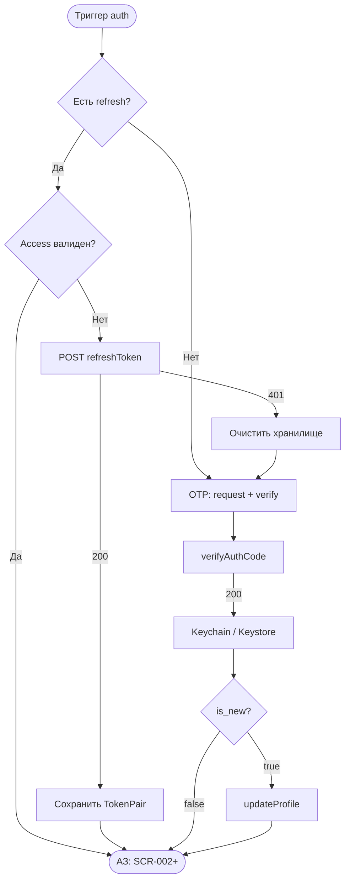
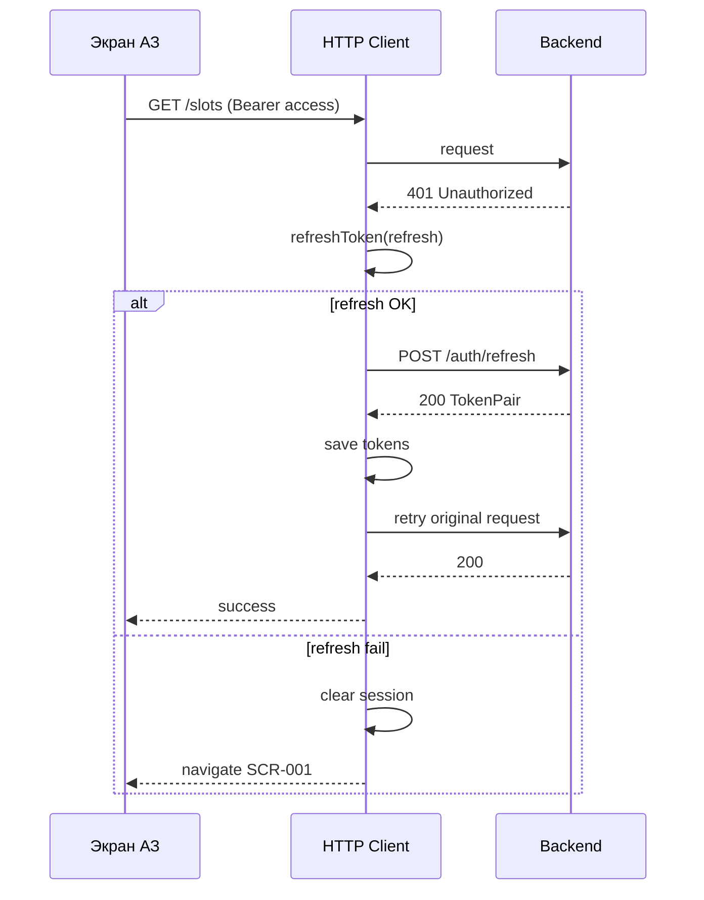

# OTP-авторизация и JWT-сессия

**ID:** LOGIC-001  
**Тип:** Логика  
**Домен:** 09. Логики  
**Приоритет:** Critical  
**Статус:** Черновик  
**Версия:** 0.1.0  
**Функциональные блоки:** FB-AUTH-001, FB-AUTH-002, FB-AUTH-003, FB-SESSION-001

---

## Содержание

- [История изменений](#история-изменений)
- [Входные данные](#входные-данные)
- [Обзор](#обзор)
- [Точки применения](#точки-применения)
- [Флоу](#флоу)
- [Описание логики](#описание-логики)
- [API запросы](#api-запросы)
- [Локальное хранение](#локальное-хранение)
- [Связанные требования](#связанные-требования)
- [Критерии приёмки](#критерии-приёмки)
- [Обработка ошибок](#обработка-ошибок)

---

## История изменений

| Релиз | ТЗ | Описание изменений |
|-------|-----|-------------------|
| 0.1.0 | [LOGIC-001_OTP-авторизация.md](LOGIC-001_OTP-авторизация.md) | Первоначальная документация: OTP, JWT, refresh, secure storage, 401 |
| — | — | Первоначальная документация |

---

## Входные данные

| Название | Тип | Возможные значения | Описание |
|----------|-----|-------------------|----------|
| `accessToken` | Защищённое хранилище | JWT string / null | Access-токен текущей сессии |
| `refreshToken` | Защищённое хранилище | string / null | Refresh для ротации |
| `accessExpiresAt` | Защищённое хранилище / вычисление | epoch ms | `now + expires_in` из последнего TokenPair |
| `clientProfile` | Локальный кэш | `Client` | id, name, phone после verify / updateProfile |
| `isAuthenticated` | Производное | boolean | access валиден **или** refresh успешно обновлён |

---

## Обзор

Логика **LOGIC-001** описывает сквозной механизм аутентификации клиента «Глина»:

1. **OTP-поток** — запрос и проверка одноразового кода по телефону (`requestAuthCode`, `verifyAuthCode`).
2. **JWT-сессия** — хранение пары `access_token` + `refresh_token`, заголовок `Authorization: Bearer`.
3. **Refresh** — прозрачное обновление access при истечении или HTTP 401 (`refreshToken`).
4. **Secure storage** — Keychain (iOS) / EncryptedSharedPreferences + Keystore (Android).
5. **Logout** — API `logout` + локальная очистка (экран профиля вне MVP, но контракт готов).

Логика **не** дублирует UI шагов SCR-001 (форма, OTP-ячейки) — см.
[SCR-001-registration.md](../SCR-001-registration.md); здесь — инфраструктура сессии и сетевой слой.

### User Story

> Как **клиент**, я хочу **оставаться авторизованным между запусками приложения**,
> чтобы **не вводить телефон и код при каждом открытии**.

### Бизнес-ценность

- Безопасная верификация телефона без пароля (FR-1).
- Снижение трения при повторных визитах (auto-skip SCR-001).
- Единая обработка 401 для всех экранов АЗ (NFR-5).

---

## Точки применения

| Экран/Компонент | Элемент/Триггер | Условие |
|-----------------|-----------------|---------|
| [SCR-001 Регистрация / Вход](../SCR-001-registration.md) | requestAuthCode, verifyAuthCode, updateProfile после verify | НЗ, первичный вход |
| App launch / Root coordinator | Проверка сессии | Всегда |
| HTTP client (interceptor) | Любой запрос АЗ | Authorization header + 401 → refresh |
| HTTP client (interceptor) | Ответ 401 после failed refresh | Сброс сессии → SCR-001 |
| Push registration (будущее BS-002) | registerPushToken | После auth, с Bearer |
| Logout (вне MVP UI) | logout | Явный выход / отзыв refresh |

---

## Флоу

### Общая схема auth



### Refresh при API-запросе (interceptor)



---

## Описание логики

### Шаг 1: Проверка сессии при запуске

При `onLaunch` coordinator читает secure storage:

- Если `refreshToken` **отсутствует** → маршрут **SCR-001**.
- Если `accessToken` **не истёк** (с запасом ~60 с до `accessExpiresAt`) → **SCR-002**.
- Если access истёк, но refresh есть → **фоновый** `refreshToken`; при успехе SCR-002, при 401 → очистка → SCR-001.

Опционально: параллельный `getProfile` для актуализации `clientProfile` (не блокирует вход при сетевой ошибке, если локальная сессия валидна).

### Шаг 2: Установка сессии после verifyAuthCode

Из `VerifyCodeResponse`:

| Поле | Действие |
|------|----------|
| `tokens.access_token` | Secure storage + in-memory |
| `tokens.refresh_token` | Secure storage (ротация при каждом refresh) |
| `tokens.expires_in` | Вычислить `accessExpiresAt` |
| `client` | Кэш профиля (id, phone, name если есть) |
| `is_new` | Флаг для SCR-001: нужен PATCH имени |

**Не** логировать токены и OTP в plaintext (crash reports, analytics).

### Шаг 3: Authorization header

Для всех операций с `security: bearerAuth` (кроме `/auth/request-code`, `/auth/verify-code`, `/auth/refresh`):

```
Authorization: Bearer {access_token}
```

Content-Type: `application/json` для JSON body.

### Шаг 4: Refresh и ротация

- Триггер: access истёк **или** ответ **401** с `code=unauthorized` на защищённом endpoint.
- Один concurrent refresh (mutex / actor): параллельные 401 ждут один refresh, затем retry.
- Успех: **заменить оба** токена новыми из `TokenPair` (ротация refresh на бэкенде).
- Неудача 401: очистить storage, emit `SessionExpired`, навигация SCR-001 **без** snack с техническими деталями.

### Шаг 5: Logout (контракт, UI post-MVP)

`POST /auth/logout` с текущим Bearer access:

- Успех 204: удалить tokens, client cache, push token локально; SCR-001.
- 401: всё равно локальная очистка (токен уже недействителен).

Экран профиля (SCR-007) **не в MVP** — logout вызывается из dev menu / будущих настроек.

---

## API запросы

### POST /auth/request-code — requestAuthCode

**Спецификация:** [`../../api/auth/api.yaml`](../../api/auth/api.yaml) → `requestAuthCode`

**Триггер:** SCR-001 шаг 1 — «Продолжить»; SCR-001 resend OTP

**Headers:** без Authorization

**Body (`RequestCodeRequest`):**

| Параметр | Тип | Описание | Значение/Источник |
|----------|-----|----------|-------------------|
| `phone` | string E.164 | Телефон клиента | Нормализованный ввод SCR-001 |

**Обработка ответа:**

| Результат | Действие |
|-----------|----------|
| 200 | Передать UI `ttl_seconds`, `resend_after_seconds`; demo: опционально `code` |
| 400 | UI: «Не удалось войти…» |
| 429 | UI: cooldown resend |
| 5xx / сеть | UI: snack с retry |

---

### POST /auth/verify-code — verifyAuthCode

**Спецификация:** [`../../api/auth/api.yaml`](../../api/auth/api.yaml) → `verifyAuthCode`

**Триггер:** SCR-001 — submit OTP

**Body (`VerifyCodeRequest`):**

| Параметр | Тип | Описание | Значение/Источник |
|----------|-----|----------|-------------------|
| `phone` | string | Тот же номер, что request-code | `draftPhoneE164` |
| `code` | string | OTP 4–6 цифр | OTP UI |

**Обработка ответа:**

| Результат | Действие |
|-----------|----------|
| 200 | `establishSession(tokens, client)`; вернуть `is_new` в SCR-001 |
| 400 `invalid_code` | UI ошибка OTP; **не** сохранять сессию |
| 429 | Cooldown; сохранить draft |
| 5xx / сеть | Retry verify |

---

### POST /auth/refresh — refreshToken

**Спецификация:** [`../../api/auth/api.yaml`](../../api/auth/api.yaml) → `refreshToken`

**Триггер:** Interceptor / app launch; access expired

**Body (`RefreshTokenRequest`):**

| Параметр | Тип | Описание | Значение/Источник |
|----------|-----|----------|-------------------|
| `refresh_token` | string | Текущий refresh | Secure storage |

**Обработка ответа:**

| Результат | Действие |
|-----------|----------|
| 200 | `establishSession(new TokenPair)` — **полная замена** пары |
| 401 | `clearSession()` → SCR-001 |
| 400 / 5xx | Однократный retry refresh; затем clearSession |

---

### POST /auth/logout — logout

**Спецификация:** [`../../api/auth/api.yaml`](../../api/auth/api.yaml) → `logout`

**Триггер:** Явный logout (post-MVP UI); опционально перед удалением аккаунта

**Headers:** `Authorization: Bearer {access_token}`

**Обработка ответа:**

| Результат | Действие |
|-----------|----------|
| 204 | `clearSession()` |
| 401 | `clearSession()` локально |
| 5xx | `clearSession()` локально + log (best-effort server revoke) |

---

### PATCH /profile — updateProfile

**Спецификация:** [`../../api/profile/api.yaml`](../../api/profile/api.yaml) → `updateProfile`

**Триггер:** SCR-001 после verify при `is_new=true`

**Headers:** Bearer access (сразу после verify)

**Body:**

| Параметр | Тип | Описание | Значение/Источник |
|----------|-----|----------|-------------------|
| `name` | string | Имя клиента | `draftName` SCR-001 |

**Обработка:** 200 → обновить `clientProfile`; ошибки — см. SCR-001.

---

## Локальное хранение

| Ключ | Тип хранения | Описание |
|------|--------------|----------|
| `auth.access_token` | Keychain / Keystore | JWT access |
| `auth.refresh_token` | Keychain / Keystore | Refresh для ротации |
| `auth.access_expires_at` | Keychain / Keystore или prefs | Epoch ms истечения access |
| `client.profile` | Encrypted prefs / secure | JSON `Client` (id, name, phone) |
| `auth.last_phone` | Preferences (non-secret) | Опционально: маска для UX SCR-001 |

**Требования безопасности:**

- iOS: Keychain, `kSecAttrAccessibleAfterFirstUnlockThisDeviceOnly` или stricter.
- Android: EncryptedSharedPreferences + hardware-backed Keystore где доступно.
- Запрет backup токенов в незашифрованный cloud backup (Android `allowBackup` rules).

---

## Связанные требования

### Функциональные (FR-*)

| ID | Название | Приоритет |
|----|----------|-----------|
| FR-1 | Регистрация и вход по имени и телефону | Must |

### Нефункциональные (NFR-*)

| ID | Название | Приоритет |
|----|----------|-----------|
| NFR-2 | Интеграция с API бэкенда | Must |
| NFR-5 | Только свои данные после auth | Высокий |
| NFR-8 | Канонический контракт API | Средний |

---

## Критерии приёмки

| ID | Критерий |
|----|----------|
| AC-001 | **Дано** успешный `verifyAuthCode`, **Когда** получен `TokenPair`, **Тогда** access и refresh сохранены в Keychain/Keystore, `accessExpiresAt` вычислен из `expires_in` |
| AC-002 | **Дано** валидный refresh и истёкший access, **Когда** app launch, **Тогда** выполняется `refreshToken` и пользователь попадает на SCR-002 без SCR-001 |
| AC-003 | **Дано** API вернул 401 на защищённый endpoint, **Когда** refresh успешен, **Тогда** исходный запрос автоматически повторяется с новым access **один раз** |
| AC-004 | **Дано** refresh вернул 401, **Когда** interceptor обработал ошибку, **Тогда** tokens очищены и выполнена навигация на SCR-001 |
| AC-005 | **Дано** параллельные запросы получили 401, **Когда** refresh in-flight, **Тогда** выполняется **один** POST /auth/refresh, все запросы retry после успеха |
| AC-006 | **Дано** logout вызван явно, **Когда** POST /auth/logout завершён (или failed), **Тогда** локальные tokens удалены |
| AC-007 | **Дано** OTP неверный, **Когда** verifyAuthCode 400 invalid_code, **Тогда** tokens **не** записываются в storage |

---

## Обработка ошибок

| Тип ошибки | Контекст | Действие |
|------------|----------|----------|
| `invalid_code` | verifyAuthCode | UI SCR-001; без session |
| `too_many_requests` | request / verify | Timer + сообщение; без session |
| `unauthorized` (401) | Любой АЗ endpoint | Refresh → retry или clearSession |
| `unauthorized` (401) | refreshToken | clearSession → SCR-001 |
| Сеть недоступна | refresh on launch | Показ SCR-002 если access ещё валиден; иначе offline gate / SCR-001 |
| `internal_error` (5xx) | auth endpoints | Snack + retry; не partial session |

---
