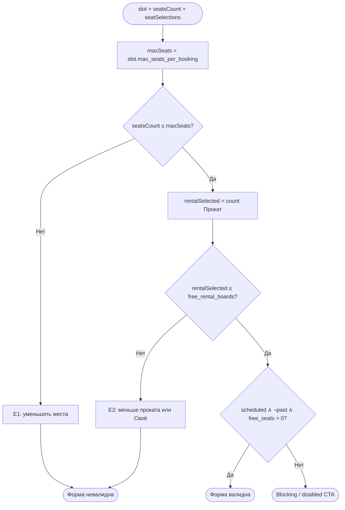

# Расчёт доступности

**ID:** LOGIC-002  
**Тип:** Логика  
**Домен:** 09. Логики  
**Приоритет:** Critical  
**Статус:** Черновик  
**Функциональные блоки:** FB-BOOK-002

---

## История изменений

| Релиз | ТЗ | Описание изменений |
|-------|-----|-------------------|
| 0.1.0 | [LOGIC-002_Расчёт-доступности.md](LOGIC-002_Расчёт-доступности.md) | Первоначальная документация |

---

## Входные данные

| Название | Тип | Возможные значения | Описание |
|----------|-----|-------------------|----------|
| `slot` | Ответ API `getSlot` | `Slot` | Актуальные данные слота |
| `seatsCount` | Состояние UI | integer ≥ 1 | Текущее значение степпера на SCR-004 |
| `seatSelections` | Состояние UI | `own` \| `rental`[] | Выбор инвентаря по местам |

**Ключевые поля `slot`:**

| Поле API | Роль в логике |
|----------|---------------|
| `free_seats` | Свободные места в группе |
| `free_rental_boards` | Свободные прокатные комплекты |
| `max_seats_per_booking` | Верхняя граница степпера (расчёт сервера) |
| `route.capacity_cap` | Потолок программы (учтён сервером в `max_seats_per_booking`) |
| `status` | `scheduled` / `cancelled` |
| `start_at` | Для признака «прошедшее» |

---

## Обзор

Логика определяет **допустимые границы** выбора на экране оформления записи (SCR-004): максимальное число мест в одной брони и максимальное число прокатных мест. Учитывает **два независимых лимита** (FR-9, FR-10): места в группе и прокатный фонд инструментов/фартука.

«**Своё**» занимает место в группе, но **не** уменьшает доступный прокатный фонд. «**Прокат**» занимает место **и** расходует один прокатный комплект.

### User Story

> Как **клиент**, я хочу **видеть только допустимые комбинации мест и проката**,
> чтобы **не отправить заведомо невалидную бронь**.

### Бизнес-ценность

- Предотвращает ошибки до вызова API (FR-11).
- Единый источник правил для степпера, переключателей и disabled CTA.
- Согласован с серверным расчётом `max_seats_per_booking` — клиент не дублирует формулу потолка программы.

---

## Точки применения

| Экран/Компонент | Элемент/Триггер | Условие |
|-----------------|-----------------|---------|
| [SCR-004 Оформление записи](SCR-004-booking.md) | Степпер «Число мест» | Всегда в Content |
| [SCR-004 Оформление записи](SCR-004-booking.md) | Переключатели «Своё/Прокат» | Всегда в Content |
| [SCR-004 Оформление записи](SCR-004-booking.md) | CTA «Записаться» (enabled/disabled) | Перед submit |
| [SCR-004 Оформление записи](SCR-004-booking.md) | Inline E1, E2 | При нарушении лимита |

---

## Флоу



---

## Описание логики

### Шаг 1: Максимум мест в брони (`maxSeats`)

```
maxSeats = slot.max_seats_per_booking
```

Поле `max_seats_per_booking` возвращается API и **уже содержит** серверный расчёт:

```
max_seats_per_booking = min(free_seats, route.capacity_cap, …)
```

где `route.capacity_cap` — потолок программы (новичковая ≤ 6, на круге ≤ 10; см. [data-model.md](../4-design/data-model.md)).

**Клиент не хардкодит** 3, 6 или 10 — использует только `max_seats_per_booking` из ответа (P6, FR-9).

**Степпер:**

| Параметр | Значение |
|----------|----------|
| Минимум | `1` |
| Максимум | `maxSeats` |
| Подпись | «Можно записать до {maxSeats} мест» |

Если `maxSeats < seatsCount` (после refresh getSlot) — автоматически **уменьшить** `seatsCount` до `maxSeats` и показать E1 при необходимости.

### Шаг 2: Лимит проката (`rentalLimit`)

```
rentalLimit = slot.free_rental_boards
rentalSelected = count(seatSelections where value = rental)
ownSelected = seatsCount - rentalSelected
```

| Правило | Описание |
|---------|----------|
| FR-10 «Своё» | Занимает место в группе; **не** увеличивает `rentalSelected` |
| FR-10 «Прокат» | Занимает место **и** +1 к `rentalSelected` |
| Верхняя граница | `rentalSelected ≤ rentalLimit` |
| Связь с местами | `rentalSelected ≤ seatsCount` (следует из UI) |

**UI-счётчик:** «Прокат выбрано: {rentalSelected} из {rentalLimit}».

**Disabled «Прокат»** на месте `i`, если:
```
rentalSelected ≥ rentalLimit  AND  seatSelections[i] ≠ rental
```

**Особый случай:** `free_rental_boards = 0` → все места принудительно «Своё»; запись **возможна** при `free_seats > 0` (UC-1 A1).

### Шаг 3: Default для нового места

При добавлении места степпером «+»:

```
defaultSelection = rental  if rentalSelected < rentalLimit
                   own      otherwise
```

### Шаг 4: Доступность записи (`isBookable`)

```
isPast = slot.start_at < now()
isBookable = slot.status = scheduled
          AND NOT isPast
          AND slot.free_seats > 0
          AND seatsCount ≤ maxSeats
          AND seatsCount ≤ slot.free_seats
          AND rentalSelected ≤ rentalLimit
```

### Шаг 5: Маппинг в API

При submit:

```
seats_count  = seatsCount
rental_count = rentalSelected
```

Сервер дополнительно проверяет инварианты; при нарушении — 409 `slot_full` или 422.

---

## API запросы

Логика **не вызывает API самостоятельно**; потребляет результат [getSlot](../api/slots/api.yaml) и подготавливает тело [createBooking](../api/bookings/api.yaml).

| Поле запроса | Источник логики |
|--------------|-----------------|
| `seats_count` | `seatsCount` |
| `rental_count` | `rentalSelected` |

**Обработка 409 `slot_full` на SCR-004:**

| `details` | Действие |
|-----------|----------|
| `available_seats` | Обновить UI; E1 или E3 |
| `available_rental_boards` | Обновить UI; E2 |

---

## Локальное хранение

Не используется. Состояние формы живёт в памяти экрана SCR-004 до submit или dismiss.

---

## Связанные требования

### Функциональные (FR)

| ID | Название | Приоритет |
|----|----------|-----------|
| FR-8–FR-11 | Одно место, переключатель проката | Must |
| FR-9 | Лимит мест с учётом потолка программы | Must |
| FR-10 | Отдельный учёт прокатного фонда | Must |
| FR-11 | Запрет записи сверх лимита | Must |

### Use cases

| ID | Связь |
|----|-------|
| UC-1 | Шаги 4–5; A1 (все своё), A2 (часть прокат); E1, E2, E3 |

---

## Критерии приёмки

| ID | Критерий |
|----|----------|
| AC-001 | **Дано** `max_seats_per_booking = 2`, `free_seats = 5`, **Когда** SCR-004 открыт, **Тогда** степпер max = 2 (не 5) |
| AC-002 | **Дано** `free_rental_boards = 1`, 2 места, **Когда** на обоих выбран «Прокат», **Тогда** форма невалидна, E2 |
| AC-003 | **Дано** `free_rental_boards = 0`, **Когда** форма открыта, **Тогда** `rentalSelected = 0`, все «Своё», CTA enabled при наличии мест |
| AC-004 | **Дано** 2 места (1 прокат, 1 своё), **Когда** submit, **Тогда** `rental_count = 1`, `seats_count = 2` |
| AC-005 | **Дано** refresh: `free_seats` стало 1 при `seatsCount = 2`, **Тогда** `seatsCount` clamp до 1, E1 |
| AC-006 | **Дано** `rentalSelected = rentalLimit`, **Когда** пользователь смотрит свободное место, **Тогда** «Прокат» disabled на нём |

---

## Обработка ошибок

| Тип ошибки | Контекст | Действие |
|------------|----------|----------|
| E1 — нехватка мест | `seatsCount > free_seats` или 409 (места) | «Недостаточно мест. Свободно: [N]. Уменьшите число мест до [N].» |
| E2 — нехватка проката | `rentalSelected > free_rental_boards` | «Недостаточно прокатных комплектов. Свободно: [M]. Выберите меньше проката или «Своё».» |
| E3 — гонка | 409, `available_seats = 0` | Refresh getSlot; «Места уже заняты. Данные обновлены.» |
| Слот отменён | `status = cancelled` / 410 | Blocking; запись невозможна |

---
