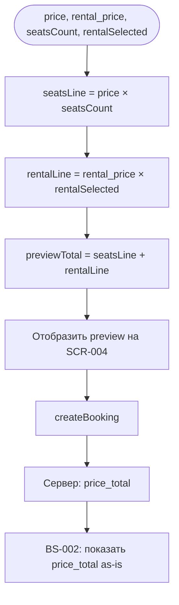

# Расчёт цены брони

**ID:** LOGIC-003  
**Тип:** Логика  
**Домен:** 09. Логики  
**Приоритет:** Critical  
**Статус:** Черновик  
**Функциональные блоки:** FB-BOOK-003

---

## История изменений

| Релиз | ТЗ | Описание изменений |
|-------|-----|-------------------|
| 0.1.0 | [LOGIC-003_Расчёт-цены-брони.md](LOGIC-003_Расчёт-цены-брони.md) | Первоначальная документация |

---

## Входные данные

| Название | Тип | Возможные значения | Описание |
|----------|-----|-------------------|----------|
| `slot.price` | Ответ API `getSlot` | integer ≥ 0, RUB | Цена за одно место |
| `slot.rental_price` | Ответ API `getSlot` | integer ≥ 0, RUB | Тариф проката за один комплект |
| `seatsCount` | Состояние UI (SCR-004) | integer ≥ 1 | Число мест в брони |
| `rentalSelected` | Вычисление [LOGIC-002](LOGIC-002_Расчёт-доступности.md) | 0 … `seatsCount` | Число мест с «Прокат» |

---

## Обзор

Логика рассчитывает **preview итоговой стоимости** брони на экране оформления (SCR-004) по тарифам из слота. Формула совпадает с серверной фиксацией `price_total` при создании брони (FR-18, [data-model.md](../4-design/data-model.md)).

**Два режима:**

| Режим | Где | Источник суммы |
|-------|-----|----------------|
| **Preview** | SCR-004 (блок цены, CTA) | Клиентский расчёт по формуле ниже |
| **Финальный** | BS-002, SCR-005, SCR-006 | `Booking.price_total` с сервера (read-only) |

Клиент **не пересчитывает** итог на экране успеха — только отображает `price_total` из `CreateBookingResponse`.

### User Story

> Как **клиент**, я хочу **видеть итоговую цену до подтверждения**,
> чтобы **понимать сумму офлайн-оплаты на месте**.

### Бизнес-ценность

- Прозрачность стоимости до commit (US-11, FR-18).
- Единая формула для UI и доменной модели — меньше расхождений с API.
- Офлайн-оплата: приложение показывает сумму, не принимает платёж.

---

## Точки применения

| Экран/Компонент | Элемент/Триггер | Условие |
|-----------------|-----------------|---------|
| [SCR-004 Оформление записи](../SCR-004-booking.md) | Блок «Места» / «Прокат» / «Итого» | При изменении степпера или переключателей |
| [SCR-004 Оформление записи](../SCR-004-booking.md) | CTA «Записаться · {сумма}» | Вместе с preview |
| [BS-002 Вы записаны](../BS-002-booking-success.md) | «Итого: … ₽» | После 201 — только `price_total` |

---

## Флоу



---

## Описание логики

### Формула (каноническая)

```
seats_line   = slot.price × seatsCount
rental_line  = slot.rental_price × rentalSelected
previewTotal = seats_line + rental_line
```

Эквивалент на уровне API ([bookings/models.yaml](../api/bookings/models.yaml), [slots/models.yaml](../api/slots/models.yaml)):

```
price_total = slot.price × seats_count + slot.rental_price × rental_count
```

где `rental_count = rentalSelected` ([LOGIC-002](LOGIC-002_Расчёт-доступности.md)).

### Отображение на SCR-004

| Строка | Условие показа | Формат (пример) |
|--------|----------------|-----------------|
| Места | Всегда | «{price} ₽ × {seatsCount} = {seats_line} ₽» |
| Прокат | `rentalSelected > 0` | «{rental_price} ₽ × {rentalSelected} = {rental_line} ₽» |
| **Итого** | Всегда | «{previewTotal} ₽» — крупно, контрастно |
| CTA | Всегда | «Записаться · {previewTotal} ₽» |

**Форматирование:** разделитель тысяч — пробел («2 500 ₽»); валюта — ₽ (RUB).

**Скрытие строки проката:** при `rentalSelected = 0` (все «Своё», UC-1 A1) строка «Прокат» не показывается; `previewTotal = price × seatsCount`.

### Preview vs сервер

| Аспект | Preview (SCR-004) | Сервер (`price_total`) |
|--------|-------------------|------------------------|
| Когда | До и во время редактирования | При успешном createBooking (201) |
| Кто считает | Клиент | Бэкенд |
| Формула | Та же | Та же |
| Редактируемость | Read-only | Read-only в `Booking` |
| Расхождение | Не ожидается при одинаковых входах | **Источник истины** для BS-002 |

Если `previewTotal ≠ response.price_total` (нештатно) — на BS-002 показывать **только** `price_total` с сервера; опционально логировать расхождение.

### Граничные значения

| Случай | Результат |
|--------|-----------|
| `seatsCount = 1`, все «Своё» | `previewTotal = price` |
| `rental_price = 0` | Строка проката может показывать «0 ₽» или скрываться по UX; итог = `seats_line` |
| `price = 0` | Допустимо по API (`minimum: 0`); итог может быть 0 |

---

## API запросы

### POST /bookings (createBooking)

**Триггер:** Подтверждение на SCR-004

**Body (фрагмент, влияющий на цену):**

| Параметр | Источник | Влияние на `price_total` |
|----------|----------|--------------------------|
| `seats_count` | `seatsCount` | Множитель `slot.price` |
| `rental_count` | `rentalSelected` | Множитель `slot.rental_price` |

**Обработка ответа:**

| Результат | Действие |
|-----------|----------|
| 201 Created | Передать `price_total` на BS-002; **не** пересчитывать на клиенте |
| 409 / 410 / 422 | Preview на форме сохраняется; итог не фиксируется |

Клиент **не отправляет** сумму в теле запроса — только `seats_count` и `rental_count`; сервер вычисляет `price_total` (FR-18).

---

## Локальное хранение

Не используется.

---

## Связанные требования

### Функциональные (FR)

| ID | Название | Приоритет |
|----|----------|-----------|
| FR-18 | Цена занятия и фиксация записи; оплата офлайн | Must |
| FR-8 | «Своё» / «прокат» влияет на `rental_count` и цену | Must |

### Данные

| Источник | Поле |
|----------|------|
| [data-model.md](../4-design/data-model.md) | `price_total = price × seats_count + rental_price × rental_count` |
| [slots/models.yaml](../api/slots/models.yaml) | `price`, `rental_price` |
| [bookings/models.yaml](../api/bookings/models.yaml) | `price_total` read-only |

### User stories

| ID | Связь |
|----|-------|
| US-11 | Видеть цену без онлайн-оплаты |

---

## Критерии приёмки

| ID | Критерий |
|----|----------|
| AC-001 | **Дано** `price=2500`, `rental_price=800`, `seatsCount=2`, `rentalSelected=1`, **Когда** preview на SCR-004, **Тогда** итого = 2500×2 + 800×1 = **5800** ₽ |
| AC-002 | **Дано** все места «Своё», **Когда** preview, **Тогда** строка «Прокат» скрыта, итого = `price × seatsCount` |
| AC-003 | **Дано** успешный 201 с `price_total=5800`, **Когда** BS-002, **Тогда** отображается 5800 с ответа, не preview |
| AC-004 | **Дано** изменение переключателя с «Прокат» на «Своё», **Когда** UI обновлён, **Тогда** `previewTotal` уменьшается на `rental_price` |
| AC-005 | **Дано** изменение степпера +1, **Когда** новое место «Прокат», **Тогда** `previewTotal` += `price + rental_price` |

---

## Обработка ошибок

| Тип | Контекст | Действие |
|-----|----------|----------|
| Отсутствие `price` / `rental_price` | getSlot incomplete | Error state SCR-004; submit заблокирован |
| createBooking fail | Любая ошибка до 201 | Preview остаётся на форме; `price_total` не показывается как финальный |

---
