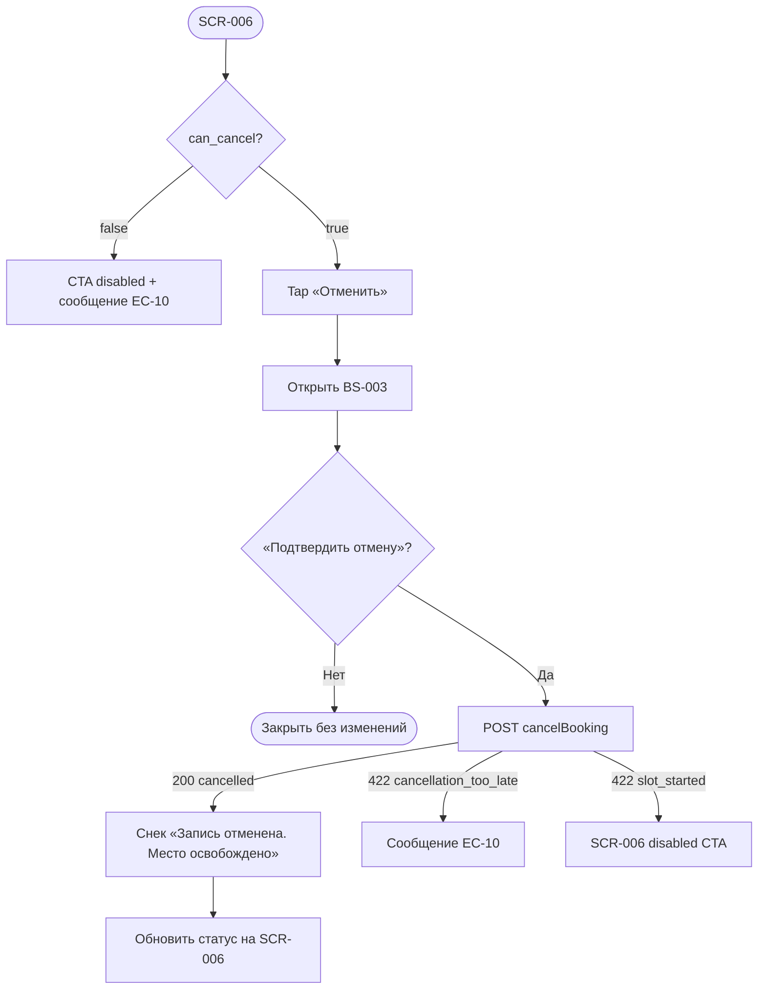

# Отмена брони клиентом

**ID:** LOGIC-004  
**Тип:** Логика  
**Домен:** 09. Логики  
**Приоритет:** Critical  
**Статус:** Актуален  
**Функциональные блоки:** FB-BOOK-006, FB-BOOK-004

---

## Содержание

- [История изменений](#история-изменений)
- [Обзор](#обзор)
- [Точки применения](#точки-применения)
- [Флоу](#флоу)
- [Описание логики](#описание-логики)
- [API запросы](#api-запросы)
- [Связанные требования](#связанные-требования)
- [Критерии приёмки](#критерии-приёмки)
- [Обработка ошибок](#обработка-ошибок)

---

## История изменений

| Релиз | ТЗ | Описание изменений |
|-------|-----|-------------------|
| 1.0.0 | LOGIC-004_Отмена-ранняя-поздняя.md | Первоначальная документация |
| 1.1.0 | — | Порог отмены **10 минут** (UC-03, FR-14); убран статус `late_cancel` |

---

## Обзор

Логика **отмены брони клиентом** до старта занятия. Отмена доступна, если до `slot.start_at`
осталось **более 10 минут** (UC-03, FR-14). При **≤ 10 минут** кнопка отмены заблокирована;
сервер при попытке confirm вернёт 422 `cancellation_too_late`.

| Условие | Поведение |
|---------|-----------|
| > 10 мин до старта | Отмена доступна → `status = cancelled`, место и прокат возвращаются |
| ≤ 10 мин до старта | Отмена **заблокирована** (EC-10) |
| Занятие началось | Отмена недоступна → 422 `slot_started` |

### User Story

> Как клиент, я хочу отменить бронь, если до занятия больше 10 минут,
> чтобы освободить место для других.

### Бизнес-ценность

- Согласованность с NFR-4: успешная отмена освобождает место и прокат.
- Прозрачное UX: при блокировке — понятное сообщение со ссылкой на мастерскую.
- Единый источник истины — поле `can_cancel` и ответ `cancelBooking`.

---

## Точки применения

| Экран/Компонент | Элемент/Триггер | Условие |
|-----------------|-----------------|---------|
| [SCR-006](SCR-006-booking-details.md) | CTA «Отменить», snackbar после отмены | `status=active`, `can_cancel=true` |
| [BS-003](BS-003-cancel-confirm.md) | Подтверждение | Открыта поверх SCR-006 |
| [SCR-005](SCR-005-my-bookings.md) | Бейдж «отменена» | Отображение списка |

---

## Флоу

---

## Описание логики

### Шаг 1: Допустимость отмены (SCR-006)

Отмена доступна только если:

- `booking.status = active`
- `booking.can_cancel = true` (сервер: до старта **> 10 минут**)

При `can_cancel = false` и до старта ≤ 10 мин — CTA disabled, текст:
«Отмена невозможна — до начала занятия осталось менее 10 минут. Если вы не можете прийти,
свяжитесь с мастерской напрямую».

Отмена **недоступна** для `cancelled`, `club_cancelled` и прошедших занятий.

### Шаг 2: Подтверждение (BS-003)

Шторка с вопросом «Вы уверены, что хотите отменить запись?» и пояснением, что место
освободится. Без вариантов «ранняя/поздняя».

### Шаг 3: Подтверждение (cancelBooking)

`POST /bookings/{bookingId}/cancel` без тела.

Сервер:

1. Проверяет, что занятие не началось.
2. Проверяет, что до `slot.start_at` **> 10 минут**; иначе 422 `cancellation_too_late`.
3. Устанавливает `status = cancelled`, заполняет `cancelled_at`.
4. Возвращает место и прокат в слот.

### Шаг 4: UI-реакция (SCR-006)

| Ответ | Snackbar |
|-------|----------|
| 200, `status=cancelled` | «Запись отменена. Место освобождено» |

---

## API запросы

### POST /bookings/{bookingId}/cancel

**Спецификация:** [bookings/api.yaml](../../api/bookings/api.yaml) → `cancelBooking`

**Обработка ответа:**

| Результат | Действие |
|-----------|----------|
| 200, `status=cancelled` | Закрыть BS-003; обновить SCR-006; снек успеха |
| 422 `cancellation_too_late` | Закрыть BS-003; disabled CTA; сообщение EC-10 |
| 422 `slot_started` | Закрыть BS-003; refresh getBooking; disabled CTA |
| 409 `already_cancelled` | Закрыть BS-003; refresh |
| 401 | Logout → SCR-001 |
| 5xx / сеть | Ошибка в BS-003, повтор |

### GET /bookings/{bookingId} (вспомогательный)

Поле `can_cancel` — read-only, вычисляется сервером.

---

## Связанные требования

| ID | Название | Приоритет |
|----|----------|-----------|
| FR-13 | Отмена до старта | Must |
| FR-14 | Порог 10 минут | Must |
| NFR-4 | Согласованность отмен и инвентаря | Высокий |
| EC-10 | Блокировка ≤ 10 мин | — |

---

## Критерии приёмки

| ID | Критерий |
|----|----------|
| AC-001 | **Дано** активная бронь, `can_cancel=true`, **Когда** confirm, **Тогда** снек «Запись отменена. Место освобождено» |
| AC-002 | **Дано** ≤ 10 мин до старта, **Тогда** CTA «Отменить» disabled и текст EC-10 |
| AC-003 | **Дано** confirm при `cancellation_too_late`, **Тогда** сообщение EC-10, не error-snackbar |
| AC-004 | **Дано** занятие началось, **Когда** cancelBooking, **Тогда** 422 и disabled CTA |

---

## Обработка ошибок

| Тип ошибки | Контекст | Действие |
|------------|----------|----------|
| `cancellation_too_late` | ≤ 10 мин | Disabled CTA, текст EC-10 |
| `slot_started` | После confirm | Refresh, disabled «Отменить» |
| `already_cancelled` | Повторная отмена | Refresh, disabled CTA |
| Сеть | Confirm | Сообщение в BS-003, повтор |

---
