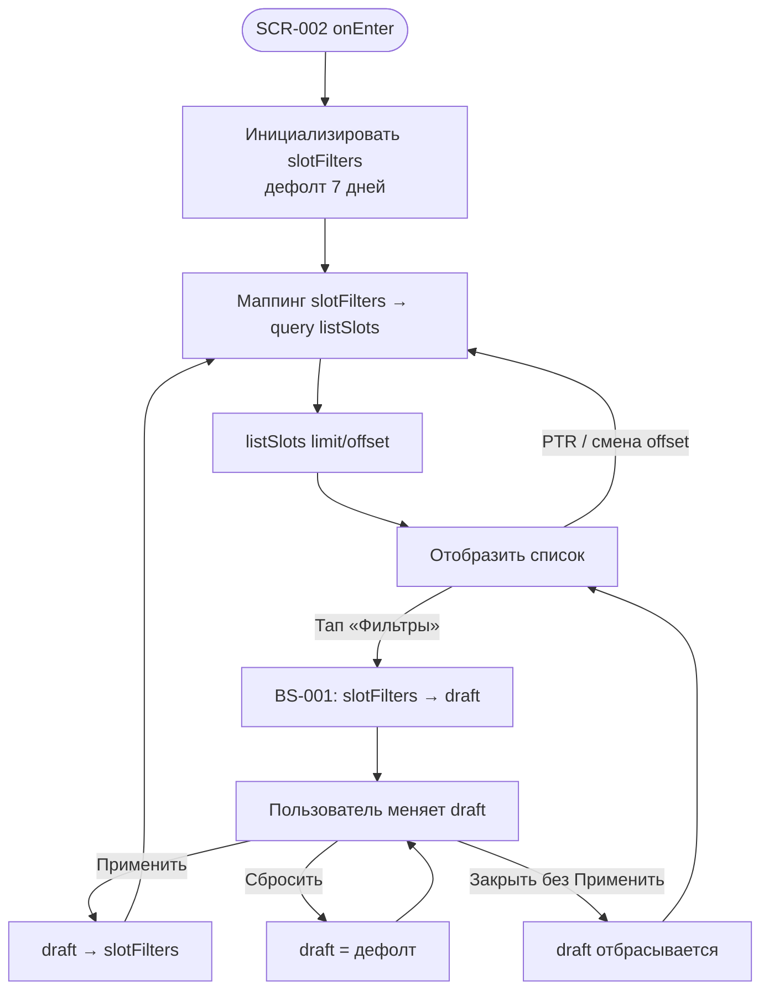

# Фильтрация слотов

**ID:** LOGIC-005  
**Тип:** Логика  
**Домен:** 09. Логики  
**Приоритет:** High  
**Статус:** Черновик  
**Функциональные блоки:** FB-SLOTS-001, FB-SLOTS-002

---

## Содержание

- [История изменений](#история-изменений)
- [Входные данные](#входные-данные)
- [Обзор](#обзор)
- [Точки применения](#точки-применения)
- [Флоу](#флоу)
- [Описание логики](#описание-логики)
- [API запросы](#api-запросы)
- [Локальное хранение](#локальное-хранение)
- [Связанные требования](#связанные-требования)
- [Критерии приёмки](#критерии-приёмки)
- [Обработка ошибок](#обработка-ошибок)

---

## История изменений

| Релиз | ТЗ | Описание изменений |
|-------|-----|-------------------|
| 0.1.0 | [LOGIC-005 Фильтрация слотов](LOGIC-005_Фильтрация-слотов.md) | Первоначальная документация |

---

## Входные данные

| Название | Тип | Возможные значения | Описание |
|----------|-----|-------------------|----------|
| `slotFilters` | Состояние сессии | см. [модель фильтров](#шаг-1-модель-состояния-фильтров) | Текущие применённые параметры фильтрации списка слотов |
| `slotFiltersDraft` | Состояние UI (BS-001) | см. модель фильтров | Черновик фильтров внутри шторки до нажатия «Применить» |
| `serverNow` | Remote / кэш | ISO 8601 | Текущий момент сервера; используется для дефолтного `date_from` и валидации дат |

> **Терминология.** Поле API `route` — домен **Program** (программа); `instructor` — домен **Master** (мастер). См. [data-model.md](../../4-design/data-model.md).

---

## Обзор

Переиспользуемая логика управления состоянием фильтров каталога слотов: дефолтный 7‑дневный горизонт (FR-2), маппинг UI-параметров на query-параметры `listSlots`, правила комбинирования фильтров (OR внутри группы, AND между группами), определение «активности» фильтров для индикатора на SCR-002 и сохранение применённых значений в **состоянии сессии** до явного сброса или перезапуска приложения.

### User Story

> Как клиент, я хочу отфильтровать список занятий по дате, программе, наличию мест и мастеру,
> чтобы быстрее найти подходящий мастер-класс.

### Бизнес-ценность

- Сокращает путь к записи за счёт релевантной выдачи (FR-4, US-3).
- Единый источник истины для параметров `listSlots` на SCR-002 и BS-001.
- Согласованность с API-контрактом: дефолт «ближайшие 7 дней», а не «все предстоящие».

---

## Точки применения

| Экран/Компонент | Элемент/Триггер | Условие |
|-----------------|-----------------|---------|
| [SCR-002 Список слотов](../SCR-002-slot-list.md) | Инициализация, PTR, пагинация | Всегда — чтение `slotFilters` |
| [SCR-002 Список слотов](../SCR-002-slot-list.md) | Кнопка «Фильтры», индикатор активных фильтров | Всегда |
| [BS-001 Фильтры](../BS-001-filters.md) | Открытие шторки | Копирование `slotFilters` → `slotFiltersDraft` |
| [BS-001 Фильтры](../BS-001-filters.md) | «Применить» | Запись `slotFiltersDraft` → `slotFilters`, перезагрузка списка |
| [BS-001 Фильтры](../BS-001-filters.md) | «Сбросить» | Сброс `slotFiltersDraft` к дефолту |

---

## Флоу

---

## Описание логики

### Шаг 1: Модель состояния фильтров

Структура `slotFilters` / `slotFiltersDraft`:

| Поле UI | Поле состояния | Тип | Дефолт |
|---------|----------------|-----|--------|
| Период «С» | `dateFrom` | `Instant?` | `null` → API подставляет текущий момент |
| Период «По» | `dateTo` | `Instant?` | `null` → API подставляет `dateFrom + 7 дней` |
| Пресет даты | `datePreset` | `today \| week \| weekend \| custom \| none` | `none` |
| Программа (чипы) | `routeTypes` | `RouteType[]` | `[]` (любая программа) |
| Только со свободными | `onlyAvailable` | `boolean` | `false` |
| Мастер (чипы) | `instructorIds` | `UUID[]` | `[]` (любой мастер) |

`RouteType` — enum API: `novice` (лепка для новичков), `experienced` (работа на круге).

**Дефолтный горизонт (FR-2, R-027):** при сбросе или первом входе клиент **не передаёт** `date_from` и `date_to` (или передаёт явно `date_from = now`, `date_to = now + 7d` в UTC согласно серверу). Пустые даты на клиенте **не означают** «все предстоящие» — трактуются как API-дефолт «ближайшие 7 дней».

### Шаг 2: Маппинг на query-параметры `listSlots`

| Состояние | Query-параметр | Правило |
|-----------|----------------|---------|
| `dateFrom != null` | `date_from` | ISO 8601 date-time (UTC) |
| `dateFrom == null` | — | параметр опускается (сервер = now) |
| `dateTo != null` | `date_to` | ISO 8601 date-time (UTC), граница включительна |
| `dateTo == null` | — | параметр опускается (сервер = date_from + 7d) |
| `routeTypes` не пуст | `route_type` | массив; **OR** внутри группы |
| `routeTypes` пуст | — | параметр опускается |
| `onlyAvailable == true` | `only_available` | `true` |
| `onlyAvailable == false` | — | параметр опускается (дефолт API = false) |
| `instructorIds` не пуст | `instructor_id` | массив UUID; **OR** внутри группы |
| `instructorIds` пуст | — | параметр опускается |
| Пагинация | `limit`, `offset` | из состояния списка SCR-002 (не часть `slotFilters`) |

**Комбинирование (FR-4):** между группами — **AND** (`route_type` AND `instructor_id` AND период AND `only_available`).

### Шаг 3: Пресеты дат (BS-001)

| Пресет | `dateFrom` | `dateTo` | `datePreset` |
|--------|------------|----------|--------------|
| «Сегодня» | начало текущего дня (локаль TZ клуба) | конец текущего дня | `today` |
| «Эта неделя» | начало текущей недели (пн) | конец текущей недели (вс) | `week` |
| «Выходные» | сб 00:00 ближайших выходных | вс 23:59 тех же выходных | `weekend` |
| Ручной ввод «С»/«По» | значение picker | значение picker | `custom` |
| Дефолт списка | `null` | `null` | `none` |

Ручная правка полей «С»/«По» снимает активный пресет (`datePreset = custom`). Прошедшие даты в picker недоступны.

### Шаг 4: Признак «фильтры активны»

Индикатор на SCR-002 (`hasActiveFilters = true`), если **хотя бы одно** поле отличается от дефолта:

- `dateFrom != null` OR `dateTo != null` (пользователь задал период, отличный от API-дефолта без явных дат — см. AC-E02 для пресетов, совпадающих с 7 днями),
- OR `routeTypes.length > 0`,
- OR `onlyAvailable == true`,
- OR `instructorIds.length > 0`.

> **Примечание.** Явный период, совпадающий с дефолтом «now … +7d», считается активным фильтром, если пользователь выбрал его через BS-001 (отличается от «не передавать параметры» только семантически для empty state «по фильтрам» vs «нет расписания»).

### Шаг 5: Сброс

«Сбросить» в BS-001 обнуляет `slotFiltersDraft` к дефолту (шаг 1). «Сбросить» + «Применить» записывает дефолт в `slotFilters` и перезагружает SCR-002 с API-дефолтом 7 дней.

---

## API запросы

### GET /slots — listSlots

**Триггер:** изменение `slotFilters`, инициализация SCR-002, pull-to-refresh, пагинация.

**Спецификация:** [../api/slots/api.yaml](../api/slots/api.yaml) → `listSlots`

**Headers:**

| Поле | Описание |
|------|----------|
| `Authorization` | Bearer access-токен |

**Параметры:**

| Параметр | Тип | Описание | Источник |
|----------|-----|----------|----------|
| `date_from` | date-time | Начало периода (вкл.) | `slotFilters.dateFrom` или опускается |
| `date_to` | date-time | Конец периода (вкл.) | `slotFilters.dateTo` или опускается |
| `route_type` | string[] | Тип программы (`novice` / `experienced`) | `slotFilters.routeTypes` |
| `instructor_id` | uuid[] | Идентификаторы мастеров | `slotFilters.instructorIds` |
| `only_available` | boolean | Только `free_seats > 0` | `slotFilters.onlyAvailable` |
| `limit` | int | Размер страницы (1–100, деф. 20) | состояние пагинации SCR-002 |
| `offset` | int | Смещение (деф. 0) | состояние пагинации SCR-002 |

**Обработка ответа:**

| Результат | Действие |
|-----------|----------|
| 200 + `items` | Обновить список; `meta.total` для пагинации |
| 200 + пустой `items` | Empty state SCR-002 (с учётом `hasActiveFilters`) |
| 400 | Error state; снек с `message` |
| 401 | Разлогин / переход на SCR-001 |
| 5xx / сеть | Error state с «Обновить» |

---

## Локальное хранение

| Ключ | Тип хранения | Описание |
|------|--------------|----------|
| `slotFilters` | Состояние сессии (in-memory / ViewModel) | Применённые фильтры; **не** персистится между перезапусками приложения в MVP |
| `slotFiltersDraft` | Состояние UI BS-001 | Живёт только пока открыта шторка |

При повторном входе на SCR-002 в рамках сессии фильтры сохраняются. Cold start → дефолт 7 дней.

---

## Связанные требования

### Функциональные

| ID | Название | Приоритет |
|----|----------|-----------|
| FR-2 | Список слотов на 7 дней по умолчанию | Must |
| FR-3 | Empty state при отсутствии слотов | Must |
| FR-4 | Фильтрация по дате, программе, местам, мастеру | Must |

### Нефункциональные

| ID | Название | Приоритет |
|----|----------|-----------|
| NFR-8 | Лимиты и доступность — из API, не хардкод | Must |

---

## Критерии приёмки

| ID | Критерий |
|----|----------|
| AC-001 | **Дано** первый вход на SCR-002 в сессии, **Когда** экран загружается, **Тогда** `listSlots` вызывается без `date_from`/`date_to` (или с now/+7d) и показываются слоты на ближайшие 7 дней |
| AC-002 | **Дано** выбраны чипы «Новичковая лепка» и «Гончарный круг», **Когда** пользователь нажимает «Применить», **Тогда** запрос содержит `route_type=novice&route_type=experienced` (OR) |
| AC-003 | **Дано** выбран мастер и программа, **Когда** применены фильтры, **Тогда** запрос содержит оба параметра (AND между группами) |
| AC-004 | **Дано** toggle «Только со свободными местами» включён, **Когда** список обновлён, **Тогда** в выдаче только слоты с `free_seats > 0` |
| AC-005 | **Дано** применён хотя бы один недефолтный фильтр, **Когда** SCR-002 отображается, **Тогда** виден индикатор активных фильтров |
| AC-006 | **Дано** BS-001 открыта, **Когда** пользователь закрывает шторку без «Применить», **Тогда** `slotFilters` не меняется |
| AC-007 | **Дано** BS-001, **Когда** «Сбросить» + «Применить», **Тогда** `slotFilters` = дефолт и список загружается с 7‑дневным горизонтом |
| AC-E01 | **Дано** фильтры активны и API вернул пустой список, **Когда** отображается empty state, **Тогда** текст «Нет слотов по условиям…», а не «Пока нет доступных занятий» |
| AC-E02 | **Дано** пользователь вернулся на SCR-002 после навигации в SCR-003, **Когда** экран снова виден, **Тогда** `slotFilters` и позиция списка сохранены в сессии |

---

## Обработка ошибок

| Тип ошибки | Контекст | Действие |
|------------|----------|----------|
| `date_to < date_from` | Валидация BS-001 до «Применить» | Блокировать «Применить»; подсветить поле «По» |
| HTTP 400 | Невалидные query после «Применить» | Error state SCR-002; не сбрасывать `slotFilters` |
| Пустой справочник мастеров | listInstructors | Группа «Мастер» пуста; остальные фильтры работают |

---
