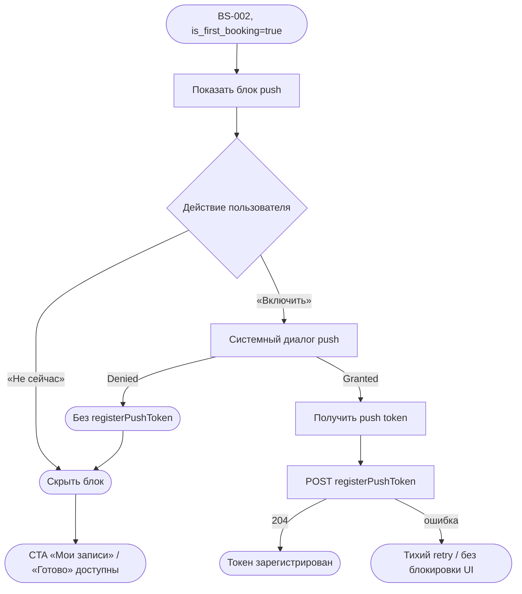

# Запрос push-разрешения

**ID:** LOGIC-007  
**Тип:** Логика  
**Домен:** 09. Логики  
**Приоритет:** High  
**Статус:** Актуален  
**Функциональные блоки:** FB-NOTIF-001

---

## Содержание

- [История изменений](#история-изменений)
- [Входные данные](#входные-данные)
- [Обзор](#обзор)
- [Точки применения](#точки-применения)
- [Флоу](#флоу)
- [Описание логики](#описание-логики)
- [API запросы](#api-запросы)
- [Локальное хранение](#локальное-хранение)
- [Связанные требования](#связанные-требования)
- [Критерии приёмки](#критерии-приёмки)
- [Обработка ошибок](#обработка-ошибок)

---

## История изменений

| Релиз | ТЗ | Описание изменений |
|-------|-----|-------------------|
| 1.0.0 | LOGIC-007_Запрос-push-разрешения.md | Первоначальная документация |

---

## Входные данные

| Название | Тип | Описание |
|----------|-----|----------|
| `is_first_booking` | Ответ `createBooking` | `true` — показать блок push на BS-002 |
| `platform` | Состояние устройства | `ios` \| `android` |
| `pushToken` | OS (APNs/FCM) | Токен после системного разрешения |
| `accessToken` | Защищённое хранилище | Bearer для API |

---

## Обзор

Единственная точка **запроса системного разрешения на push** в продукте — [BS-002](BS-002-booking-success.md) после **первой успешной** записи (`is_first_booking = true` из ответа `createBooking`). На SCR-001 разрешение **не** запрашивается.

Цели push (после регистрации токена):

- Уведомление об отмене занятия мастерской (FR-19, Must).
- Напоминания о предстоящей записи (FR-20, Should; тайминг — `reminder_hours` с сервера).

### User Story

> Как клиент после первой записи, я хочу включить напоминания о занятиях,
> чтобы не забыть о визите в мастерскую.

### Бизнес-ценность

- Контекстуальный запрос после ценного действия (первая бронь) повышает conversion opt-in.
- Отказ не блокирует запись и навигацию с BS-002.
- Регистрация токена на сервере — prerequisite для FR-19 / NFR-9.

---

## Точки применения

| Экран/Компонент | Элемент/Триггер | Условие |
|-----------------|-----------------|---------|
| [BS-002](BS-002-booking-success.md) | Блок «Напомнить о занятии?» | `is_first_booking = true` |
| [BS-002](BS-002-booking-success.md) | «Включить» | Tap пользователя |
| App lifecycle | Получение FCM/APNs token | После разрешения ОС |

---

## Флоу

---

## Описание логики

### Шаг 1: Условие показа (BS-002)

Блок push отображается **только если** `CreateBookingResponse.is_first_booking = true`.

При повторных записях (`is_first_booking = false`) блок **не показывается**; повторный системный запрос **не инициируется**.

### Шаг 2: In-app prompt

| Элемент | Текст |
|---------|-------|
| Заголовок/текст | «Напомнить о занятии?» |
| Primary | «Включить» |
| Secondary | «Не сейчас» |

«Не сейчас» — закрывает блок без вызова системного диалога.

### Шаг 3: Системное разрешение

По tap «Включить» — **нативный** системный запрос push (iOS 15+ / Android 9+).

| Исход ОС | Действие клиента |
|----------|------------------|
| Granted | Получить token → `registerPushToken` |
| Denied | Не вызывать API; не показывать ошибку; CTA BS-002 активны |
| Not determined → denied позже | Аналогично Denied |

### Шаг 4: Регистрация на сервере

После получения token — `POST /auth/push-tokens`. Повтор с тем же token **идемпотентен**.

`reminder_hours` из ответа `createBooking` — информационное поле для BE (расписание напоминаний); клиент **не** планирует локальные напоминания в MVP.

### Шаг 5: Push → SCR-006 (FR-19)

При отмене мастерской push содержит `bookingId`; tap открывает [SCR-006](SCR-006-booking-details.md) (см. UC-4). Регистрация токена через LOGIC-007 — prerequisite доставки.

---

## API запросы

### POST /auth/push-tokens

**Спецификация:** [auth/api.yaml](../api/auth/api.yaml) → `registerPushToken`

**Триггер:** Системное разрешение granted + token получен

**Headers:** `Authorization: Bearer {access_token}`

**Body:**

| Поле | Тип | Источник |
|------|-----|----------|
| `token` | string | APNs / FCM |
| `platform` | `ios` \| `android` | OS |

**Обработка ответа:**

| Результат | Действие |
|-----------|----------|
| 204 | Сохранить флаг `push_registered` локально (опц.) |
| 400 | Логировать; не блокировать BS-002 |
| 401 | Refresh token / SCR-001 |
| 5xx / сеть | Фоновый retry (экспоненциальный backoff); UI не блокируется |

### DELETE /auth/push-tokens (вне MVP UI)

При logout — удаление token через body `{ token, platform }` ([auth/api.yaml](../api/auth/api.yaml) → `deletePushToken`). Экран настроек в MVP отсутствует.

---

## Локальное хранение

| Ключ | Тип | Описание |
|------|-----|----------|
| `push_prompt_shown` | Локальный кэш | `true` после первого показа блока (не показывать повторно даже при сбое API) |
| `push_token` | Защищённое хранилище | Последний зарегистрированный token (опц., для logout) |
| `access_token` / `refresh_token` | Keychain / Keystore | Сессия |

---

## Связанные требования

| ID | Название | Приоритет |
|----|----------|-----------|
| FR-19 | Push при отмене мастерской | Must |
| FR-20 | Напоминания о записи | Should |
| NFR-9 | Доставка push форс-мажора | Must |
| NFR-10 | Напоминания заблаговременно | Средний |

---

## Критерии приёмки

| ID | Критерий |
|----|----------|
| AC-001 | **Дано** `is_first_booking=true`, **Когда** BS-002 открыт, **Тогда** блок «Напомнить о занятии?» виден |
| AC-002 | **Дано** `is_first_booking=false`, **Когда** BS-002 открыт, **Тогда** блок push отсутствует |
| AC-003 | **Дано** tap «Включить» и granted, **Когда** token получен, **Тогда** POST registerPushToken с корректным `platform` |
| AC-004 | **Дано** denied ОС, **Когда** возврат на BS-002, **Тогда** нет error snackbar, CTA доступны |
| AC-005 | **Дано** «Не сейчас», **Когда** tap, **Тогда** системный диалог не показывается |
| AC-006 | **Дано** SCR-001 регистрация, **Когда** вход, **Тогда** push **не** запрашивается |

---

## Обработка ошибок

| Тип | Контекст | Действие |
|-----|----------|----------|
| API 5xx после granted | registerPushToken | Фоновый retry; не мешать «Мои записи» / «Готово» |
| Нет сети | registerPushToken | Retry при следующем старте приложения |
| Token refresh OS | Периодически | Re-register при изменении token |

---
