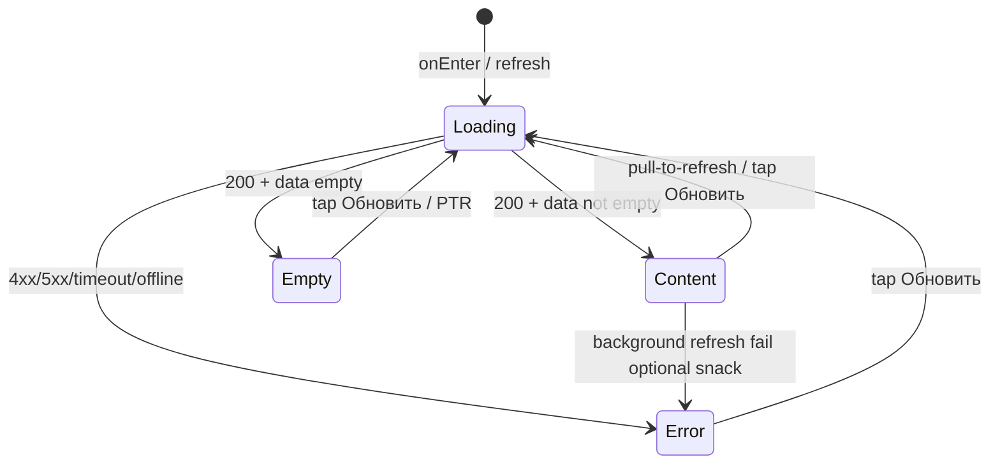
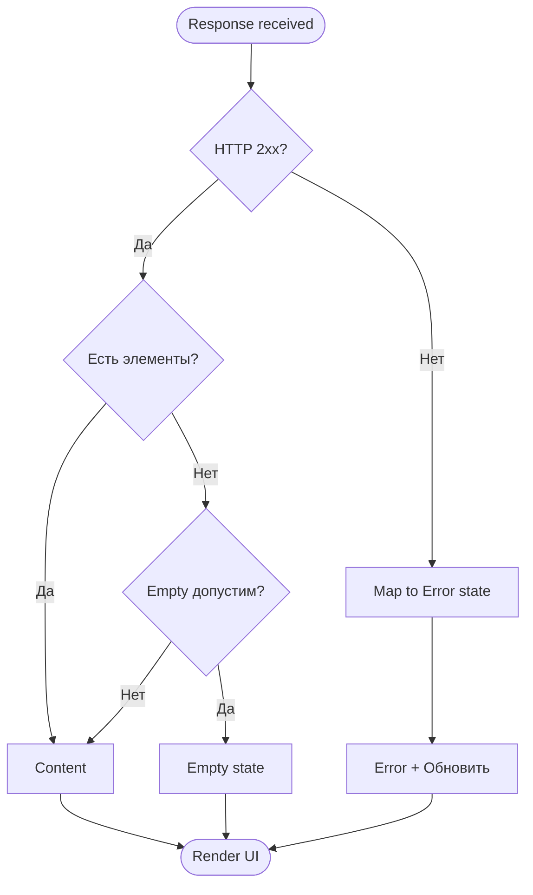

# Паттерн состояний экрана

**ID:** LOGIC-008  
**Тип:** Логика  
**Домен:** 09. Логики  
**Приоритет:** High  
**Статус:** Черновик  
**Версия:** 0.1.0  
**Функциональные блоки:** FB-UI-001 (скелетон), FB-UI-002 (empty), FB-UI-003 (error), FB-UI-004 (retry)

---

## Содержание

- [История изменений](#история-изменений)
- [Обзор](#обзор)
- [Точки применения](#точки-применения)
- [Флоу](#флоу)
- [Описание логики](#описание-логики)
- [Связанные требования](#связанные-требования)
- [Критерии приёмки](#критерии-приёмки)
- [Обработка ошибок](#обработка-ошибок)

---

## История изменений

| Релиз | ТЗ | Описание изменений |
|-------|-----|-------------------|
| 0.1.0 | [LOGIC-008_Паттерн-состояний-экрана.md](LOGIC-008_Паттерн-состояний-экрана.md) | Первоначальная документация паттерна Loading/Content/Empty/Error |
| — | — | Первоначальная документация |

---

## Обзор

Логика **LOGIC-008** задаёт **единый паттерн представления данных** на экранах, загружающих
контент из API (NFR-1, [foundations §5](../../3-design-brief/00-foundations.md#5-сквозной-паттерн-состояний-экрана)):

| Состояние | Когда | UI |
|-----------|-------|-----|
| **Loading** | Первичная загрузка / явный refresh | Скелетон или шиммер (структура будущего контента) |
| **Content** | HTTP 200, данные есть | Основной UI экрана |
| **Empty** | HTTP 200, данных нет (пустой список / допустимая пустота) | Заглушка + пояснение + опциональное действие |
| **Error** | 4xx/5xx, timeout, нет сети | Сообщение + кнопка **«Обновить»** |

Паттерн **не заменяет** локальные состояния форм (валидация полей SCR-001), bottom sheet lifecycle
и доменные бейджи («Отменено мастерской») — они описаны в экранных ТЗ.

### User Story

> Как **клиент**, я хочу **понимать, загружаются ли данные, пуст ли список или произошла ошибка**,
> чтобы **не видеть «белый экран» и знать, что делать дальше**.

### Бизнес-ценность

- Предсказуемый UX на всех data-driven экранах MVP.
- Снижение обращений в поддержку при временных сбоях сети в мастерской.
- Единая реализация компонентов (Skeleton, EmptyState, ErrorState) на iOS/Android.

---

## Точки применения

| Экран/Компонент | Элемент/Триггер | Условие |
|-----------------|-----------------|---------|
| [SCR-002 Список слотов](../SCR-002-slot-list.md) | onEnter, PTR, retry | GET slots — основной список |
| [SCR-005 Мои бронирования](../SCR-005-my-bookings.md) | onEnter, tab switch | GET bookings |
| [SCR-003 Карточка слота](../SCR-003-slot-card.md) | onEnter | GET slot by id |
| [SCR-006 Детали брони](../SCR-006-booking-details.md) | onEnter | GET booking |
| [SCR-001 Регистрация](../SCR-001-registration.md) | Submit auth forms | **Частично:** Loading/Error на CTA, без Empty |
| BS-001, BS-003 | — | Наследуют состояние родителя или локальный loading action |

**Не применяется** в полном виде:

- **SCR-004** — форма с локальной валидацией; Loading на submit, не skeleton списка.
- **BS-002** — статический success screen после createBooking.

---

## Флоу

### State machine (data-driven экран)

### Поток принятия решения после ответа API

---

## Описание логики

### Шаг 1: Loading

**Триггеры входа в Loading:**

- Первое открытие экрана (`onEnter`) с необходимостью сетевого запроса.
- Pull-to-refresh (PTR), если включён на экране.
- Тап кнопки **«Обновить»** в Error или Empty (если Empty предлагает refresh).

**Отображение:**

- **Skeleton / shimmer**, повторяющий структуру Content (карточки слотов, строки броней).
- Длительность: до завершения **критичного** запроса инициализации (см. таблицу в SCR-ТЗ).
- Не показывать одновременно skeleton и stale content при **первичной** загрузке.
- При PTR допустимо: overlay refresh indicator **поверх** Content (platform standard).

**Блокировка:**

- Навигация назад остаётся доступной.
- Интерактивные элементы Content **disabled** при full-screen skeleton.

---

### Шаг 2: Content

**Условие:** HTTP 200 (или 2xx с телом) **и** данные удовлетворяют критерию «не empty» экрана.

Примеры критериев (экранные ТЗ уточняют):

| Экран | Content когда |
|-------|---------------|
| SCR-002 | `items.length > 0` в выбранном периоде |
| SCR-005 | есть хотя бы одна бронь в активной вкладке **или** вкладка «Прошедшие» с данными |
| SCR-003 / SCR-006 | объект slot/booking получен |

**Stale-while-revalidate (опционально):** при повторном входе можно кратко показать кэш + фоновый refresh; при fail refresh — snack, Content **не** сбрасывать в Error без явного действия пользователя.

---

### Шаг 3: Empty

**Условие:** HTTP 200 **и** данных нет по семантике экрана.

| Экран | Empty текст (микрокопия) | Действие |
|-------|--------------------------|----------|
| SCR-002 | «Пока нет доступных занятий» ([foundations §6](../../3-design-brief/00-foundations.md)) | Кнопка «Обновить»; подсказка сменить фильтры → BS-001 |
| SCR-005 | «У вас пока нет записей» *(экранное ТЗ)* | CTA «Посмотреть занятия» → SCR-002 |

Empty **не** используется для:

- Ошибки авторизации (401 после failed refresh → LOGIC-001 → SCR-001).
- Ошибки «слот не найден» 404 → **Error**, не Empty.

---

### Шаг 4: Error

**Условие:**

- HTTP **4xx/5xx** на критичном запросе инициализации.
- **Timeout** (рекомендуемый порог: 30 с — уточняется в сетевом слое).
- **Offline** / DNS / TLS failure.

**Отображение:**

- Иллюстрация или иконка (platform/design system).
- Текст:
  - Сеть: **«Не удалось загрузить. Проверьте соединение и попробуйте снова.»**
  - Сервер 5xx: тот же нейтральный текст (без HTTP-кода для пользователя).
- Primary action: **«Обновить»** → переход в Loading + повтор запроса.

**Сохранение контекста:**

- Фильтры SCR-002 / BS-001 **не сбрасываются** при Error.
- SCR-001: введённые поля формы сохраняются (см. SCR-001).

---

### Шаг 5: Частичная загрузка (несколько запросов)

Если экран инициирует несколько запросов (редко в MVP):

| Запрос | Критичный | При fail |
|--------|-----------|----------|
| Основной список | Да | Error whole screen |
| Вторичный блок | Нет | Скрыть блок / inline error |

Пример: SCR-002 — один критичный `listSlots`; фильтры из локального state.

---

### Шаг 6: Pull-to-refresh и «Обновить»

Единое поведение:

1. Перевод в Loading (skeleton **или** PTR spinner).
2. Повтор **тех же** запросов инициализации с текущими параметрами (фильтры, pagination offset=0).
3. Результат → Content / Empty / Error.

Debouncing: игнорировать повторный tap «Обновить» во время Loading.

---

## Связанные требования

### Функциональные (FR-*)

| ID | Название | Приоритет |
|----|----------|-----------|
| FR-2 | Список слотов | Must |
| FR-3 | Empty state при отсутствии слотов | Must |
| FR-12 | Список своих бронирований | Must |

### Нефункциональные (NFR-*)

| ID | Название | Приоритет |
|----|----------|-----------|
| NFR-1 | Mobile-first, понятные состояния UI | Высокий |
| NFR-8 | Данные из API, не хардкод empty-условий | Средний |

---

## Критерии приёмки

| ID | Критерий |
|----|----------|
| AC-001 | **Дано** SCR-002 открыт впервые, **Когда** запрос слотов in-flight, **Тогда** отображается skeleton/shimmer, а не пустой белый экран |
| AC-002 | **Дано** API вернул 200 и пустой массив слотов, **Когда** загрузка завершена, **Тогда** Empty «Пока нет доступных занятий» и кнопка «Обновить» |
| AC-003 | **Дано** API вернул 200 и непустой список, **Когда** загрузка завершена, **Тогда** Content без skeleton |
| AC-004 | **Дано** нет сети при onEnter SCR-002, **Когда** timeout/offline, **Тогда** Error с текстом про соединение и кнопкой «Обновить» |
| AC-005 | **Дано** экран в Error, **Когда** пользователь нажимает «Обновить», **Тогда** выполняется повторный запрос и переход Loading → Content/Empty/Error |
| AC-006 | **Дано** SCR-005 с активными фильтрами/вкладкой, **Когда** Error и retry, **Тогда** вкладка и контекст навигации сохранены |
| AC-007 | **Дано** успешный Content SCR-002, **Когда** пользователь выполняет PTR, **Тогда** список обновляется без сброса применённых фильтров BS-001 |

---

## Обработка ошибок

| Тип ошибки | Контекст | Действие UI | Состояние |
|------------|----------|-------------|-----------|
| Offline / timeout | onEnter критичного GET | «Не удалось загрузить…» + Обновить | Error |
| HTTP 5xx | onEnter | Нейтральный текст + Обновить | Error |
| HTTP 404 | GET slot/booking by id | «Не удалось загрузить…» или экранное сообщение | Error |
| HTTP 401 | Любой АЗ GET | LOGIC-001 refresh; fail → SCR-001 | вне LOGIC-008 |
| HTTP 403 | Чужие данные | Error / redirect (NFR-5) | Error |
| Partial non-critical fail | Вторичный блок | Скрыть блок | Content |

**Не показывать** пользователю: stack trace, `code` enum из API (кроме dev builds), raw JSON.

---

## Рекомендации реализации (не normative)

- Общий enum/sealed class: `ScreenState<T> { Loading, Content(T), Empty, Error(ErrorModel) }`.
- Единый composable / SwiftUI View modifier `ScreenStateHost`.
- Accessibility: озвучивать смену состояния (VoiceOver / TalkBack) — «Загрузка», «Список пуст», «Ошибка загрузки».

---
