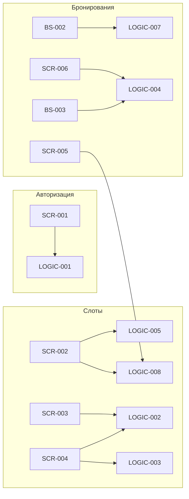

# Индекс логик

> Переиспользуемая бизнес-логика клиентского приложения «Глина».
> Экранные ТЗ ссылаются на документы этого раздела в секции «Применяемые логики».

**Статус:** Актуален · **Дата:** 2026-07-04

---

## Реестр (7 логик)

| ID | Документ | Краткое описание |
|----|----------|------------------|
| **LOGIC-001** | [OTP-авторизация и сессия](LOGIC-001_OTP-авторизация.md) | Вход по SMS OTP, JWT access/refresh, хранение токенов, 401-flow |
| **LOGIC-002** | [Расчёт доступности мест и проката](LOGIC-002_Расчёт-доступности.md) | Степпер до `max_seats_per_booking`; прокат ≤ `free_rental_boards` |
| **LOGIC-003** | [Расчёт и отображение цены брони](LOGIC-003_Расчёт-цены-брони.md) | Preview на SCR-004; итог — серверный `price_total` после создания |
| **LOGIC-004** | [Отмена брони клиентом](LOGIC-004_Отмена-ранняя-поздняя.md) | Порог **10 мин**; `can_cancel` в OpenAPI |
| **LOGIC-005** | [Фильтрация слотов](LOGIC-005_Фильтрация-слотов.md) | OR внутри группы фильтров, AND между группами; дефолт 7 дней |
| **LOGIC-007** | [Запрос push-разрешения](LOGIC-007_Запрос-push-разрешения.md) | После первой записи на BS-002 → системный push → `registerPushToken` |
| **LOGIC-008** | [Паттерн состояний экрана](LOGIC-008_Паттерн-состояний-экрана.md) | Loading / Content / Empty / Error / Refreshing; snackbar и retry |

---

## Карта применения по экранам

---

## Трассировка к требованиям

| Логика | FR | NFR |
|--------|----|----|
| LOGIC-001 | FR-1 | NFR-5 |
| LOGIC-002 | FR-8–FR-11 | NFR-8 |
| LOGIC-003 | FR-18 | NFR-8 |
| LOGIC-004 | FR-13, FR-14 | NFR-4 |
| LOGIC-005 | FR-2, FR-4 | NFR-8 |
| LOGIC-007 | FR-19, FR-20 | NFR-9, NFR-10 |
| LOGIC-008 | — | NFR-1 |

---

## Шаблон

Новые логики оформляются по [_LOGIC_TEMPLATE.md](../_LOGIC_TEMPLATE.md).

---
