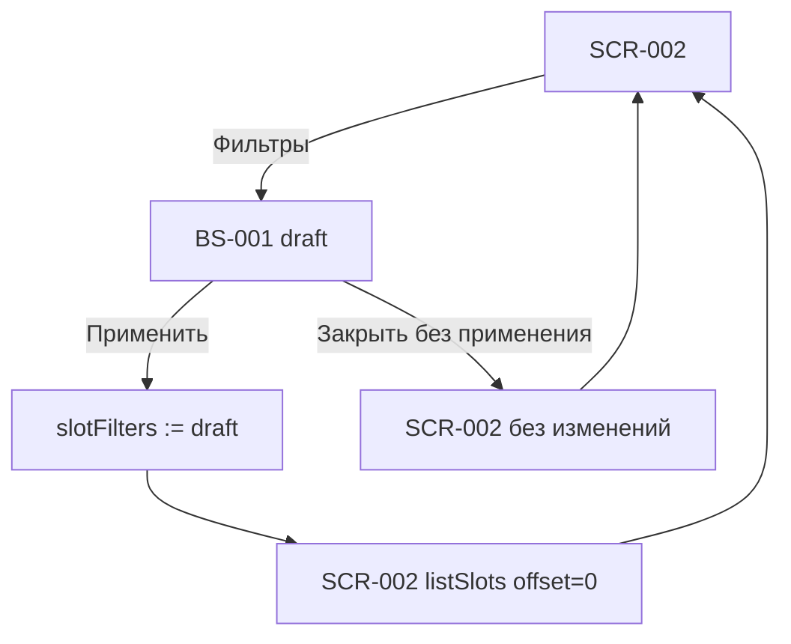
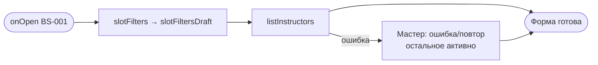

# Фильтры

**ID:** BS-001  
**Тип:** Bottom Sheet  
**Домен:** 02. Слоты и запись  
**Приоритет:** High  
**Статус:** Черновик  
**Функциональные блоки:** FB-SLOTS-002  
**Зона авторизации:** АЗ  
**Дизайн-макет:** [BS-001 Фильтры](../3-design-brief/BS-001-filters.md) — версия 0.2

---

## Содержание

- [История изменений](#история-изменений)
- [Обзор](#обзор)
- [Навигация](#навигация)
- [Входные данные](#входные-данные)
- [Применяемые логики](#применяемые-логики)
- [Свойства Bottom Sheet](#свойства-bottom-sheet)
- [Инициализация](#инициализация)
- [Используемые запросы](#используемые-запросы)
- [Макет экрана](#макет-экрана)
- [Элементы экрана](#элементы-экрана)
- [Состояния экрана](#состояния-экрана)
- [Действия пользователя](#действия-пользователя)
- [Связанные требования](#связанные-требования)
- [Критерии приёмки](#критерии-приёмки)

---

## История изменений

| Релиз | ТЗ | Описание изменений |
|-------|-----|-------------------|
| 0.1.0 | [BS-001 Фильтры](BS-001-filters.md) | Первоначальная документация |

---

## Обзор

**BS-001 «Фильтры»** — bottom sheet поверх [SCR-002](SCR-002-slot-list.md) для уточнения
выдачи каталога слотов. Шторка — **форма выбора параметров**, не экран результатов: empty state
после применения показывается на родительском SCR-002.

Поддерживаемые фильтры (FR-4): период дат, программа (`route_type`), только со свободными
местами (`only_available`), мастер (`instructor_id`). Комбинирование: **AND** между группами,
**OR** внутри мультивыбора (программа, мастер).

> **Терминология.** Чипы программы маппятся на `route_type`: «Новичковая лепка» → `novice`,
> «Гончарный круг» / «Работа на круге» → `experienced`. Имена чипов — из `route.name`
> справочника или фиксированные подписи UI, согласованные с дизайн-брифом.

### User Story

> Как клиент, я хочу задать условия отбора занятий в одной шторке,
> чтобы быстрее найти подходящий мастер-класс.

### Бизнес-ценность

- Снижает когнитивную нагрузку при выборе из длинного расписания (US-3).
- Единый UX с пресетами дат и мультивыбором без live-счётчика результатов в шторке.

---

## Навигация

### Входящая (откуда открывается)

| Источник | Триггер | Условие | Передаваемые параметры |
|----------|---------|---------|------------------------|
| [SCR-002 Список слотов](SCR-002-slot-list.md) | Тап «Фильтры» | — | текущие `slotFilters` |
| [SCR-002 Список слотов](SCR-002-slot-list.md) | Empty state «изменить фильтры» | Фильтры активны | `slotFilters` |

### Исходящая (куда ведёт)

| Назначение | Триггер | Передаваемые параметры |
|------------|---------|------------------------|
| [SCR-002 Список слотов](SCR-002-slot-list.md) | «Применить» | обновлённые `slotFilters` → перезагрузка listSlots |
| [SCR-002 Список слотов](SCR-002-slot-list.md) | Закрытие без «Применить» | без изменений `slotFilters` |

### Диаграмма навигации



---

## Входные данные

| Название | Тип | Возможные значения | Описание |
|----------|-----|-------------------|----------|
| `slotFilters` | Состояние сессии | см. LOGIC-005 | Применённые фильтры родителя |
| `slotFiltersDraft` | Состояние UI | копия / редактирование | Черновик в шторке |

---

## Применяемые логики

| Логика | Элемент/Триггер | Описание |
|--------|-----------------|----------|
| [LOGIC-005 Фильтрация слотов](09_Логики/LOGIC-005_Фильтрация-слотов.md) | Все контролы, «Применить», «Сбросить» | Модель состояния, маппинг API, дефолты |

---

## Свойства Bottom Sheet

| Свойство | Значение |
|----------|----------|
| Высота | Динамическая, до ~90% экрана; длинный контент скроллится |
| Закрытие свайпом | Да (грабер сверху) |
| Закрытие по тапу вне области | Да (бэкдроп) |
| Затемнение фона | Да |
| Кнопка закрытия | Да (✕ в header, дополнительно к swipe/backdrop) |

> Сквозные правила шторки — [foundations §4.3](../3-design-brief/00-foundations.md#43-bottom-sheet-bs-001-bs-003).

---

## Инициализация

### Диаграмма загрузки



### Запросы при открытии

| № | Запрос | Критичный | Зависит от | Условие |
|---|--------|-----------|------------|---------|
| 1 | [listInstructors](#listinstructors) | Нет | — | Если кэш справочника пуст / устарел |

---

## Используемые запросы

### listInstructors

**Тип:** REST  
**Метод:** GET  
**Спецификация:** [../api/instructors/api.yaml](../api/instructors/api.yaml) → `listInstructors`

**Триггер:** Открытие шторки (при отсутствии актуального кэша мастеров)

**Параметры:**

| Параметр | Тип | Обязательность | Источник | Описание |
|----------|-----|----------------|----------|----------|
| `limit` | int | Нет | константа | 100 (все мастера MVP) |
| `offset` | int | Нет | `0` | — |

**Обработка ответа:**

| Результат | Условие | UI-реакция |
|-----------|---------|------------|
| Загрузка | — | Скелетон в группе «Мастер» |
| Успех | `items` не пуст | Чипы имён мастеров (`instructor.id`, `instructor.name`) |
| Успех | `items` пуст | Группа «Мастер» скрыта или подпись «Нет данных» |
| HTTP 401 | — | Закрыть шторку; разлогин |
| HTTP 5xx / сеть | — | Неблокирующая ошибка + «Повторить» в группе «Мастер» |

> **Примечание.** Программы для чипов «Программа» берутся из статического маппинга
> `route_type` ↔ подписи UI (2 значения MVP) или из уникальных `route` предыдущих
> ответов `listSlots`; отдельного endpoint справочника программ нет.

---

## Макет экрана

### Структура

```
┌──────────────────────────────────────┐
│                ▭ грабер               │
├──────────────────────────────────────┤
│  Фильтры                   Сбросить ✕ │
├──────────────────────────────────────┤
│  [скролл-область фильтров]           │
│  … см. элементы …                    │
├──────────────────────────────────────┤
│ [            Применить              ] │  ← фикс. CTA
└──────────────────────────────────────┘
            ░░░ бэкдроп ░░░
```

### Компоненты

| Компонент | Описание | Обязательность |
|-----------|----------|----------------|
| Грабер | Индикатор swipe-to-close | Да |
| Header | «Фильтры», «Сбросить», ✕ | Да |
| Группы фильтров | Дата, программа, toggle, мастер | Да |
| CTA «Применить» | Primary, фиксирован внизу | Да |

---

## Элементы экрана

### 1. Header шторки

| Элемент | Описание | Источник данных | Валидация | Действие |
|---------|----------|-----------------|-----------|----------|
| Заголовок «Фильтры» | — | — | — | — |
| «Сбросить» | Сброс draft к дефолту | — | — | LOGIC-005 reset draft |
| ✕ закрытие | Закрыть без применения | — | — | Dismiss |

**Условия доступности:**
- «Сбросить» активна, если `slotFiltersDraft` отличается от дефолта.

### 2. Дата старта

| Элемент | Описание | Источник данных | Валидация | Действие |
|---------|----------|-----------------|-----------|----------|
| Пресет «Сегодня» | Быстрый диапазон | — | — | LOGIC-005 preset today |
| Пресет «Эта неделя» | Пн–вс текущей недели | — | — | preset week |
| Пресет «Выходные» | Ближайшие сб–вс | — | — | preset weekend |
| Поле «С» | date_from draft | `slotFiltersDraft.dateFrom` | ≥ сегодня | Date picker |
| Поле «По» | date_to draft | `slotFiltersDraft.dateTo` | ≥ «С» | Date picker |

**Логика:**
- [LOGIC-005](09_Логики/LOGIC-005_Фильтрация-слотов.md) — пресеты и ручной диапазон синхронизированы; ручная правка → `datePreset = custom`.
- Прошедшие даты в picker недоступны.
- Дефолт (без выбора периода в шторке): `dateFrom/dateTo = null` → API-дефолт 7 дней.

### 3. Программа

| Элемент | Описание | Источник данных | Валидация | Действие |
|---------|----------|-----------------|-----------|----------|
| Чип «Новичковая лепка» | `route_type=novice` | — | — | Toggle в `routeTypes` |
| Чип «Гончарный круг» | `route_type=experienced` | — | — | Toggle в `routeTypes` |

**Логика:**
- Мультивыбор (OR): можно выбрать оба типа.
- Ничего не выбрано → параметр `route_type` не передаётся.

### 4. Только со свободными местами

| Элемент | Описание | Источник данных | Валидация | Действие |
|---------|----------|-----------------|-----------|----------|
| Toggle | `only_available` | `slotFiltersDraft.onlyAvailable` | — | Переключение |

**Логика:**
- Дефолт: **выключен** (`false`).
- Включён → `only_available=true` в listSlots.

### 5. Мастер

| Элемент | Описание | Источник данных | Валидация | Действие |
|---------|----------|-----------------|-----------|----------|
| Чипы мастеров | Мультивыбор | `listInstructors.items[]` | — | Toggle UUID в `instructorIds` |

**Логика:**
- Мультивыбор (OR) по `instructor_id`.
- Пустой выбор → параметр не передаётся.

### 6. «Применить»

| Элемент | Описание | Источник данных | Валидация | Действие |
|---------|----------|-----------------|-----------|----------|
| Primary CTA | Применить фильтры | — | `dateTo >= dateFrom` | `slotFilters := draft`; закрыть; SCR-002 listSlots |

**Условия доступности:**
- Неактивна, если `dateTo < dateFrom`.
- В остальных случаях всегда активна (в т.ч. при пустом выборе = дефолт).

---

## Состояния экрана

### Таблица состояний

| Состояние | Условие | Отображение |
|-----------|---------|-------------|
| Default | draft = дефолт | «Сбросить» неактивна |
| HasSelection | draft ≠ дефолт | «Сбросить» активна; выбранные чипы/toggle видны |
| LoadingMasters | listInstructors в процессе | Скелетон в «Мастер» |
| MasterError | ошибка справочника | Сообщение + «Повторить»; остальные группы активны |

### Диаграмма переходов

```mermaid
stateDiagram-v2
    [*] --> Default : open + draft=applied

    Default --> HasSelection : change any control
    HasSelection --> Default : Сбросить

    Default --> Applying : Применить
    HasSelection --> Applying : Применить
    Applying --> [*] : close + SCR-002 reload

    Default --> [*] : dismiss without apply
    HasSelection --> [*] : dismiss without apply
```

---

## Действия пользователя

| Действие | Элемент | Триггер | Результат |
|----------|---------|---------|-----------|
| Применить фильтры | «Применить» | Tap | draft → slotFilters; SCR-002 listSlots offset=0 |
| Сбросить | «Сбросить» | Tap | draft = дефолт LOGIC-005 |
| Закрыть без изменений | ✕ / swipe / backdrop | Tap/Swipe | draft отбрасывается |
| Выбрать пресет даты | Чип пресета | Tap | заполнить С/По |
| Выбрать программу / мастера | Чип | Tap | toggle мультивыбора |

---

## Связанные требования

### Функциональные

| ID | Название | Приоритет |
|----|----------|-----------|
| FR-2 | Дефолтный горизонт 7 дней (сброс фильтров) | Must |
| FR-4 | Фильтрация по дате, программе, местам, мастеру | Must |

### Use cases / User stories

| ID | Связь |
|----|-------|
| UC-3 A1, E1 | Альтернативный и ошибочный сценарии фильтрации |
| US-3 | Фильтрация каталога |

---

## Критерии приёмки

### Позитивные сценарии

| ID | Критерий | Приоритет |
|----|----------|-----------|
| AC-001 | **Дано** SCR-002, **Когда** тап «Фильтры», **Тогда** BS-001 открывается с текущими применёнными значениями в draft | P0 |
| AC-002 | **Дано** выбраны фильтры, **Когда** «Применить», **Тогда** шторка закрывается, SCR-002 перезагружает listSlots с новыми query и показывает индикатор активных фильтров | P0 |
| AC-003 | **Дано** изменён draft, **Когда** «Сбросить», **Тогда** все контролы возвращаются к дефолту (7 дней, все программы/мастера, only_available=false) | P0 |
| AC-004 | **Дано** toggle «Только со свободными местами», **Когда** включён и применён, **Тогда** на SCR-002 нет слотов с «Мест нет» | P0 |
| AC-005 | **Дано** выбраны два мастера, **Когда** «Применить», **Тогда** запрос содержит `instructor_id` для обоих (OR) | P1 |

### Негативные сценарии

| ID | Критерий | Приоритет |
|----|----------|-----------|
| AC-N01 | **Дано** пользователь изменил draft, **Когда** закрывает шторку без «Применить», **Тогда** `slotFilters` на SCR-002 не меняется | P0 |
| AC-N02 | **Дано** «По» раньше «С», **Когда** отображается форма, **Тогда** «Применить» неактивна | P1 |

### Граничные условия (Edge Cases)

| ID | Критерий | Приоритет |
|----|----------|-----------|
| AC-E01 | **Дано** «Сбросить» + «Применить», **Когда** список обновлён, **Тогда** индикатор фильтров скрыт, горизонт = дефолт 7 дней | P0 |
| AC-E02 | **Дано** listInstructors недоступен, **Когда** шторка открыта, **Тогда** фильтры даты/программы/toggle доступны; группа «Мастер» показывает ошибку с повтором | P2 |
| AC-E03 | **Дано** применённые фильтры дали пустой список, **Когда** BS-001 закрыта, **Тогда** empty state отображается на SCR-002, не в шторке | P0 |

---
