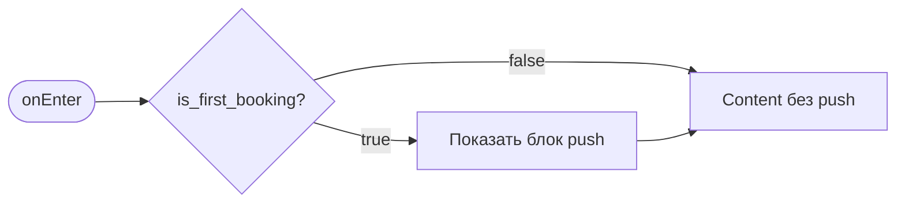

# Подтверждение записи («Вы записаны»)

**ID:** BS-002  
**Тип:** Экран  
**Домен:** 04. Запись на мастер-класс  
**Приоритет:** High  
**Статус:** Актуален  
**Функциональные блоки:** FB-BOOK-005  
**Зона авторизации:** АЗ  
**Дизайн-макет:** [BS-002-booking-success.md](../3-design-brief/BS-002-booking-success.md) — версия 0.2

---

## Содержание

- [История изменений](#история-изменений)
- [Обзор](#обзор)
- [Навигация](#навигация)
- [Входные данные](#входные-данные)
- [Применяемые логики](#применяемые-логики)
- [Инициализация](#инициализация)
- [Макет экрана](#макет-экрана)
- [Элементы экрана](#элементы-экрана)
- [Состояния экрана](#состояния-экрана)
- [Действия пользователя](#действия-пользователя)
- [Связанные требования](#связанные-требования)
- [Критерии приёмки](#критерии-приёмки)

---

## История изменений

| Релиз | ТЗ | Описание изменений |
|-------|-----|-------------------|
| 1.0.0 | BS-002-booking-success.md | Первоначальная документация |

---

## Обзор

**Полноэкранное** подтверждение успешной записи (не bottom sheet). Открывается **только** после HTTP 201 `createBooking` на SCR-004. Показывает сводку брони с серверным `price_total`, напоминание об офлайн-оплате и две CTA. При `is_first_booking = true` — триггер [LOGIC-007](09_Логики/LOGIC-007_Запрос-push-разрешения.md).

> Тип — **Экран** (Glina design). Без грабера, swipe-to-close и автозакрытия по таймеру.

### User Story

> Как клиент, я хочу однозначно увидеть, что запись прошла успешно,
> чтобы проверить параметры и перейти к «Мои записи» или каталогу занятий.

### Бизнес-ценность

- Завершение короткого пути записи (P2: ≤ 3 экранов до подтверждения).
- Единственная точка запроса push-разрешения после первой брони (FR-20).
- Обратная связь о создании — этот экран, не snackbar ([foundations §6.1](../3-design-brief/00-foundations.md#61-снеки-успеха)).

---

## Навигация

### Входящая

| Источник | Триггер | Условие | Передаваемые параметры |
|----------|---------|---------|------------------------|
| [SCR-004](SCR-004-booking.md) | HTTP 201 `createBooking` | Единственная точка входа | `CreateBookingResponse` (см. § Входные данные) |

### Исходящая

| Назначение | Триггер | Передаваемые параметры |
|------------|---------|------------------------|
| [SCR-005](SCR-005-my-bookings.md) | «Мои записи» | — |
| [SCR-002](SCR-002-slot-list.md) | «Готово» / системный back | — (стек SCR-003/004 сбрасывается) |

Таб-бар **скрыт** до перехода «Готово».

---

## Входные данные

Данные передаются из ответа `createBooking` (навигационный аргумент / ViewModel):

| Название | Тип | Описание |
|----------|-----|----------|
| `booking.id` | UUID | ID созданной брони |
| `booking.slot` | Slot | Вложенный слот |
| `booking.seats_count` | int | Число мест |
| `booking.rental_count` | int | Число прокатных мест |
| `booking.price_total` | int | Итог RUB (read-only, FR-18) |
| `is_first_booking` | boolean | Первая успешная бронь клиента |
| `reminder_hours` | int[] | Часы напоминаний с сервера (инфо; FR-20) |

**Примечание:** при открытии BS-002 **новых API-запросов нет** — данные из ответа 201.

---

## Применяемые логики

| Логика | Элемент/Триггер | Описание |
|--------|-----------------|----------|
| [LOGIC-007](09_Логики/LOGIC-007_Запрос-push-разрешения.md) | Блок push при `is_first_booking=true` | Запрос системного разрешения и `registerPushToken` |

---

## Инициализация



Запросов при открытии **нет**.

---

## Макет экрана

```
┌─────────────────────────────────────┐
│               ( ✓ )                 │
│            Вы записаны              │
│  ┌───────────────────────────────┐  │
│  │ Сводка: дата, программа,      │  │
│  │ мастер, места, price_total    │  │
│  └───────────────────────────────┘  │
│  ⓘ Оплата на месте…                │
│  [ Напомнить о занятии? ] (1-я)    │
│  [       Мои записи        ]        │
│  [         Готово          ]        │
└─────────────────────────────────────┘
```

---

## Элементы экрана

### 1. Блок успеха

| Элемент | Описание | Источник |
|---------|----------|----------|
| Иконка успеха | Форма + текст | Статический UI |
| Заголовок | **«Вы записаны»** | Статический |

### 2. Сводка брони

| Элемент | Источник данных |
|---------|-----------------|
| Дата и время | `slot.start_at` |
| Программа | `slot.route.name` |
| Мастер | `slot.instructor.name` |
| Мест | `seats_count` — «Мест: N» |
| Своё / прокат | `rental_count`, `seats_count` |
| Итого | `price_total` — «Итого: {N} ₽» |

**Правила:**

- `price_total` **не пересчитывается** на клиенте — только из ответа сервера.
- При `rental_count = 0` строка проката может быть скрыта.
- `price` / `rental_price` на верхнем уровне `booking` **не используются** — тарифы в `booking.slot`.

### 3. Напоминание об оплате

Статический текст: «Оплата на месте: наличные или перевод на карту.»

### 4. Блок push (только первая запись)

| Элемент | Условие | Действие |
|---------|---------|----------|
| «Напомнить о занятии?» | `is_first_booking = true` | — |
| «Включить» | — | [LOGIC-007](09_Логики/LOGIC-007_Запрос-push-разрешения.md) |
| «Не сейчас» | — | Закрыть блок без последствий |

При `is_first_booking = false` блок **не показывается**.

### 5. Кнопки

| Кнопка | Стиль | Действие |
|--------|-------|----------|
| «Мои записи» | Primary | → SCR-005 (таб «Мои записи») |
| «Готово» | Secondary | → SCR-002, pop SCR-003/004 из стека |

Системный «назад» ≡ «Готово».

---

## Состояния экрана

| Состояние | Условие | Отображение |
|-----------|---------|-------------|
| Content (первая запись) | 201 + `is_first_booking=true` | Сводка + push-блок + CTA |
| Content (повторная) | 201 + `is_first_booking=false` | Сводка + CTA, без push |
| Loading / Empty / Error | — | **Не применимы** (ошибки на SCR-004) |

---

## Действия пользователя

| Действие | Элемент | Результат |
|----------|---------|-----------|
| Мои записи | Primary CTA | SCR-005 |
| Готово | Secondary CTA / back | SCR-002 |
| Включить push | Push-блок | LOGIC-007 |
| Не сейчас | Push-блок | Скрыть блок |

---

## Связанные требования

| ID | Название | Приоритет |
|----|----------|-----------|
| FR-18 | Цена и фиксация записи | Must |
| FR-20 | Напоминания / push-онбординг | Should |
| NFR-9 | Push при отмене мастерской | Must |
| NFR-10 | Напоминания о записи | Средний |

---

## Критерии приёмки

| ID | Критерий | Приоритет |
|----|----------|-----------|
| AC-001 | **Дано** успешный 201 с полным `Booking`, **Когда** BS-002 открыт, **Тогда** «Вы записаны» и сводка с `price_total` с сервера | P0 |
| AC-002 | **Дано** `is_first_booking=true`, **Когда** экран открыт, **Тогда** блок «Напомнить о занятии?» | P0 |
| AC-003 | **Дано** `is_first_booking=false`, **Когда** экран открыт, **Тогда** блок push отсутствует | P0 |
| AC-004 | **Дано** BS-002, **Когда** «Готово», **Тогда** SCR-002 без SCR-003/004 в back stack | P0 |
| AC-005 | **Дано** BS-002, **Когда** «Мои записи», **Тогда** SCR-005 | P0 |
| AC-N01 | **Дано** отказ от push, **Когда** «Не сейчас», **Тогда** запись сохранена, CTA доступны | P1 |

---
