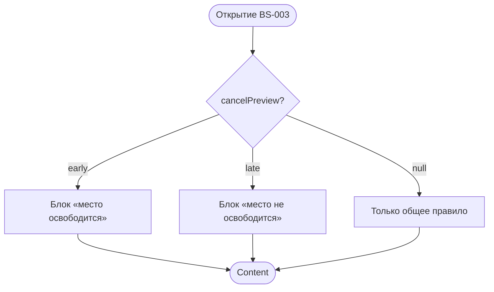

# Подтверждение отмены

**ID:** BS-003  
**Тип:** Bottom Sheet  
**Домен:** 05. Мои бронирования  
**Приоритет:** High  
**Статус:** Актуален  
**Функциональные блоки:** FB-BOOK-006  
**Зона авторизации:** АЗ  
**Дизайн-макет:** [BS-003-cancel-confirm.md](../3-design-brief/BS-003-cancel-confirm.md) — версия 0.2

---

## Содержание

- [История изменений](#история-изменений)
- [Обзор](#обзор)
- [Навигация](#навигация)
- [Входные данные](#входные-данные)
- [Применяемые логики](#применяемые-логики)
- [Свойства Bottom Sheet](#свойства-bottom-sheet)
- [Инициализация](#инициализация)
- [Используемые запросы](#используемые-запросы)
- [Макет экрана](#макет-экрана)
- [Элементы экрана](#элементы-экрана)
- [Состояния экрана](#состояния-экрана)
- [Действия пользователя](#действия-пользователя)
- [Связанные требования](#связанные-требования)
- [Критерии приёмки](#критерии-приёмки)

---

## История изменений

| Релиз | ТЗ | Описание изменений |
|-------|-----|-------------------|
| 1.0.0 | BS-003-cancel-confirm.md | Первоначальная документация |

---

## Обзор

Bottom sheet поверх [SCR-006](SCR-006-booking-details.md) для **осознанного подтверждения отмены** активной брони до старта занятия. Доступна при `can_cancel = true` (> **10 минут** до старта, UC-03); финал — `cancelBooking` ([LOGIC-004](09_Логики/LOGIC-004_Отмена-ранняя-поздняя.md)).

Результат (обновлённый статус + snackbar) отображается на **родительском SCR-006**, не в шторке.

### User Story

> Как клиент, я хочу понять последствия отмены и подтвердить её явно,
> чтобы не отменить запись случайно и знать, освободится ли место.

---

## Навигация

### Входящая

| Источник | Триггер | Условие |
|----------|---------|---------|
| [SCR-006](SCR-006-booking-details.md) | «Отменить» | `status=active`, `slot.start_at > now` |

### Исходящая

| Действие | Результат |
|----------|-----------|
| «Подтвердить отмену» + 200 | Закрыть BS-003 → SCR-006 обновлён + snackbar |
| «Не отменять» / swipe / бэкдроп | SCR-006 без изменений |

---

## Входные данные

| Название | Тип | Описание |
|----------|-----|----------|
| `bookingId` | UUID | ID отменяемой брони |
| `booking` | Booking (snapshot) | Данные с SCR-006 для предпросмотра |
| `cancelPreview` | `early` \| `late` \| null | Предпросмотр типа отмены (см. LOGIC-004) |

---

## Применяемые логики

| Логика | Элемент/Триггер | Описание |
|--------|-----------------|----------|
| [LOGIC-004](09_Логики/LOGIC-004_Отмена-ранняя-поздняя.md) | Открытие, confirm, snackbar | Ранняя/поздняя отмена, `cancelBooking` |

---

## Свойства Bottom Sheet

| Свойство | Значение |
|----------|----------|
| Высота | Динамическая (до ~90% экрана) |
| Закрытие свайпом | Да (= отказ) |
| Закрытие по тапу вне области | Да (= отказ) |
| Затемнение фона | Да |
| Кнопка закрытия | Грабер сверху |
| Анимация | Снизу вверх ([foundations §4.3](../3-design-brief/00-foundations.md#43-bottom-sheet-bs-001-bs-003)) |

---

## Инициализация



При открытии **отдельный API не вызывается** — используется snapshot с SCR-006 (`can_cancel` из последнего `getBooking`, см. LOGIC-004).

---

## Используемые запросы

### cancelBooking

**Тип:** REST  
**Метод:** POST  
**Спецификация:** [bookings/api.yaml](../api/bookings/api.yaml) → `cancelBooking`

**Триггер:** Tap «Подтвердить отмену»

**Параметры:**

| Параметр | Тип | Обязательность | Источник |
|----------|-----|----------------|----------|
| `bookingId` | UUID (path) | Да | Navigation |

**Body:** пустой.

**Обработка ответа:**

| Результат | Условие | UI-реакция |
|-----------|---------|------------|
| Загрузка | — | Loader на «Подтвердить отмену», блокировка кнопок |
| Успех | `status=cancelled` | Закрыть BS-003; SCR-006: снек **«Бронь отменена»** |
| Успех | `status=cancelled` | Закрыть BS-003; SCR-006: снек **«Запись отменена. Место освобождено»** |
| HTTP 422 | `code=slot_started` | Закрыть BS-003; SCR-006 refresh; disabled CTA |
| HTTP 409 | `code=already_cancelled` | Закрыть BS-003; SCR-006 refresh |
| HTTP 401 | — | SCR-001 |
| HTTP 5xx / сеть | — | Ошибка в шторке + повтор; статус не меняется |

Тексты снеков — [foundations §6.1](../3-design-brief/00-foundations.md#61-снеки-успеха).

---

## Макет экрана

```
┌─────────────────────────────┐
│            ▔▔▔▔              │
│  Отменить запись?            │
│  [Общее правило отмены]      │
│  [Блок текущего случая]      │
│  [ Подтвердить отмену ]      │  ← деструктивная
│  [    Не отменять    ]       │  ← primary accent
└─────────────────────────────┘
```

Параметры брони (программа, цена) **не дублируются** — контекст на SCR-006.

---

## Элементы экрана

### 1. Тексты

| Контекст | Текст |
|----------|-------|
| Заголовок | «Отменить запись?» |
| Общее правило | «Отменить запись можно, если до начала занятия осталось **более 10 минут**. Место освободится для других.» |
| Ранняя (блок случая) | «Место освободится и станет доступно другим.» |
| Поздняя (блок случая) | «Поздняя отмена: место не освобождено. Штраф не взимается.» |
| Подтверждение | «Подтвердить отмену» |
| Отказ | «Не отменять» |
| Ошибка сети | «Не удалось загрузить. Проверьте соединение и попробуйте снова.» |

**Запрещено:** угрозы штрафов, вина клиента.

### 2. Блок «текущий случай»

| `cancelPreview` | Отображение |
|-----------------|-------------|
| `early` | Общее правило + блок ранней отмены |
| `late` | Общее правило + блок поздней отмены |
| `null` | Только общее правило (оба исхода в одном тексте) |

Источник `can_cancel` — [LOGIC-004](09_Логики/LOGIC-004_Отмена-ранняя-поздняя.md) (read-only в `Booking`, сервер).

### 3. Кнопки

- **«Не отменять»** — визуально **предпочтительнее** (primary accent).
- **«Подтвердить отмену»** — деструктивная, менее акцентная.
- Тач-зоны ≥ 44 pt.

---

## Состояния экрана

| Состояние | Отображение |
|-----------|-------------|
| Content — early | Общее + блок ранней |
| Content — late | Общее + блок поздней |
| Content — neutral | Только общее правило |
| Submitting | Loader на confirm |
| Error | Сообщение + повтор в шторке |

---

## Действия пользователя

| Действие | Результат |
|----------|-----------|
| Подтвердить отмену | POST `cancelBooking` |
| Не отменять | Dismiss |
| Swipe / бэкдроп | Dismiss (= не отменять) |

---

## Связанные требования

| ID | Название | Приоритет |
|----|----------|-----------|
| FR-13 | Отмена до старта | Must |
| FR-14 | Ранняя отмена | Must |
| FR-14 | Отмена (>10 мин) | Must |

---

## Критерии приёмки

| ID | Критерий | Приоритет |
|----|----------|-----------|
| AC-001 | **Дано** `cancelPreview=early`, **Когда** BS-003 открыт, **Тогда** блок «место освободится» | P0 |
| AC-002 | **Дано** confirm → `cancelled`, **Когда** BS-003 закрыт, **Тогда** снек успеха на SCR-006 | P0 |
| AC-003 | **Дано** confirm → `cancelled`, **Когда** BS-003 закрыт, **Тогда** снек «Бронь отменена» | P0 |
| AC-004 | **Дано** swipe down, **Когда** без confirm, **Тогда** SCR-006 без изменений | P0 |
| AC-N01 | **Дано** 422 `slot_started`, **Когда** confirm, **Тогда** SCR-006 с disabled CTA | P0 |
| AC-N02 | **Дано** сеть недоступна, **Когда** confirm, **Тогда** ошибка в шторке, повтор возможен | P0 |

---
