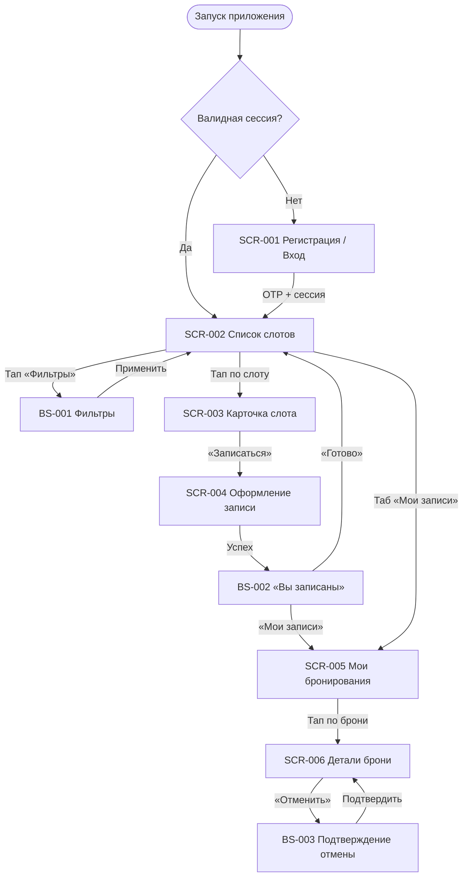

# Технические спецификации (ТЗ) · Мобильное приложение «Глина»

> **Этап 5.** Implementation-ready ТЗ клиентского мобильного приложения гончарной мастерской
> **«Глина»**: экраны, bottom sheet, переиспользуемые логики, API-контракты, критерии приёмки.

**Статус:** Черновик · **Версия:** 0.1.0 · **Дата:** 2026-07-04

**Источники:**
[Фича-лист](feature-list.md) ·
[Дизайн-брифы](../3-design-brief/) ·
[Функциональные требования](../2-requirements/functional-requirements.md) ·
[Нефункциональные требования](../2-requirements/non-functional-requirements.md) ·
[Модель данных](../4-design/data-model.md) ·
[OpenAPI](../api/redocly.yaml)

---

## 1. Назначение

Документы этого каталога — **технические спецификации для разработки** нативных клиентов iOS и Android.
Они детализируют поведение экранов, интеграцию с REST API, состояния UI, валидацию, навигацию и
критерии приёмки. Дизайн-макеты и сквозные UX-правила — в [3-design-brief](../3-design-brief/);
здесь — контракт реализации.

**MVP-скоуп:** только роль «Клиент»; слоты, программы и мастера — read-only из API; оплата офлайн.

---

## 2. Реестр документов ТЗ · Экраны и шторки

| ID | Документ ТЗ | Тип | Зона | Приоритет | Статус ТЗ | Дизайн-бриф |
|----|-------------|-----|------|-----------|-----------|-------------|
| **SCR-001** | [Регистрация / Вход](SCR-001-registration.md) | Экран | НЗ | Critical | Черновик 0.1.0 | [SCR-001-registration.md](../3-design-brief/SCR-001-registration.md) |
| **SCR-002** | [Список слотов](SCR-002-slot-list.md) | Экран | АЗ | Critical | Черновик 0.1.0 | [SCR-002-slot-list.md](../3-design-brief/SCR-002-slot-list.md) |
| **BS-001** | [Фильтры](BS-001-filters.md) | Bottom Sheet | АЗ | High | Черновик 0.1.0 | [BS-001-filters.md](../3-design-brief/BS-001-filters.md) |
| **SCR-003** | [Карточка слота](SCR-003-slot-card.md) | Экран | АЗ | Critical | Черновик 0.1.0 | [SCR-003-slot-card.md](../3-design-brief/SCR-003-slot-card.md) |
| **SCR-004** | [Оформление записи](SCR-004-booking.md) | Экран | АЗ | Critical | Черновик 0.1.0 | [SCR-004-booking.md](../3-design-brief/SCR-004-booking.md) |
| **BS-002** | [Подтверждение записи](BS-002-booking-success.md) | Экран | АЗ | High | Черновик 0.1.0 | [BS-002-booking-success.md](../3-design-brief/BS-002-booking-success.md) |
| **SCR-005** | [Мои бронирования](SCR-005-my-bookings.md) | Экран | АЗ | Critical | Черновик 0.1.0 | [SCR-005-my-bookings.md](../3-design-brief/SCR-005-my-bookings.md) |
| **SCR-006** | [Детали брони + отмена](SCR-006-booking-details.md) | Экран | АЗ | Critical | Черновик 0.1.0 | [SCR-006-booking-details.md](../3-design-brief/SCR-006-booking-details.md) |
| **BS-003** | [Подтверждение отмены](BS-003-cancel-confirm.md) | Bottom Sheet | АЗ | High | Черновик 0.1.0 | [BS-003-cancel-confirm.md](../3-design-brief/BS-003-cancel-confirm.md) |

> **Зоны:** НЗ — неавторизованная; АЗ — авторизованная (JWT-сессия).

---

## 3. Реестр логик (09_Логики)

Переиспользуемые сквозные и доменные логики. Экранные ТЗ ссылаются на них в секции «Применяемые логики».

| ID | Документ | Назначение | Статус |
|----|----------|------------|--------|
| **LOGIC-001** | [OTP-авторизация](09_Логики/LOGIC-001_OTP-авторизация.md) | OTP-поток, JWT-сессия, refresh, secure storage, 401 | Черновик 0.1.0 |
| **LOGIC-002** | [Расчёт доступности](09_Логики/LOGIC-002_Расчёт-доступности.md) | Лимиты мест и прокатного фонда на SCR-004 | Черновик 0.1.0 |
| **LOGIC-003** | [Расчёт цены брони](09_Логики/LOGIC-003_Расчёт-цены-брони.md) | Preview цены; итог — `price_total` с сервера | Черновик 0.1.0 |
| **LOGIC-004** | [Отмена брони клиентом](09_Логики/LOGIC-004_Отмена-ранняя-поздняя.md) | `cancelBooking`; порог **10 мин**; `can_cancel` | Черновик 0.1.0 |
| **LOGIC-005** | [Фильтрация слотов](09_Логики/LOGIC-005_Фильтрация-слотов.md) | Параметры фильтра, дефолт 7 дней | Черновик 0.1.0 |
| **LOGIC-007** | [Запрос push-разрешения](09_Логики/LOGIC-007_Запрос-push-разрешения.md) | После первой записи; `registerPushToken` | Черновик 0.1.0 |
| **LOGIC-008** | [Паттерн состояний экрана](09_Логики/LOGIC-008_Паттерн-состояний-экрана.md) | Loading → Content → Empty → Error (NFR-1) | Черновик 0.1.0 |

Шаблоны: [_SCREEN_TEMPLATE.md](_SCREEN_TEMPLATE.md) · [_LOGIC_TEMPLATE.md](_LOGIC_TEMPLATE.md)

---

## 4. Навигация

Полная карта переходов, таб-бар и сценарии UC — в [feature-list.md §3](feature-list.md#3-карта-навигации).

**Корневые экраны АЗ (таб-бар):** «Занятия» (SCR-002) · «Мои записи» (SCR-005).  
Подробности каркаса — [foundations §4](../3-design-brief/00-foundations.md).

---

## 5. Конвенции реализации

### 5.1 Платформа и интеграция

| Тема | Правило |
|------|---------|
| **Клиенты** | Нативные **iOS** и **Android** (отдельные кодовые базы или общий KMP — решение команды; ТЗ платформо-нейтрально) |
| **Backend** | REST API по контрактам [`01-analysis/api/`](../api/redocly.yaml); домены: `auth`, `profile`, `slots`, `bookings`, `instructors` |
| **Спецификации запросов** | В ТЗ: `operationId`, HTTP-метод, path → ссылка на `../api/{domain}/api.yaml` |
| **Авторизация API** | `Authorization: Bearer <access_token>` для защищённых операций (кроме auth OTP/refresh) |

### 5.2 Термины UI ↔ OpenAPI

Семантика домена «Глина» и имена полей JSON — по [data-model.md §Соответствие терминов](../4-design/data-model.md#соответствие-терминов-домена-и-полей-openapi):

| Термин в UI («Глина») | Поле / сущность OpenAPI | Примечание |
|------------------------|-------------------------|------------|
| **Программа** | `Route` | Не использовать «маршрут» / route в пользовательских текстах |
| **Мастер** | `Instructor` | Не «инструктор» в UI |
| **Прокатный фонд** | `free_rental_boards`, `rental_count` | Комплекты инструментов и фартука; не «доски» в UI |
| **Отменено мастерской** | `club_cancelled` | Статус брони / слота |
| **Адрес мастерской** | `meeting_point` | Текстовый адрес; **интерактивная карта вне MVP** |
| **Своё / Прокат** | агрегаты `seats_count`, `rental_count` | «Своё» = место без прокатного комплекта |

### 5.3 Данные и лимиты

- **Не хардкодить** потолки программ (6 / 10), прокатный фонд, цены, `max_seats_per_booking` — только из ответов API (NFR-8, P6 в foundations).
- Порог отмены (**10 минут**) определяет сервер через `can_cancel`.
- «Прошедшее» занятие — производное от `slot.start_at`, не отдельный статус.

### 5.4 Состояния экрана

Сквозной паттерн **Loading → Content → Empty → Error** — [LOGIC-008](09_Логики/LOGIC-008_Паттерн-состояний-экрана.md), [foundations §5](../3-design-brief/00-foundations.md#5-сквозной-паттерн-состояний-экрана).

### 5.5 Идентификаторы и трассировка

- Сохранять связи `FR-*`, `NFR-*`, `UC-*`, `SCR-*`, `BS-*`, `LOGIC-*` при изменении ТЗ.
- Критерии приёмки — формат **Дано / Когда / Тогда**.

---

## 6. Вне MVP (явно не в реестре ТЗ)

| Функция | Причина |
|---------|---------|
| **SCR-007** Экран профиля | Не в скоупе домена; имя задаётся при регистрации (SCR-001); API profile — для PATCH имени и будущего развития |
| **BS-004** Карта маршрута | Не в домене гончарной мастерской; адрес — текст `meeting_point` |
| CRUD расписания, роли мастера/владелицы | Существующая инфраструктура |
| Онлайн-оплата, публичный рейтинг | Границы скоупа MVP |

---

## 7. API-домены (справочник)

| Домен | Файл | Операции MVP |
|-------|------|--------------|
| Auth | [`../api/auth/api.yaml`](../api/auth/api.yaml) | `requestAuthCode`, `verifyAuthCode`, `refreshToken`, `logout`, `registerPushToken` |
| Profile | [`../api/profile/api.yaml`](../api/profile/api.yaml) | `updateProfile` (SCR-001); `getProfile` — опционально для кэша |
| Slots | [`../api/slots/api.yaml`](../api/slots/api.yaml) | Список, карточка, фильтры |
| Bookings | [`../api/bookings/api.yaml`](../api/bookings/api.yaml) | `createBooking`, список, детали, `cancelBooking` |
| Instructors | [`../api/instructors/api.yaml`](../api/instructors/api.yaml) | Справочник мастеров / программ для фильтров |

Линт и bundle: `npm --prefix 01-analysis/api run lint` · `npm --prefix 01-analysis/api run bundle`.

---

## 8. История изменений

| Релиз | Документ | Описание |
|-------|----------|----------|
| 0.1.0 | README.md | Первоначальный индекс ТЗ «Глина» |
| 0.1.0 | SCR-001-registration.md | ТЗ экрана регистрации / входа |
| 0.1.0 | SCR-002 … BS-003 | ТЗ экранов и шторок MVP |
| 0.1.0 | LOGIC-001 … LOGIC-008 | Переиспользуемые логики (7 шт.) |
