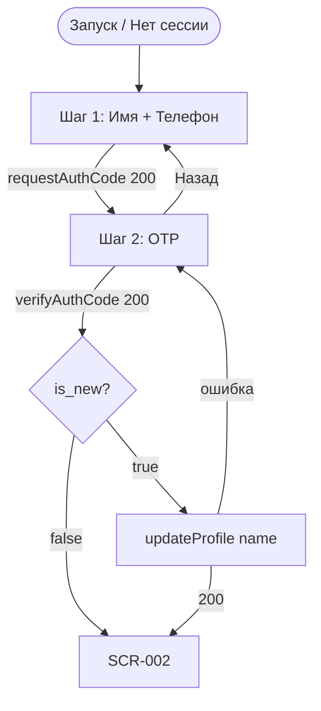
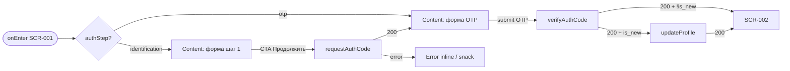
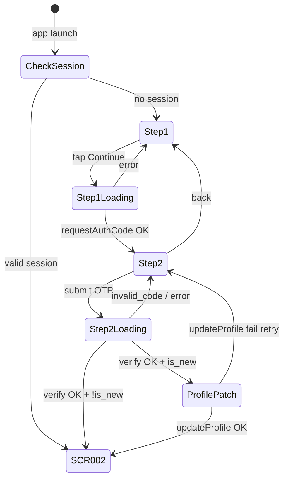

# Регистрация / Вход

**ID:** SCR-001  
**Тип:** Экран  
**Домен:** 01. Авторизация  
**Приоритет:** Critical  
**Статус:** Черновик  
**Версия:** 0.1.0  
**Функциональные блоки:** FB-AUTH-001 (форма идентификации), FB-AUTH-002 (OTP), FB-AUTH-003 (сохранение сессии)  
**Зона авторизации:** НЗ  
**Дизайн-бриф:** [SCR-001-registration.md](../3-design-brief/SCR-001-registration.md) — версия 0.2

---

## Содержание

- [История изменений](#история-изменений)
- [Обзор](#обзор)
- [Навигация](#навигация)
- [Входные данные](#входные-данные)
- [Применяемые логики](#применяемые-логики)
- [Инициализация](#инициализация)
- [Используемые запросы](#используемые-запросы)
- [Макет экрана](#макет-экрана)
- [Элементы экрана](#элементы-экрана)
- [Состояния экрана](#состояния-экрана)
- [Действия пользователя](#действия-пользователя)
- [Связанные требования](#связанные-требования)
- [Критерии приёмки](#критерии-приёмки)

---

## История изменений

| Релиз | ТЗ | Описание изменений |
|-------|-----|-------------------|
| 0.1.0 | [SCR-001-registration.md](SCR-001-registration.md) | Первоначальная спецификация: двухшаговый OTP-поток, согласование дизайн-брифа и API |

---

## Обзор

Экран **SCR-001** — единственная точка входа в приложение «Глина» для неавторизованного клиента.
Реализует регистрацию и повторный вход **без пароля** по номеру телефона с подтверждением OTP (FR-1).

Поток согласован с дизайн-брифом (имя + телефон, один сценарий без выбора «регистрация / вход») и
контрактом API (OTP, JWT, `is_new`, PATCH профиля для нового клиента):

1. **Шаг 1 — Идентификация:** имя + телефон → `requestAuthCode`.
2. **Шаг 2 — Подтверждение:** сегментированное поле OTP → `verifyAuthCode`.
3. **После verify:** если `is_new=true` → `updateProfile` с именем из шага 1; если `is_new=false` → переход в АЗ без PATCH.
4. **Сессия:** пара JWT (`access_token`, `refresh_token`) сохраняется в Keychain (iOS) / Keystore (Android).
   При следующем запуске с валидной сессией экран **пропускается** — старт на [SCR-002](SCR-002-slot-list.md).

Отдельного экрана профиля (SCR-007) в MVP нет; имя задаётся только при первичной регистрации.

### User Story

> Как **клиент**, я хочу **быстро войти по имени и телефону без пароля**,
> чтобы **сразу перейти к списку мастер-классов и записаться на занятие**.

### Бизнес-ценность

- Снижает порог входа vs Instagram Direct и ручную запись (FR-1, US-1).
- Единый поток для нового и returning-клиента — меньше путаницы в UI.
- OTP + JWT обеспечивают верификацию телефона и безопасную сессию без пароля.

---

## Навигация

### Входящая (откуда открывается)

| Источник | Триггер | Условие | Передаваемые параметры |
|----------|---------|---------|------------------------|
| Запуск приложения | `onLaunch` | Нет валидной JWT-сессии ([LOGIC-001](09_Логики/LOGIC-001_OTP-авторизация.md)) | — |
| Завершение сессии | Logout / refresh 401 без recovery | Сессия сброшена | — |
| Deep link | `glina://auth` *(опционально, post-MVP)* | Нет сессии | — |

> При **валидной сессии** SCR-001 **не показывается** — навигация сразу на SCR-002.

### Исходящая (куда ведёт)

| Назначение | Триггер | Передаваемые параметры |
|------------|---------|------------------------|
| [SCR-002 Список слотов](SCR-002-slot-list.md) | Успешный `verifyAuthCode` + (при `is_new`) успешный `updateProfile` | — |
| Шаг 2 OTP (тот же SCR-001) | Успешный `requestAuthCode` | Локально: `phone`, `name`, `ttl_seconds`, `resend_after_seconds` |

### Диаграмма навигации экрана



---

## Входные данные

| Название | Тип | Возможные значения | Описание |
|----------|-----|-------------------|----------|
| `sessionState` | Защищённое хранилище | `valid`, `expired`, `absent` | Результат проверки JWT при старте ([LOGIC-001](09_Логики/LOGIC-001_OTP-авторизация.md)) |
| `authStep` | Состояние экрана | `identification`, `otp` | Текущий подшаг SCR-001 |
| `draftName` | Локальное состояние | string | Имя, введённое на шаге 1; сохраняется при переходе на OTP и при ошибках |
| `draftPhoneE164` | Локальное состояние | string E.164 | Телефон после нормализации (`+79991234567`) |
| `otpMeta` | Память экрана | `{ ttl_seconds, resend_after_seconds, codeLength? }` | Из ответа `requestAuthCode`; `codeLength` — из demo-поля `code` или конфиг (4–6) |

---

## Применяемые логики

| Логика | Элемент/Триггер | Описание |
|--------|-----------------|----------|
| [LOGIC-001 OTP-авторизация](09_Логики/LOGIC-001_OTP-авторизация.md) | Старт приложения, все auth-запросы, сохранение токенов | JWT-сессия, refresh, secure storage, обработка 401 |
| [LOGIC-008 Паттерн состояний экрана](09_Логики/LOGIC-008_Паттерн-состояний-экрана.md) | Отправка форм / OTP | Loading на CTA; Error с сохранением введённых данных |

---

## Инициализация

При открытии SCR-001 **сетевые запросы не выполняются** — отображается шаг 1 «Идентификация»
(Content). Проверка сессии выполняется **до** роутинга на SCR-001 (см. LOGIC-001).

### Диаграмма загрузки



### Запросы при открытии

| № | Запрос | Критичный | Зависит от | Условие |
|---|--------|-----------|------------|---------|
| — | — | — | — | При открытии SCR-001 запросов нет |

> Полное описание запросов см. в секции [Используемые запросы](#используемые-запросы).

---

## Используемые запросы

### requestAuthCode

**Тип:** REST  
**Метод:** POST  
**Path:** `/auth/request-code`  
**Спецификация:** [`../api/auth/api.yaml`](../api/auth/api.yaml) → `requestAuthCode`

**Триггер:** Тап «Продолжить» на шаге 1 после успешной локальной валидации

**Headers:** без Authorization (`security: []`)

**Параметры (body JSON — `RequestCodeRequest`):**

| Параметр | Тип | Обязательность | Источник | Описание |
|----------|-----|----------------|----------|----------|
| `phone` | string | Да | Поле «Телефон», нормализация E.164 | `^\+[1-9]\d{1,14}$`, напр. `+79991234567` |

**Обработка ответа:**

| Результат | Условие | UI-реакция |
|-----------|---------|------------|
| Загрузка | — | CTA «Продолжить» → Loading; поля заблокированы |
| Успех | HTTP 200 | Сохранить `ttl_seconds`, `resend_after_seconds`; определить длину OTP (см. ниже); переход на **шаг 2** |
| HTTP 400 | `code=bad_request` | Snack / inline: «Не удалось войти. Попробуйте ещё раз»; данные формы сохранены |
| HTTP 429 | rate limit / resend | Snack: «Запросить код повторно можно через N сек» (из `message` или `resend_after_seconds`) |
| HTTP 5xx | — | Snack: «Не удалось войти. Попробуйте ещё раз» |
| Сеть | Нет соединения | «Не удалось загрузить. Проверьте соединение и попробуйте снова.» ([design brief §8](../3-design-brief/SCR-001-registration.md#8-тексты-интерфейса-микрокопия)) |

**Длина OTP-ячеек:** pattern API `^\d{4,6}$`. В demo-ответе поле `code` задаёт фактическую длину; в production — конфигурация SMS-провайдера (по умолчанию **4** ячейки, максимум **6**). UI — сегментированное поле с автофокусом и переходом между ячейками.

---

### verifyAuthCode

**Тип:** REST  
**Метод:** POST  
**Path:** `/auth/verify-code`  
**Спецификация:** [`../api/auth/api.yaml`](../api/auth/api.yaml) → `verifyAuthCode`

**Триггер:** Автоотправка при заполнении всех OTP-ячеек **или** тап «Подтвердить» (если предусмотрен вторичный CTA)

**Headers:** без Authorization

**Параметры (body JSON — `VerifyCodeRequest`):**

| Параметр | Тип | Обязательность | Источник | Описание |
|----------|-----|----------------|----------|----------|
| `phone` | string | Да | `draftPhoneE164` | Тот же номер, что на шаге 1 |
| `code` | string | Да | Сегментированное OTP-поле | 4–6 цифр, без пробелов |

**Обработка ответа (`VerifyCodeResponse`):**

| Результат | Условие | UI-реакция |
|-----------|---------|------------|
| Загрузка | — | Loading на OTP-блоке / CTA; блокировка повторного submit |
| Успех | HTTP 200 | Сохранить `tokens` (LOGIC-001); прочитать `is_new`, `client` |
| Успех + `is_new=true` | `client.name` пустое | Вызвать [updateProfile](#updateprofile) с `draftName` |
| Успех + `is_new=false` | returning client | Навигация на SCR-002 (имя из `client.name` в кэше приложения) |
| HTTP 400 | `code=invalid_code` | Inline под OTP: «Неверный код. Проверьте SMS и попробуйте снова»; очистить ячейки |
| HTTP 429 | — | Snack: слишком много попыток; таймер cooldown |
| HTTP 5xx / сеть | — | Snack по [foundations §6](../3-design-brief/00-foundations.md#6-tone-of-voice-и-микрокопия); OTP и телефон сохранены |

---

### updateProfile

**Тип:** REST  
**Метод:** PATCH  
**Path:** `/profile`  
**Спецификация:** [`../api/profile/api.yaml`](../api/profile/api.yaml) → `updateProfile`

**Триггер:** Успешный `verifyAuthCode` при `is_new=true`

**Headers:** `Authorization: Bearer {access_token}` из ответа verify

**Параметры (body JSON — `UpdateProfileRequest`):**

| Параметр | Тип | Обязательность | Источник | Описание |
|----------|-----|----------------|----------|----------|
| `name` | string | Да | `draftName` с шага 1 | `minLength: 1`, `maxLength: 100` |

**Обработка ответа:**

| Результат | Условие | UI-реакция |
|-----------|---------|------------|
| Загрузка | — | Full-screen или CTA loading (кратковременно) |
| Успех | HTTP 200, `Client` | Кэш профиля; навигация **SCR-002** |
| HTTP 400 | валидация имени | Inline на шаге 1 при возврате **или** snack «Проверьте имя…»; остаёмся в потоке auth |
| HTTP 401 | — | LOGIC-001: refresh; при неудаче — сброс на шаг 1 |
| HTTP 5xx / сеть | — | Snack + кнопка «Повторить» PATCH без повторного OTP, если токен ещё валиден |

---

**Доступные спецификации (MVP SCR-001):**

REST API (`01-analysis/api/`):
- [`auth/api.yaml`](../api/auth/api.yaml) — `requestAuthCode`, `verifyAuthCode`, `refreshToken`, `logout`
- [`auth/models.yaml`](../api/auth/models.yaml) — DTO OTP и TokenPair
- [`profile/api.yaml`](../api/profile/api.yaml) — `updateProfile`
- [`profile/models.yaml`](../api/profile/models.yaml) — `Client`, `UpdateProfileRequest`

---

## Макет экрана

Экран состоит из **двух подшагов** в одном navigation stack entry (без отдельного SCR-ID).
Таб-бар в НЗ **отсутствует** ([foundations §4.1](../3-design-brief/00-foundations.md#41-базовый-каркас)).

### Шаг 1 — Идентификация (структура)

```
┌─────────────────────────────────────┐
│  Глина                              │  ← Header / бренд
├─────────────────────────────────────┤
│                                     │
│  Войдите, чтобы записаться          │  ← пояснение
│  на мастер-класс                    │
│                                     │
│  Имя                                │
│  [________________________]         │
│                                     │
│  Телефон                            │
│  [ +7 ___ ___-__-__ ]              │
│                                     │
│  Без пароля — вход по номеру        │  ← caption
│  телефона                           │
│                                     │
├─────────────────────────────────────┤
│  [        Продолжить        ]       │  ← fixed bottom CTA
└─────────────────────────────────────┘
```

### Шаг 2 — OTP (структура)

```
┌─────────────────────────────────────┐
│  [←]  Код из SMS                    │  ← back → шаг 1
├─────────────────────────────────────┤
│                                     │
│  Отправили код на +7 *** ***-**-67  │  ← маскированный phone
│                                     │
│  [ □ ] [ □ ] [ □ ] [ □ ]            │  ← segmented OTP (4–6)
│                                     │
│  Запросить код повторно через 0:59  │  ← таймер resend_after_seconds
│                                     │
├─────────────────────────────────────┤
│  [       Подтвердить       ]        │  ← опционально, если не auto-submit
└─────────────────────────────────────┘
```

### Компоненты

| Компонент | Описание | Обязательность |
|-----------|----------|----------------|
| Header «Глина» | Бренд / приветствие | Да (шаг 1) |
| Back (шаг 2) | Возврат на шаг 1 без потери `draftName` | Да |
| Поля ввода | Имя, телефон, OTP cells | Да |
| Caption | «Без пароля — вход по номеру телефона» | Да (шаг 1) |
| Primary CTA | «Продолжить» / «Подтвердить» | Да |
| Resend timer | Обратный отсчёт `resend_after_seconds` | Да (шаг 2) |

---

## Элементы экрана

> **Терминология UI:** в текстах — «мастер-класс», «программа» (не route), «мастер» (не instructor).

### 1. Шаг 1 — Блок идентификации

| Элемент | Описание | Источник данных | Валидация | Действие |
|---------|----------|-----------------|-----------|----------|
| Заголовок «Глина» | Название приложения | — | — | — |
| Пояснение | «Войдите, чтобы записаться на мастер-класс» | [design brief §8](../3-design-brief/SCR-001-registration.md#8-тексты-интерфейса-микрокопия) | — | — |
| Поле «Имя» | Как обращаться к клиенту | `draftName` | Обязательно. Пусто → «Укажите, как к вам обращаться». Длина 1–100 символов; недопустимые символы → «Проверьте имя — кажется, тут лишние символы» | — |
| Поле «Телефон» | Национальная маска → E.164 | `draftPhoneE164` | Обязательно. Неполный → «Похоже, номер введён не полностью». Паттерн E.164 после нормализации | — |
| Подсказка | «Без пароля — вход по номеру телефона» | design brief | — | — |
| CTA «Продолжить» | Primary, full width | — | — | Валидация → [requestAuthCode](#requestauthcode) |

**Момент валидации:** при тапе «Продолжить» (не на каждый символ).

**Логика:**
- CTA «Продолжить»: disabled, пока имя и телефон не заполнены и не прошли формат-валидацию.
- Для **returning** клиента имя может быть предзаполнено из локального кэша последнего успешного входа (опционально; редактируемо).

**Условия доступности:**
- CTA активна ⟺ валидация шага 1 пройдена ∧ не Loading.

---

### 2. Шаг 2 — Блок OTP

| Элемент | Описание | Источник данных | Валидация | Действие |
|---------|----------|-----------------|-----------|----------|
| Текст получателя | «Отправили код на …» | `draftPhoneE164`, маскирование | — | — |
| OTP-ячейки | Сегментированный ввод | ввод пользователя | Только цифры; длина = `codeLength` | Auto-submit → [verifyAuthCode](#verifyauthcode) |
| Таймер resend | «Запросить код повторно через M:SS» | `resend_after_seconds` из requestAuthCode | — | По 0 → ссылка «Отправить код снова» → requestAuthCode |
| CTA «Подтвердить» | Если не auto-submit | — | Все ячейки заполнены | verifyAuthCode |
| Назад | Header back | — | — | `authStep = identification`, OTP очищается |

**Логика:**
- TTL кода (`ttl_seconds`): по истечении без успешного verify показать «Код устарел. Запросите новый» + активный resend.
- Повторный `requestAuthCode` использует тот же `phone`; имя не отправляется повторно на auth API.

**Условия доступности:**
- Resend неактивен, пока `resendTimer > 0`.
- Resend активен после таймера или при явной ошибке `invalid_code` (опционально сразу).

---

## Состояния экрана

SCR-001 — **форма**, не список данных: паттерн LOGIC-008 применяется к **отправкам** (Loading / Error),
базовое состояние — **Content** (форма видима).

### Таблица состояний

| Состояние | Условие | Отображение |
|-----------|---------|-------------|
| Content (шаг 1) | `authStep=identification` | Форма имя + телефон |
| Content (шаг 2) | `authStep=otp` | OTP + timer |
| Loading | In-flight requestAuthCode / verifyAuthCode / updateProfile | CTA loading, поля disabled |
| Validation Error | Локальная валидация | Подсветка поля + текст из §8 design brief |
| Error (network/server) | 4xx/5xx/timeout | Snack / banner; **введённые данные сохраняются** |
| Error (OTP) | `invalid_code` | Сообщение под OTP; ячейки очистить |

Empty state **не применим** (нет списковых данных).

### Диаграмма переходов



---

## Действия пользователя

| Действие | Элемент | Триггер | Результат |
|----------|---------|---------|-----------|
| Ввод имени | Поле «Имя» | Keyboard | Обновление `draftName` |
| Ввод телефона | Поле «Телефон» | Phone keyboard | Маска + E.164 в state |
| Продолжить | CTA шаг 1 | Tap | requestAuthCode → шаг 2 |
| Ввод OTP | Ячейки | Digit input | При полном коде → verifyAuthCode |
| Отправить код снова | Link после таймера | Tap | requestAuthCode (тот же phone) |
| Назад | Back шаг 2 | Tap | Шаг 1, OTP сброс |
| Повтор после ошибки сети | Snack action | Tap | Retry последнего запроса |

---

## Связанные требования

### Функциональные (FR-*)

| ID | Название | Приоритет |
|----|----------|-----------|
| FR-1 | Регистрация и вход по имени и номеру телефона | Must |

### Нефункциональные (NFR-*)

| ID | Название | Приоритет |
|----|----------|-----------|
| NFR-1 | Mobile-first UI, крупные тач-зоны | Высокий |
| NFR-5 | Доступ только к своим данным после auth | Высокий |
| NFR-8 | Контракт API — каноническая схема | Средний |

### Use Cases / User Stories

| ID | Связь |
|----|-------|
| US-1 | Быстрый вход без пароля |
| UC-1 | Вход как первый шаг сценария записи |

---

## Критерии приёмки

### Позитивные сценарии

| ID | Критерий | Приоритет |
|----|----------|-----------|
| AC-001 | **Дано** приложение без сохранённой сессии, **Когда** пользователь вводит валидные имя и телефон и нажимает «Продолжить», **Тогда** вызывается `requestAuthCode` с `phone` в E.164 и открывается шаг OTP с таймером resend | P0 |
| AC-002 | **Дано** отправлен OTP, **Когда** пользователь вводит корректный код, **Тогда** вызывается `verifyAuthCode`, токены сохраняются в Keychain/Keystore | P0 |
| AC-003 | **Дано** `verifyAuthCode` вернул `is_new=true`, **Когда** verify успешен, **Тогда** вызывается `updateProfile` с `name` из шага 1 и выполняется переход на SCR-002 | P0 |
| AC-004 | **Дано** `verifyAuthCode` вернул `is_new=false`, **Когда** verify успешен, **Тогда** `updateProfile` **не** вызывается и выполняется переход на SCR-002 | P0 |
| AC-005 | **Дано** валидная неистёкшая JWT-сессия, **Когда** пользователь запускает приложение, **Тогда** SCR-001 не показывается, открывается SCR-002 | P0 |
| AC-006 | **Дано** шаг 2 OTP, **Когда** истёк `resend_after_seconds`, **Тогда** доступна повторная отправка `requestAuthCode` на тот же номер | P1 |

### Негативные сценарии

| ID | Критерий | Приоритет |
|----|----------|-----------|
| AC-N01 | **Дано** пустое имя, **Когда** «Продолжить», **Тогда** «Укажите, как к вам обращаться» без сетевого запроса | P0 |
| AC-N02 | **Дано** неполный телефон, **Когда** «Продолжить», **Тогда** «Похоже, номер введён не полностью» | P0 |
| AC-N03 | **Дано** неверный OTP, **Когда** verify, **Тогда** HTTP 400 `invalid_code`, сообщение под полем, запрос на SCR-002 не выполняется | P0 |
| AC-N04 | **Дано** HTTP 429 на requestAuthCode, **Когда** resend слишком рано, **Тогда** пользователь видит сообщение о повторе позже, данные шага 1 сохранены | P1 |
| AC-N05 | **Дано** отсутствие сети на шаге 1, **Когда** «Продолжить», **Тогда** «Не удалось загрузить. Проверьте соединение…», поля не очищаются | P0 |

### Граничные условия (Edge Cases)

| ID | Критерий | Приоритет |
|----|----------|-----------|
| AC-E01 | **Дано** demo-ответ с `code` длиной 6, **Когда** открывается шаг 2, **Тогда** UI показывает 6 OTP-ячеек | P1 |
| AC-E02 | **Дано** успешный verify и падение `updateProfile` по сети, **Когда** пользователь нажимает «Повторить», **Тогда** PATCH повторяется без нового OTP при валидном access_token | P1 |
| AC-E03 | **Дано** пользователь на шаге 2, **Когда** нажимает «Назад», **Тогда** возвращается шаг 1 с сохранёнными именем и телефоном | P1 |
| AC-E04 | **Дано** истёк `ttl_seconds` OTP, **Когда** пользователь отправляет код, **Тогда** `invalid_code` и предложение запросить новый код | P2 |

---
