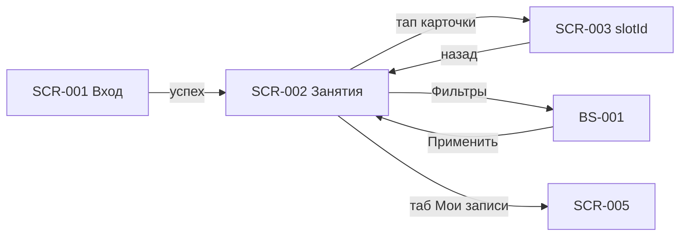
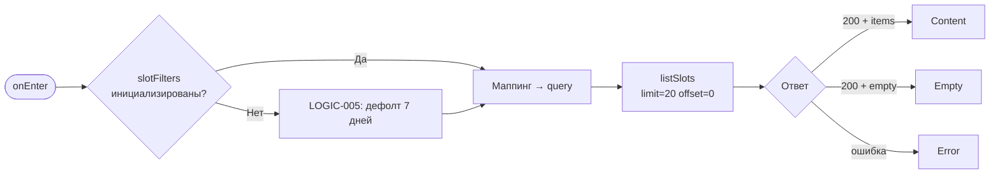
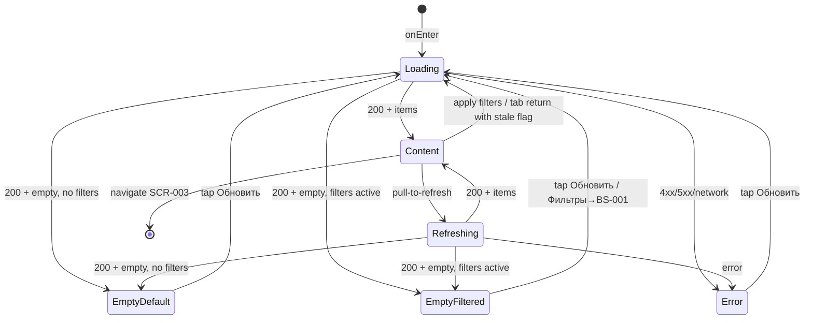

# Список слотов

**ID:** SCR-002  
**Тип:** Экран  
**Домен:** 02. Слоты и запись  
**Приоритет:** Critical  
**Статус:** Черновик  
**Функциональные блоки:** FB-SLOTS-001  
**Зона авторизации:** АЗ  
**Дизайн-макет:** [SCR-002 Список слотов](../3-design-brief/SCR-002-slot-list.md) — версия 0.2

---

## Содержание

- [История изменений](#история-изменений)
- [Обзор](#обзор)
- [Навигация](#навигация)
- [Входные данные](#входные-данные)
- [Применяемые логики](#применяемые-логики)
- [Инициализация](#инициализация)
- [Используемые запросы](#используемые-запросы)
- [Макет экрана](#макет-экрана)
- [Элементы экрана](#элементы-экрана)
- [Состояния экрана](#состояния-экрана)
- [Действия пользователя](#действия-пользователя)
- [Связанные требования](#связанные-требования)
- [Критерии приёмки](#критерии-приёмки)

---

## История изменений

| Релиз | ТЗ | Описание изменений |
|-------|-----|-------------------|
| 0.1.0 | [SCR-002 Список слотов](SCR-002-slot-list.md) | Первоначальная документация |

---

## Обзор

**SCR-002 «Занятия»** — главный экран авторизованной зоны и стартовая вкладка таб-бара.
Показывает каталог предстоящих групповых мастер-классов (слотов) с возможностью фильтрации,
обновления и перехода к карточке слота для записи.

По умолчанию отображаются слоты на **ближайшие 7 дней** (FR-2). Сортировка — по `start_at`
по возрастанию; при длинном списке — группировка по дням с sticky-заголовками секций.

> **Терминология.** Поле API `route.name` — **программа**; `instructor.name` — **мастер**.
> Числа мест (`free_seats`, `total_seats`) и цена — только из ответа API (NFR-8).

### User Story

> Как клиент, я хочу видеть ближайшие занятия с ключевыми параметрами,
> чтобы быстро выбрать подходящий мастер-класс и записаться.

### Бизнес-ценность

- Единственная точка входа в сценарий записи (BR-2, P2).
- Актуальная доступность мест через pull-to-refresh и пагинацию.
- Прозрачное отображение заполненных и отменённых слотов без скрытия данных.

---

## Навигация

### Входящая (откуда открывается)

| Источник | Триггер | Условие | Передаваемые параметры |
|----------|---------|---------|------------------------|
| [SCR-001 Регистрация / Вход](SCR-001-registration.md) | Успешный вход | Первый экран АЗ | — |
| Таб-бар | Тап «Занятия» | Из корневого экрана АЗ | — |
| [SCR-003 Карточка слота](SCR-003-slot-card.md) | «Назад» | — | — |
| [BS-001 Фильтры](BS-001-filters.md) | «Применить» / «Сбросить» + «Применить» | — | параметры фильтров (см. LOGIC-005) |
| [BS-002 Подтверждение записи](BS-002-booking-success.md) | «Готово» | — | — |

### Исходящая (куда ведёт)

| Назначение | Триггер | Передаваемые параметры |
|------------|---------|------------------------|
| [SCR-003 Карточка слота](SCR-003-slot-card.md) | Тап по карточке слота | `slotId` (= `items[].id`) |
| [BS-001 Фильтры](BS-001-filters.md) | Тап «Фильтры» | текущие `slotFilters` (LOGIC-005) |
| [SCR-005 Мои бронирования](SCR-005-my-bookings.md) | Таб «Мои записи» | — |

### Диаграмма навигации



---

## Входные данные

| Название | Тип | Возможные значения | Описание |
|----------|-----|-------------------|----------|
| `slotFilters` | Состояние сессии | см. [LOGIC-005](09_Логики/LOGIC-005_Фильтрация-слотов.md) | Применённые параметры фильтрации |
| `listOffset` | Состояние экрана | `0`, `20`, … | Смещение пагинации |
| `listLimit` | Состояние экрана | `20` (дефолт) | Размер страницы |
| `accessToken` | Защищённое хранилище | JWT | Bearer для API |

---

## Применяемые логики

| Логика | Элемент/Триггер | Описание |
|--------|-----------------|----------|
| [LOGIC-005 Фильтрация слотов](09_Логики/LOGIC-005_Фильтрация-слотов.md) | Фильтры, listSlots, индикатор | Состояние фильтров, маппинг query, дефолт 7 дней |
| [LOGIC-008 Состояния экрана](09_Логики/LOGIC-008_Паттерн-состояний-экрана.md) | Загрузка, PTR, ошибки | Loading / Content / Empty / Error / Refreshing |

---

## Инициализация

### Диаграмма загрузки



### Запросы при открытии

| № | Запрос | Критичный | Зависит от | Условие |
|---|--------|-----------|------------|---------|
| 1 | [listSlots](#listslots) | Да | — | Всегда при onEnter / смене фильтров |

> Полное описание запросов см. в секции [Используемые запросы](#используемые-запросы).

---

## Используемые запросы

### listSlots

**Тип:** REST  
**Метод:** GET  
**Спецификация:** [../api/slots/api.yaml](../api/slots/api.yaml) → `listSlots`

**Триггер:** Инициализация, pull-to-refresh, применение фильтров, подгрузка следующей страницы

**Параметры:**

| Параметр | Тип | Обязательность | Источник | Описание |
|----------|-----|----------------|----------|----------|
| `date_from` | date-time | Нет | `slotFilters.dateFrom` (LOGIC-005) | Дефолт API: текущий момент |
| `date_to` | date-time | Нет | `slotFilters.dateTo` (LOGIC-005) | Дефолт API: date_from + 7 дней |
| `route_type` | string[] | Нет | `slotFilters.routeTypes` | `novice` / `experienced` |
| `instructor_id` | uuid[] | Нет | `slotFilters.instructorIds` | Фильтр по мастерам |
| `only_available` | boolean | Нет | `slotFilters.onlyAvailable` | Дефолт API: `false` |
| `limit` | int | Нет | `listLimit` | Дефолт 20, max 100 |
| `offset` | int | Нет | `listOffset` | Дефолт 0 |

**Обработка ответа:**

| Результат | Условие | UI-реакция |
|-----------|---------|------------|
| Загрузка | первичная | Скелетон карточек (LOGIC-008 Loading) |
| Загрузка | PTR / фильтры | Refreshing поверх Content (LOGIC-008) |
| Успех | `items` не пуст | Content: список карточек |
| Успех | `items` пуст, фильтры не активны | Empty: «Пока нет доступных занятий» |
| Успех | `items` пуст, фильтры активны | Empty: «Нет слотов по условиям…» + действие «Фильтры» |
| Успех | `offset + limit < meta.total` | Показать триггер подгрузки / infinite scroll |
| HTTP 400 | — | Error state; снек из `message` |
| HTTP 401 | — | Очистка сессии → SCR-001 |
| HTTP 5xx | — | Error state с кнопкой «Обновить» |
| Сеть | Нет соединения | Error state с кнопкой «Обновить» |

**Маппинг полей карточки (`SlotSummary`):**

| UI | Поле API | Формат |
|----|----------|--------|
| Дата и время | `start_at` | Локаль TZ клуба: «Сб, 5 июля · 14:00» |
| Программа | `route.name` | Как в ответе |
| Мастер | `instructor.name` | «Мастер: {name}» |
| Цена | `price` | «{price} ₽» |
| Места | `free_seats`, `total_seats` | «Свободно {free_seats} из {total_seats}» |
| Статус отмены | `status` | `cancelled` → бейдж «Занятие отменено мастерской» |

---

## Макет экрана

### Структура

```
┌─────────────────────────────────────┐
│ Занятия              [⚙ Фильтры •]  │  ← Header
├─────────────────────────────────────┤
│ ── Сб, 5 июля ──                    │  ← Sticky секция (день)
│ ┌─────────────────────────────────┐ │
│ │ Карточка слота                  │ │
│ └─────────────────────────────────┘ │
│              ⋮ (скролл + PTR)       │
├─────────────────────────────────────┤
│ [ Занятия ]    [ Мои записи ]       │  ← Tab bar
└─────────────────────────────────────┘
```

### Компоненты

| Компонент | Описание | Обязательность |
|-----------|----------|----------------|
| Header | Заголовок «Занятия», кнопка «Фильтры» | Да |
| Индикатор фильтров | Точка/бейдж на «Фильтры» | Нет (при активных фильтрах) |
| Список карточек | Scroll + pull-to-refresh | Да |
| Секции по дням | Sticky-заголовок даты | Да (при >1 дня в выдаче) |
| Tab bar | «Занятия» (активна) / «Мои записи» | Да |

---

## Элементы экрана

### 1. Header

| Элемент | Описание | Источник данных | Валидация | Действие |
|---------|----------|-----------------|-----------|----------|
| Заголовок «Занятия» | Название экрана | — | — | — |
| Кнопка «Фильтры» | Иконка + текст | — | — | Открыть [BS-001](BS-001-filters.md) |
| Индикатор активных фильтров | Точка / бейдж | `hasActiveFilters` (LOGIC-005) | — | Открыть BS-001 |

**Логика:**
- Индикатор: [LOGIC-005](09_Логики/LOGIC-005_Фильтрация-слотов.md) — виден при `hasActiveFilters = true`; дублируется не только цветом.

### 2. Карточка слота

| Элемент | Описание | Источник данных | Валидация | Действие |
|---------|----------|-----------------|-----------|----------|
| Дата и время | Старт занятия | `start_at` | — | — |
| Программа | Название программы | `route.name` | — | — |
| Мастер | Ведущий | `instructor.name` | — | — |
| Цена | За место | `price` | — | — |
| Свободные места | Доступность | `free_seats`, `total_seats` | — | — |
| Пометка «Мест нет» | Нет свободных мест | `free_seats == 0` | — | — |
| Бейдж отмены | Слот отменён мастерской | `status == cancelled` | — | — |

**Логика:**
- Карточка **кликабельна**, если `free_seats > 0` AND `status == scheduled` → переход на [SCR-003](SCR-003-slot-card.md) с `slotId`.
- Карточка **некликабельна**, если `free_seats == 0` (пометка «Мест нет») OR `status == cancelled` (бейдж «Занятие отменено мастерской»).
- Числа мест — из API; **не** подставлять хардкод лимитов программы (6/10).

**Условия доступности:**
- Тап-зона карточки активна только для кликабельных слотов (≥ 44 pt).

### 3. Pull-to-refresh

| Элемент | Описание | Источник данных | Валидация | Действие |
|---------|----------|-----------------|-----------|----------|
| Жест PTR | Обновление списка | — | — | `listSlots` offset=0 |

**Логика:**
- [LOGIC-008](09_Логики/LOGIC-008_Паттерн-состояний-экрана.md) — Refreshing: контент остаётся на экране, индикатор поверх списка.
- После успеха — заменить данные; сбросить `listOffset` в 0.

### 4. Пагинация

| Элемент | Описание | Источник данных | Валидация | Действие |
|---------|----------|-----------------|-----------|----------|
| Подгрузка / infinite scroll | Следующая страница | `meta.total`, `meta.offset`, `meta.limit` | — | `listSlots` с увеличенным `offset` |

**Логика:**
- При достижении конца списка и `offset + items.length < meta.total` — запрос с `offset += limit`.
- При смене фильтров или PTR — `offset = 0`, список заменяется (не append).

### 5. Tab bar

| Элемент | Описание | Источник данных | Валидация | Действие |
|---------|----------|-----------------|-----------|----------|
| «Занятия» | Активная вкладка | — | — | — |
| «Мои записи» | Вторая вкладка | — | — | Переход на [SCR-005](SCR-005-my-bookings.md) |

---

## Состояния экрана

### Таблица состояний

| Состояние | Условие | Отображение |
|-----------|---------|-------------|
| Loading | Первичный запрос | Скелетон карточек |
| Content | 200 + items | Список слотов с секциями по дням |
| Empty (нет расписания) | 200 + empty, фильтры = дефолт | «Пока нет доступных занятий» + «Обновить» |
| Empty (фильтры) | 200 + empty, фильтры активны | «Нет слотов по условиям. Попробуйте изменить фильтры.» + «Фильтры» |
| Error | 4xx/5xx/сеть | «Не удалось загрузить…» + «Обновить» |
| Refreshing | PTR / повторный запрос при Content | Список + индикатор обновления |

### Диаграмма переходов



---

## Действия пользователя

| Действие | Элемент | Триггер | Результат |
|----------|---------|---------|-----------|
| Открыть карточку слота | Карточка (доступная) | Tap | SCR-003 с `slotId` |
| Открыть фильтры | «Фильтры» | Tap | BS-001 |
| Обновить список | Pull-to-refresh | Pull | listSlots offset=0 |
| Подгрузить ещё | Конец списка | Scroll | listSlots offset+=limit |
| Перейти к записям | «Мои записи» | Tap | SCR-005 |
| Повторить загрузку | «Обновить» | Tap | listSlots |
| Изменить фильтры из empty | «Фильтры» / CTA | Tap | BS-001 |

---

## Связанные требования

### Функциональные

| ID | Название | Приоритет |
|----|----------|-----------|
| FR-2 | Список слотов на 7 дней, состав карточки | Must |
| FR-3 | Empty state «Пока нет доступных занятий» | Must |
| FR-4 | Фильтрация списка | Must |

### Нефункциональные

| ID | Название | Приоритет |
|----|----------|-----------|
| NFR-1 | Mobile-first, паттерн состояний | Must |
| NFR-8 | Данные мест и цены из API | Must |

### Use cases / User stories

| ID | Связь |
|----|-------|
| UC-3 | Просмотр и фильтрация слотов |
| US-2 | Просмотр ближайших занятий |
| US-3 | Фильтрация каталога |

---

## Критерии приёмки

### Позитивные сценарии

| ID | Критерий | Приоритет |
|----|----------|-----------|
| AC-001 | **Дано** авторизованный клиент, **Когда** открывается SCR-002, **Тогда** выполняется `listSlots` с дефолтом 7 дней и отображаются карточки с датой, программой, мастером, местами и ценой | P0 |
| AC-002 | **Дано** слот с `free_seats > 0` и `status=scheduled`, **Когда** тап по карточке, **Тогда** открывается SCR-003 с корректным `slotId` | P0 |
| AC-003 | **Дано** активные фильтры, **Когда** отображается header, **Тогда** на «Фильтры» виден индикатор (не только цветом) | P0 |
| AC-004 | **Дано** список загружен, **Когда** pull-to-refresh, **Тогда** список обновляется без полной очистки контента | P0 |
| AC-005 | **Дано** `meta.total > limit`, **Когда** пользователь доскроллил до конца, **Тогда** подгружается следующая страница с `offset += limit` | P1 |
| AC-006 | **Дано** слоты нескольких дней, **Когда** отображается список, **Тогда** слоты сгруппированы по дням с sticky-заголовками | P1 |

### Негативные сценарии

| ID | Критерий | Приоритет |
|----|----------|-----------|
| AC-N01 | **Дано** ошибка сети, **Когда** открытие экрана, **Тогда** error state с «Обновить» | P0 |
| AC-N02 | **Дано** `free_seats == 0`, **Когда** отображается карточка, **Тогда** пометка «Мест нет», карточка некликабельна | P0 |
| AC-N03 | **Дано** `status == cancelled`, **Когда** отображается карточка, **Тогда** бейдж «Занятие отменено мастерской», карточка некликабельна | P0 |

### Граничные условия (Edge Cases)

| ID | Критерий | Приоритет |
|----|----------|-----------|
| AC-E01 | **Дано** API вернул пустой список без активных фильтров, **Когда** empty state, **Тогда** текст «Пока нет доступных занятий» | P0 |
| AC-E02 | **Дано** API вернул пустой список с активными фильтрами, **Когда** empty state, **Тогда** текст «Нет слотов по условиям…» и действие открыть BS-001 | P0 |
| AC-E03 | **Дано** клиент вернулся из SCR-003, **Когда** SCR-002 снова виден, **Тогда** сохранены фильтры и позиция списка в сессии | P2 |

---
