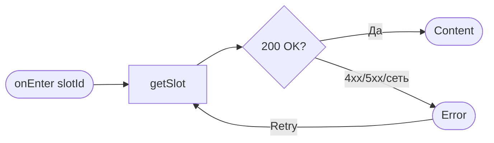
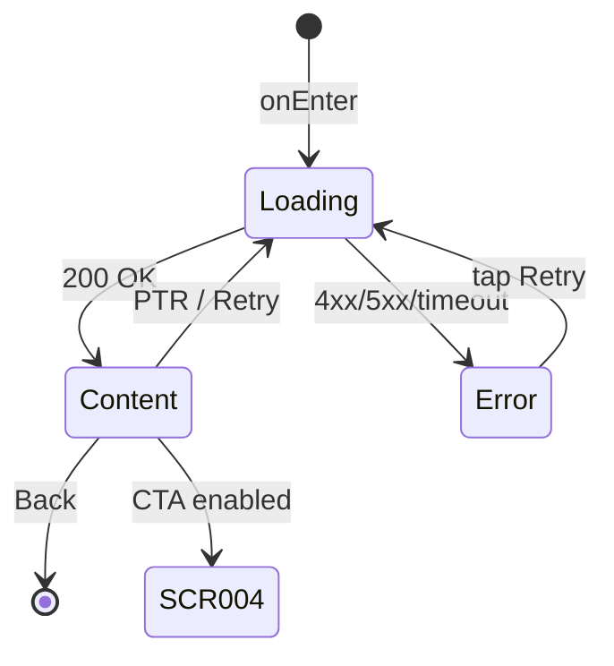

# Карточка слота

**ID:** SCR-003  
**Тип:** Экран  
**Домен:** 03. Слоты и запись  
**Приоритет:** Critical  
**Статус:** Черновик  
**Функциональные блоки:** FB-SLOT-003  
**Зона авторизации:** АЗ  
**Дизайн-макет:** [SCR-003-slot-card.md](../3-design-brief/SCR-003-slot-card.md) — версия 0.2

---

## Содержание

- [История изменений](#история-изменений)
- [Обзор](#обзор)
- [Навигация](#навигация)
- [Входные данные](#входные-данные)
- [Применяемые логики](#применяемые-логики)
- [Инициализация](#инициализация)
- [Используемые запросы](#используемые-запросы)
- [Макет экрана](#макет-экрана)
- [Элементы экрана](#элементы-экрана)
- [Состояния экрана](#состояния-экрана)
- [Действия пользователя](#действия-пользователя)
- [Связанные требования](#связанные-требования)
- [Критерии приёмки](#критерии-приёмки)

---

## История изменений

| Релиз | ТЗ | Описание изменений |
|-------|-----|-------------------|
| 0.1.0 | [SCR-003-slot-card.md](SCR-003-slot-card.md) | Первоначальная документация |

---

## Обзор

Экран показывает **полные параметры одного мастер-класса (слота)** — программу, мастера, дату/время, доступность мест и прокатного фонда, цены и адрес мастерской — чтобы клиент принял решение о записи. Промежуточный шаг между списком занятий (SCR-002) и оформлением записи (SCR-004). Вложенный экран без таб-бара.

**Карта в MVP не используется.** Адрес мастерской отображается только текстом (`meeting_point`).

### User Story

> Как **клиент**, я хочу **увидеть все параметры выбранного занятия**,
> чтобы **решить, записываться ли, и перейти к оформлению**.

### Бизнес-ценность

- Снижает неопределённость перед записью: время, место, цена, доступность.
- Честно показывает недоступность (нет мест, отмена, прошедшее занятие) без «глухого» CTA.
- Замыкает шаг 3 сценария UC-1 между каталогом и формой брони.

---

## Навигация

### Входящая (откуда открывается)

| Источник | Триггер | Условие | Передаваемые параметры |
|----------|---------|---------|------------------------|
| [SCR-002 Список слотов](SCR-002-slot-list.md) | Тап по карточке слота | Всегда (список может передавать любой слот) | `slotId` (UUID) |

### Исходящая (куда ведёт)

| Назначение | Триггер | Передаваемые параметры |
|------------|---------|------------------------|
| [SCR-004 Оформление записи](SCR-004-booking.md) | Тап «Записаться» | `slotId` |
| [SCR-002 Список слотов](SCR-002-slot-list.md) | «Назад» | — |

---

## Входные данные

| Название | Тип | Возможные значения | Описание |
|----------|-----|-------------------|----------|
| `slotId` | Состояние навигации | UUID | Идентификатор слота из SCR-002 |
| `slotSummary` | Кэш (опционально) | `SlotSummary` | Данные из списка для оптимистичного скелетона; перезаписываются ответом `getSlot` |

---

## Применяемые логики

> На этом экране переиспользуемые логики из [09_Логики](09_Логики/) **не применяются**. Расчёт лимитов и цены — на SCR-004 ([LOGIC-002](09_Логики/LOGIC-002_Расчёт-доступности.md), [LOGIC-003](09_Логики/LOGIC-003_Расчёт-цены-брони.md)).

| Логика | Элемент/Триггер | Описание |
|--------|-----------------|----------|
| — | — | — |

---

## Инициализация

### Диаграмма загрузки



### Запросы при открытии

| № | Запрос | Критичный | Зависит от | Условие |
|---|--------|-----------|------------|---------|
| 1 | [getSlot](#getslot) | Да | — | Всегда при наличии `slotId` |

> Полное описание запросов см. в секции [Используемые запросы](#используемые-запросы).

---

## Используемые запросы

### getSlot

**Тип:** REST  
**Метод:** GET  
**Спецификация:** [../api/slots/api.yaml](../api/slots/api.yaml) → `getSlot`

**Триггер:** Инициализация; повтор по кнопке «Обновить» (error state / pull-to-refresh)

**Параметры:**

| Параметр | Тип | Обязательность | Источник | Описание |
|----------|-----|----------------|----------|----------|
| `slotId` | string (UUID) | Да | Навигация | Path-параметр `/slots/{slotId}` |
| `Authorization` | header | Да | Сессия | Bearer-токен клиента |

**Обработка ответа:**

| Результат | Условие | UI-реакция |
|-----------|---------|------------|
| Загрузка | — | Скелетон блоков параметров + placeholder CTA |
| Успех | HTTP 200, тело `Slot` | Отобразить контент; вычислить состояние CTA (см. [§ CTA](#7-cta-записаться)) |
| HTTP 401 | — | Переход на SCR-001 (сессия истекла) |
| HTTP 404 | — | Error state: «Занятие не найдено» + «Обновить» / «Назад» |
| HTTP 4xx/5xx | прочие | Error state + «Обновить» |
| Сеть | Нет соединения | Error state + «Обновить» |

**Маппинг полей ответа → UI:**

| Поле API | Элемент UI |
|----------|------------|
| `start_at` | Дата и время старта (локальная TZ устройства) |
| `route.name` | Название программы |
| `route.type` | Бейдж типа: `novice` → «Новичковая», `experienced` → «На круге» |
| `route.duration_min` | Длительность «~X ч Y мин»; блок скрыт, если поле отсутствует |
| `instructor.name` | Имя мастера |
| `instructor.photo_url` | Фото мастера; null → placeholder с инициалами (Q8) |
| `free_seats`, `total_seats` | «Свободно N из M» |
| `free_rental_boards` | «Свободно N комплект(ов)» |
| `price` | «N ₽ за место» |
| `meeting_point` | Адрес мастерской (текст) |
| `status` | Влияет на CTA и бейдж отмены |

> Поля `meeting_point_lat`, `meeting_point_lng`, `route.geometry` в MVP **не отображаются**.

**Форматирование длительности:** `duration_min` → «~{часы} ч {минуты} мин»; если минуты = 0 — «~{часы} ч». Пример: 150 → «~2 ч 30 мин».

**Признак «прошедшее»:** `isPast = start_at < now()` (UTC сравнение с серверным временем; при расхождении часов устройства — предпочтительно опираться на `Date` из ответа API). Отдельного статуса «past» в API нет (FR-12, data-model).

---

## Макет экрана

### Структура

```
┌─────────────────────────────────────┐
│ [←] Мастер-класс                     │  ← Header (фикс.)
├─────────────────────────────────────┤
│                                     │
│  Сб, 20 июля · 14:00                │  ← Scrollable
│  ┌─────────────────────────────┐   │
│  │ Программа / Мастер / Места  │   │
│  │ Прокат / Цена / Адрес       │   │
│  └─────────────────────────────┘   │
│  Оплата на месте: …                 │
│                                     │
├─────────────────────────────────────┤
│        [   Записаться   ]           │  ← Fixed Bottom CTA
└─────────────────────────────────────┘
```

### Компоненты

| Компонент | Описание | Обязательность |
|-----------|----------|----------------|
| Header | «Назад» + заголовок «Мастер-класс» (или `route.name`) | Да |
| Блоки параметров | Карточки «лейбл + значение» | Да |
| Бейдж типа программы | Текст + форма, не только цвет | Да |
| Напоминание об оплате | Под блоком цены | Да |
| Primary CTA | «Записаться», фиксирован внизу | Да |

---

## Элементы экрана

### 1. Header

| Элемент | Описание | Источник данных | Валидация | Действие |
|---------|----------|-----------------|-----------|----------|
| Кнопка «Назад» | Возврат в список | — | — | Pop на [SCR-002](SCR-002-slot-list.md) |
| Заголовок | «Мастер-класс» или название программы | `route.name` из getSlot | — | — |

### 2. Дата и время

| Элемент | Описание | Источник данных | Валидация | Действие |
|---------|----------|-----------------|-----------|----------|
| Дата/время старта | «Сб, 20 июля · 14:00» | `start_at` | — | — |

**Логика:**
- Формат: краткий день недели, число, месяц, время (локаль `ru-RU`).

### 3. Блок «Программа»

| Элемент | Описание | Источник данных | Валидация | Действие |
|---------|----------|-----------------|-----------|----------|
| Название | «Лепка для новичков» | `route.name` | — | — |
| Бейдж типа | «Новичковая» / «На круге» | `route.type` | — | — |
| Длительность | «~2 ч 30 мин» | `route.duration_min` | — | — |

**Логика:**
- Блок длительности **скрыт**, если `route.duration_min` отсутствует или ≤ 0.
- Описание программы (`route.description`) в MVP **не показывается**.

### 4. Блок «Мастер»

| Элемент | Описание | Источник данных | Валидация | Действие |
|---------|----------|-----------------|-----------|----------|
| Имя мастера | «Анна» | `instructor.name` | — | — |

### 5. Блок «Места»

| Элемент | Описание | Источник данных | Валидация | Действие |
|---------|----------|-----------------|-----------|----------|
| Доступность | «Свободно N из M» | `free_seats`, `total_seats` | — | — |

### 6. Блок «Прокатный фонд»

| Элемент | Описание | Источник данных | Валидация | Действие |
|---------|----------|-----------------|-----------|----------|
| Доступность проката | «Свободно N комплект(ов)» | `free_rental_boards` | — | — |

> Числа **не хардкодятся** (6 мест, 12 комплектов и т.п.) — только из ответа API (P6, FR-5).

### 7. Блок «Цена»

| Элемент | Описание | Источник данных | Валидация | Действие |
|---------|----------|-----------------|-----------|----------|
| Цена за место | «2 500 ₽ за место» | `price` | — | — |
| Напоминание | «Оплата на месте: наличные или перевод на карту.» | Константа UI | — | — |

> `rental_price` на карточке **не дублируется** отдельной строкой; прокатный тариф показывается на SCR-004 при выборе «Прокат».

### 8. Блок «Адрес»

| Элемент | Описание | Источник данных | Валидация | Действие |
|---------|----------|-----------------|-----------|----------|
| Адрес | «Адрес: ул. Гончарная, 12» | `meeting_point` | — | — |

**Логика:**
- Только текст; без карты, без «Открыть на карте», без использования `meeting_point_lat/lng`.

### 9. CTA «Записаться»

| Элемент | Описание | Источник данных | Валидация | Действие |
|---------|----------|-----------------|-----------|----------|
| Кнопка «Записаться» | Primary, во всю ширину | Вычисляемое состояние | — | Переход на [SCR-004](SCR-004-booking.md) с `slotId` |

**Логика:**
- **Enabled**, если одновременно: `status = scheduled`, `free_seats > 0`, `isPast = false`.
- **Disabled + подпись «Мест нет»**, если: `status = scheduled`, `free_seats = 0`, `isPast = false`.
- **Disabled + бейдж «Занятие отменено мастерской»**, если: `status = cancelled` (FR-17, UC-1 E4).
- **Disabled + подпись «Занятие уже прошло»** (или аналог по макету), если: `isPast = true` (запись недоступна).
- При disabled тап **не выполняет** переход.

**Условия доступности:**

| Условие | CTA |
|---------|-----|
| `scheduled` ∧ `free_seats > 0` ∧ ¬`isPast` | Active «Записаться» |
| `scheduled` ∧ `free_seats = 0` | Disabled «Мест нет» |
| `status = cancelled` | Disabled + бейдж «Занятие отменено мастерской» |
| `isPast = true` | Disabled «Занятие уже прошло» |

---

## Состояния экрана

### Таблица состояний

| Состояние | Условие | Отображение |
|-----------|---------|-------------|
| Loading | Ожидание getSlot | Скелетон блоков + placeholder CTA |
| Content | HTTP 200 | Все параметры слота + CTA по правилам §9 |
| Error | 4xx/5xx/timeout/сеть | Заглушка ошибки + «Обновить» |
| Нет свободных мест | Content + `free_seats = 0` | Параметры + CTA disabled «Мест нет» |
| Занятие отменено | Content + `status = cancelled` | Параметры + бейдж отмены + CTA disabled |
| Занятие прошло | Content + `isPast` | Параметры + CTA disabled «Занятие уже прошло» |

### Диаграмма переходов



---

## Действия пользователя

| Действие | Элемент | Триггер | Результат |
|----------|---------|---------|-----------|
| Вернуться в каталог | «Назад» | Tap | [SCR-002](SCR-002-slot-list.md) |
| Записаться | «Записаться» | Tap (enabled) | [SCR-004](SCR-004-booking.md) + `slotId` |
| Обновить данные | «Обновить» / PTR | Tap / Pull | Повтор [getSlot](#getslot) |

---

## Связанные требования

### Функциональные (FR)

| ID | Название | Приоритет |
|----|----------|-----------|
| FR-5 | Карточка слота с параметрами занятия | Must |
| FR-17 | Запрет записи на отменённый мастерской слот | Must |
| FR-18 | Отображение цены занятия | Must |

### Use cases

| ID | Связь |
|----|-------|
| UC-1 | Шаг 3 основного потока — просмотр карточки перед оформлением |

### User stories

| ID | Название |
|----|----------|
| US-4 | Просмотр карточки слота |

### Дизайн

| Артефакт | Ссылка |
|----------|--------|
| Design brief | [SCR-003-slot-card.md](../3-design-brief/SCR-003-slot-card.md) |
| Foundations | [00-foundations.md](../3-design-brief/00-foundations.md) §4.5 (адрес без карты) |

---

## Критерии приёмки

### Позитивные сценарии

| ID | Критерий | Приоритет |
|----|----------|-----------|
| AC-001 | **Дано** авторизованный клиент и слот с `free_seats > 0`, `status = scheduled`, старт в будущем, **Когда** открывается SCR-003, **Тогда** отображаются программа, мастер, дата/время, места, прокат, цена, адрес и активная кнопка «Записаться» | P0 |
| AC-002 | **Дано** активная кнопка «Записаться», **Когда** клиент нажимает её, **Тогда** открывается SCR-004 с тем же `slotId` | P0 |
| AC-003 | **Дано** слот с `route.duration_min = 150`, **Когда** загружена карточка, **Тогда** отображается «~2 ч 30 мин» | P1 |
| AC-004 | **Дано** слот без `duration_min`, **Когда** загружена карточка, **Тогда** блок длительности скрыт | P1 |

### Негативные сценарии

| ID | Критерий | Приоритет |
|----|----------|-----------|
| AC-N01 | **Дано** ошибка сети при getSlot, **Когда** открытие экрана, **Тогда** error state с «Обновить» | P0 |
| AC-N02 | **Дано** `free_seats = 0`, **Когда** карточка загружена, **Тогда** CTA disabled с текстом «Мест нет», переход на SCR-004 невозможен | P0 |
| AC-N03 | **Дано** `status = cancelled`, **Когда** карточка загружена, **Тогда** бейдж «Занятие отменено мастерской» и CTA disabled | P0 |
| AC-N04 | **Дано** `start_at` в прошлом, **Когда** карточка загружена, **Тогда** CTA disabled («Занятие уже прошло») | P0 |
| AC-N05 | **Дано** HTTP 404, **Когда** getSlot, **Тогда** error state, переход на SCR-004 недоступен | P1 |

### Граничные условия (Edge Cases)

| ID | Критерий | Приоритет |
|----|----------|-----------|
| AC-E01 | **Дано** `free_rental_boards = 0`, **Когда** карточка загружена, **Тогда** отображается «Свободно 0 комплектов», CTA остаётся enabled при `free_seats > 0` | P1 |
| AC-E02 | **Дано** на экране нет интерактивной карты и ссылок «Открыть на карте» | P0 |

---
