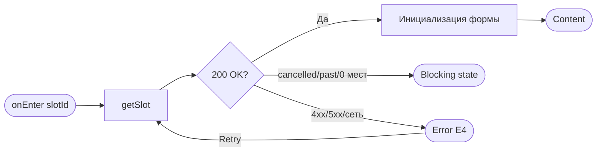
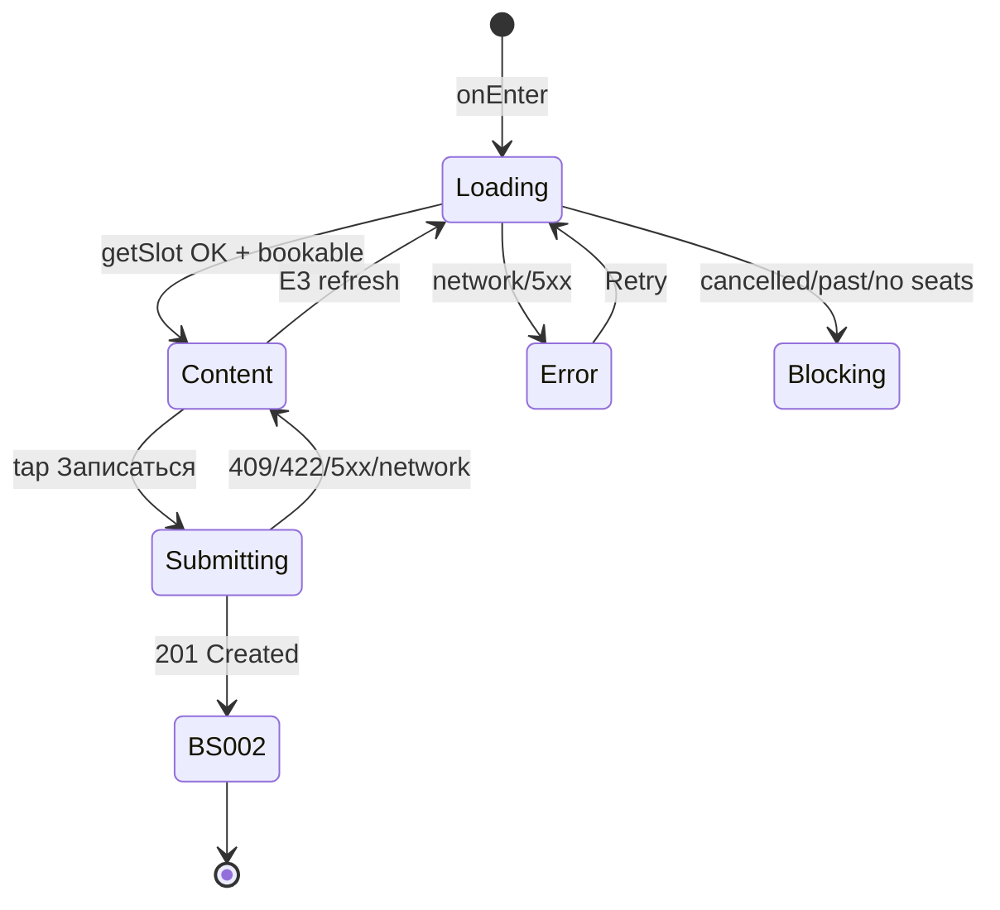

# Оформление записи

**ID:** SCR-004  
**Тип:** Экран  
**Домен:** 04. Бронирование  
**Приоритет:** Critical  
**Статус:** Черновик  
**Функциональные блоки:** FB-BOOK-004  
**Зона авторизации:** АЗ  
**Дизайн-макет:** [SCR-004-booking.md](../3-design-brief/SCR-004-booking.md) — версия 0.2

---

## Содержание

- [История изменений](#история-изменений)
- [Обзор](#обзор)
- [Навигация](#навигация)
- [Входные данные](#входные-данные)
- [Применяемые логики](#применяемые-логики)
- [Инициализация](#инициализация)
- [Используемые запросы](#используемые-запросы)
- [Макет экрана](#макет-экрана)
- [Элементы экрана](#элементы-экрана)
- [Состояния экрана](#состояния-экрана)
- [Действия пользователя](#действия-пользователя)
- [Связанные требования](#связанные-требования)
- [Критерии приёмки](#критерии-приёмки)

---

## История изменений

| Релиз | ТЗ | Описание изменений |
|-------|-----|-------------------|
| 0.1.0 | [SCR-004-booking.md](SCR-004-booking.md) | Первоначальная документация |

---

## Обзор

Экран **оформления записи** — самый сложный экран клиентского сценария. Собирает число мест (себя + гостей), для каждого места — вариант «Своё» / «Прокат», показывает preview итоговой цены и отправляет атомарное создание брони. На экране пересекаются **два независимых лимита**: места в группе и прокатный фонд инструментов/фартука.

Последний шаг перед подтверждением в потоке UC-1: SCR-002 → SCR-003 → **SCR-004** → BS-002 (≤ 3 экранов до успеха, P2).

**Имена гостей не вводятся** — достаточно агрегатов `seats_count` и `rental_count`.

### User Story

> Как **клиент**, я хочу **выбрать число мест и вариант «своё/прокат» для каждого участника и подтвердить запись**,
> чтобы **забронировать себя и гостей с понятной итоговой ценой**.

### Бизнес-ценность

- Реализует FR-6–FR-11 и FR-18 в одном экране.
- UI-ограничения снижают ошибки до вызова API; сервер гарантирует атомарность (NFR-3).
- Idempotency-Key защищает от двойной брони при повторе запроса после сетевого сбоя.

---

## Навигация

### Входящая (откуда открывается)

| Источник | Триггер | Условие | Передаваемые параметры |
|----------|---------|---------|------------------------|
| [SCR-003 Карточка слота](SCR-003-slot-card.md) | «Записаться» | На SCR-003 CTA enabled | `slotId` (UUID) |

### Исходящая (куда ведёт)

| Назначение | Триггер | Передаваемые параметры |
|------------|---------|------------------------|
| [BS-002 Вы записаны](BS-002-booking-success.md) | Успешный createBooking (201) | `bookingId` |
| [SCR-002 Список слотов](SCR-002-slot-list.md) | «К списку занятий» (после E3 с 0 мест) | — |
| [SCR-003 Карточка слота](SCR-003-slot-card.md) | «Назад» | — |

---

## Входные данные

| Название | Тип | Возможные значения | Описание |
|----------|-----|-------------------|----------|
| `slotId` | Состояние навигации | UUID | Слот для бронирования |
| `slot` | Состояние экрана | `Slot` | Актуальные данные после getSlot |
| `seatsCount` | Локальное состояние | 1 … `maxSeats` | Текущее значение степпера |
| `seatSelections` | Локальное состояние | `own` \| `rental`[] | По одному значению на каждое место |
| `idempotencyKey` | Локальное состояние | UUID | Генерируется **один раз** при первой попытке submit; повтор при сетевой ошибке — с тем же ключом |
| `submitState` | Локальное состояние | `idle` \| `submitting` | Блокировка формы при отправке |

---

## Применяемые логики

| Логика | Элемент/Триггер | Описание |
|--------|-----------------|----------|
| [LOGIC-002 Расчёт доступности](09_Логики/LOGIC-002_Расчёт-доступности.md) | Степпер мест, переключатели «Своё/Прокат» | Лимиты мест и проката; disabled опций |
| [LOGIC-003 Расчёт цены брони](09_Логики/LOGIC-003_Расчёт-цены-брони.md) | Блок цены, CTA | Preview `price × seats + rental_price × rental_count` |

---

## Инициализация

### Диаграмма загрузки



### Запросы при открытии

| № | Запрос | Критичный | Зависит от | Условие |
|---|--------|-----------|------------|---------|
| 1 | [getSlot](#getslot) | Да | — | Всегда — **обновление доступности** при входе на экран |

### Инициализация формы (после успешного getSlot)

| Параметр | Начальное значение |
|----------|-------------------|
| `seatsCount` | `1` |
| `seatSelections[0]` | «Прокат», если `free_rental_boards > 0`; иначе «Своё» |
| `idempotencyKey` | `null` (генерируется при первом submit) |

Если после getSlot слот **недоступен для записи** (`status = cancelled`, `isPast`, `free_seats = 0`) — показать blocking state (см. [§ Состояния](#состояния-экрана)), форма не редактируется.

> Полное описание запросов см. в секции [Используемые запросы](#используемые-запросы).

---

## Используемые запросы

### getSlot

**Тип:** REST  
**Метод:** GET  
**Спецификация:** [../api/slots/api.yaml](../api/slots/api.yaml) → `getSlot`

**Триггер:** Инициализация; повтор после E3/E4; опционально перед submit (не обязательно — createBooking вернёт актуальные ошибки)

**Параметры:**

| Параметр | Тип | Обязательность | Источник | Описание |
|----------|-----|----------------|----------|----------|
| `slotId` | string (UUID) | Да | Навигация | Path `/slots/{slotId}` |
| `Authorization` | header | Да | Сессия | Bearer-токен |

**Обработка ответа:**

| Результат | Условие | UI-реакция |
|-----------|---------|------------|
| Загрузка | — | Скелетон формы |
| Успех | HTTP 200 | Content; пересчитать [LOGIC-002](09_Логики/LOGIC-002_Расчёт-доступности.md), [LOGIC-003](09_Логики/LOGIC-003_Расчёт-цены-брони.md) |
| HTTP 410 / `status=cancelled` | — | Blocking: «Занятие отменено мастерской» (E4) |
| HTTP 404 | — | Error E4 + «Повторить» |
| HTTP 401 | — | SCR-001 |
| Сеть | — | Error E4 + «Повторить» |

---

### createBooking

**Тип:** REST  
**Метод:** POST  
**Спецификация:** [../api/bookings/api.yaml](../api/bookings/api.yaml) → `createBooking`

**Триггер:** Тап «Записаться» после прохождения клиентской валидации

**Headers:**

| Поле | Обязательность | Описание |
|------|----------------|----------|
| `Authorization` | Да | Bearer-токен |
| `Idempotency-Key` | Да | UUID v4; один ключ на одну логическую попытку бронирования |

**Body (`CreateBookingRequest`):**

| Поле | Тип | Источник | Описание |
|------|-----|----------|----------|
| `slot_id` | UUID | `slotId` | Слот |
| `seats_count` | integer | `seatsCount` | Число мест (1 … max) |
| `rental_count` | integer | Подсчёт переключателей | Число мест с выбором «Прокат» (0 … `seats_count`) |

**Расчёт `rental_count`:**

```
rental_count = count(seatSelections where value = rental)
```

«Своё» = `seats_count − rental_count`.

**Обработка ответа:**

| Результат | Условие | UI-реакция |
|-----------|---------|------------|
| Загрузка | — | `submitState = submitting`; лоадер на CTA; форма заблокирована |
| Успех | HTTP **201** | Переход на [BS-002](BS-002-booking-success.md) с `bookingId = response.id`, `priceTotal = response.price_total` |
| HTTP **409** | `code = slot_full` | См. [§ Ошибки 409](#обработка-ошибок-createbooking); E1/E2/E3 |
| HTTP **409** | `code = double_booking` | Inline: «У вас уже есть запись на это занятие»; опционально ссылка на SCR-006 с `details.booking_id` |
| HTTP **409** | `code = idempotency_key_conflict` | Сгенерировать новый `Idempotency-Key`, показать снек «Повторите запись» |
| HTTP **410** | `code = slot_cancelled` | Blocking E4: «Занятие отменено мастерской» |
| HTTP **422** | validation / business | Inline или снек с `message`; форма разблокирована |
| HTTP **401** | — | SCR-001 |
| HTTP **5xx** | — | Снек «Произошла ошибка. Попробуйте позже»; форма разблокирована |
| Сеть | — | E4: «Не удалось загрузить…» + «Повторить»; **сохранить** тот же `Idempotency-Key` для retry |

**Idempotency:**

- При **первом** tap «Записаться» сгенерировать `idempotencyKey = UUID()`.
- При **повторе** после сетевой ошибки — отправить с **тем же** ключом и тем же телом → сервер вернёт тот же 201 без дубля.
- При изменении `seats_count` / `rental_count` после неудачи — **новый** ключ.

---

### Обработка ошибок createBooking

#### HTTP 409 `slot_full`

1. Выполнить повторный [getSlot](#getslot) для актуализации UI.
2. Прочитать `details.available_seats`, `details.available_rental_boards` (если есть).
3. Показать сообщение по контексту (UC-1 E1/E2/E3):

| Ситуация | Сообщение (микрокопия) |
|----------|------------------------|
| Нехватка мест (E1) | «Недостаточно мест. Свободно: [N]. Уменьшите число мест до [N].» |
| Нехватка проката (E2) | «Недостаточно прокатных комплектов. Свободно: [M]. Выберите меньше проката или «Своё».» |
| Гонка, 0 мест (E3) | «Места уже заняты. Данные обновлены.» + кнопка «К списку занятий» → SCR-002 |
| Частичная нехватка | Скорректировать степпер/переключатели по [LOGIC-002](09_Логики/LOGIC-002_Расчёт-доступности.md); показать E1 или E2 |

> `[N]` = `details.available_seats` или `slot.free_seats` после refresh; `[M]` = `details.available_rental_boards` или `slot.free_rental_boards`.

---

## Макет экрана

### Структура

```
┌─────────────────────────────────────┐
│ [←] Оформление записи               │  ← Header
├─────────────────────────────────────┤
│ Сводка слота (read-only)            │
│ Свободно мест: N · прокат: M        │  ← Scrollable
│ ─────────────────────────────────── │
│ Число мест        [ − ] 2 [ + ]     │
│ Можно записать до K мест            │
│ ─────────────────────────────────── │
│ Место 1 (вы)    [•Своё | Прокат]    │
│ Место 2 (гость) [Своё |•Прокат]     │
│ Прокат выбрано: X из M              │
│ ─────────────────────────────────── │
│ Места: 2 500 ₽ × 2        5 000 ₽   │
│ Прокат: 800 ₽ × 1           800 ₽   │
│ Итого                     5 800 ₽   │
│ Оплата на месте: …                  │
├─────────────────────────────────────┤
│ [     Записаться · 5 800 ₽     ]    │  ← Fixed CTA
└─────────────────────────────────────┘
```

### Компоненты

| Компонент | Описание | Обязательность |
|-----------|----------|----------------|
| Сводка слота | Дата, программа, мастер | Да |
| Степпер мест | − / значение / + | Да |
| Строки «Своё/Прокат» | По одной на каждое место | Да |
| Счётчик проката | «Прокат выбрано: X из M» | Да |
| Блок цены | Preview, read-only | Да |
| Primary CTA | «Записаться · {итого}» | Да |

---

## Элементы экрана

### 1. Header

| Элемент | Описание | Источник данных | Валидация | Действие |
|---------|----------|-----------------|-----------|----------|
| «Назад» | Возврат без сохранения брони | — | — | SCR-003 |
| Заголовок | «Оформление записи» | Константа | — | — |

### 2. Сводка слота (read-only)

| Элемент | Описание | Источник данных | Валидация | Действие |
|---------|----------|-----------------|-----------|----------|
| Дата/время | «Сб, 20 июл · 14:00» | `slot.start_at` | — | — |
| Программа · мастер | «Лепка для новичков · Анна» | `route.name`, `instructor.name` | — | — |
| Доступность | «Свободно мест: N · прокат: M» | `free_seats`, `free_rental_boards` | — | — |

### 3. Степпер «Число мест»

| Элемент | Описание | Источник данных | Валидация | Действие |
|---------|----------|-----------------|-----------|----------|
| Кнопка «−» | Уменьшить на 1 | — | min = 1 | Обновить `seatsCount`, строки мест |
| Значение | Текущее число мест | `seatsCount` | — | — |
| Кнопка «+» | Увеличить на 1 | — | max = [LOGIC-002](09_Логики/LOGIC-002_Расчёт-доступности.md) `maxSeats` | Добавить строку места |
| Подпись лимита | «Можно записать до K мест» | `maxSeats` | — | — |

**Логика:**
- [LOGIC-002](09_Логики/LOGIC-002_Расчёт-доступности.md): `maxSeats = slot.max_seats_per_booking` (сервер уже рассчитал `min(free_seats, route.capacity_cap, …)`).
- Минимум **1** (клиент всегда бронирует себя).
- При **уменьшении** — удалить лишние строки «Своё/Прокат» **с конца**.
- При **увеличении** — добавить строку с default: «Прокат», если остаток проката > 0; иначе «Своё».

**Условия доступности:**
- «−» disabled при `seatsCount = 1`.
- «+» disabled при `seatsCount = maxSeats`.

### 4. Переключатели «Своё / Прокат»

| Элемент | Описание | Источник данных | Валидация | Действие |
|---------|----------|-----------------|-----------|----------|
| Строка места | «Место 1 (вы)», «Место 2 (гость)», … | Индекс | — | — |
| Сегмент «Своё» | Свои инструменты | `seatSelections[i]` | — | Пересчёт проката и цены |
| Сегмент «Прокат» | Комплект мастерской | `seatSelections[i]` | — | Пересчёт проката и цены |
| Счётчик | «Прокат выбрано: X из M» | Вычисляемое | — | — |

**Логика:**
- [LOGIC-002](09_Логики/LOGIC-002_Расчёт-доступности.md): `rentalSelected = count(«Прокат»)`; лимит `M = free_rental_boards`.
- «Своё» **не** расходует прокатный фонд (FR-10).
- «Прокат» расходует место в группе **и** один комплект проката.
- Если `rentalSelected = M`, опция «Прокат» на остальных местах **disabled** (с пояснением E2 при попытке).
- При `free_rental_boards = 0` все места принудительно «Своё», переключатели «Прокат» disabled.

### 5. Блок итоговой цены (read-only preview)

| Элемент | Описание | Источник данных | Валидация | Действие |
|---------|----------|-----------------|-----------|----------|
| Строка «Места» | «2 500 ₽ × 2 = 5 000 ₽» | [LOGIC-003](09_Логики/LOGIC-003_Расчёт-цены-брони.md) | — | — |
| Строка «Прокат» | «800 ₽ × 1 = 800 ₽» | LOGIC-003; скрыта при `rental_count = 0` | — | — |
| «Итого» | Крупно | LOGIC-003 `previewTotal` | — | — |
| Офлайн-оплата | «Оплата на месте: наличные или перевод на карту.» | Константа | — | — |

**Логика:**
- Preview пересчитывается при изменении степпера или переключателей.
- **Финальная** сумма на BS-002 — только `CreateBookingResponse.price_total` с сервера (FR-18); клиент **не** пересчитывает на экране успеха.

### 6. CTA «Записаться»

| Элемент | Описание | Источник данных | Валидация | Действие |
|---------|----------|-----------------|-----------|----------|
| Кнопка | «Записаться · {previewTotal} ₽» | LOGIC-003 | Клиентская валидация LOGIC-002 | [createBooking](#createbooking) |

**Момент валидации:** При отправке + непрерывно через disabled-состояния UI.

**Логика:**
- **Enabled**, если форма валидна по LOGIC-002: `1 ≤ seatsCount ≤ maxSeats`, `rentalSelected ≤ free_rental_boards`, слот `scheduled` и не past.
- **Disabled** с поясняющей микрокопией E1/E2 (не «глухая» кнопка).
- **Submitting:** лоадер на CTA, повторный тап невозможен.

**Условия доступности:**
- Disabled при `seatsCount > free_seats` (E1).
- Disabled при `rentalSelected > free_rental_boards` (E2).
- Disabled при `submitState = submitting`.

### 7. Inline-ошибки и нотисы (микрокопия E1–E4)

| Код | Точный текст | Когда |
|-----|--------------|-------|
| E1 | «Недостаточно мест. Свободно: [N]. Уменьшите число мест до [N].» | `seatsCount > free_seats` или 409 slot_full (места) |
| E2 | «Недостаточно прокатных комплектов. Свободно: [M]. Выберите меньше проката или «Своё».» | `rentalSelected > free_rental_boards` или 409 slot_full (прокат) |
| E3 | «Места уже заняты. Данные обновлены.» | 409 slot_full после гонки; при `free_seats = 0` — кнопка «К списку занятий» |
| E4 (сеть/load) | «Не удалось загрузить. Проверьте соединение и попробуйте снова.» + «Повторить» | getSlot / createBooking network error |
| E4 (отмена) | «Занятие отменено мастерской» | 410 или `status = cancelled` |

---

## Состояния экрана

### Таблица состояний

| Состояние | Условие | Отображение |
|-----------|---------|-------------|
| Loading | Ожидание getSlot | Скелетон формы |
| Content | getSlot 200, слот доступен | Форма брони |
| Submitting | createBooking in flight | Форма заблокирована, лоадер на CTA |
| Error E4 | getSlot fail | Заглушка + «Повторить» |
| Blocking | cancelled / past / 0 мест после refresh | Сообщение + без редактирования; при E3+0 мест — «К списку занятий» |
| Inline errors | E1/E2/E3 | Нотис/inline, данные формы сохранены |

### Диаграмма переходов



---

## Действия пользователя

| Действие | Элемент | Триггер | Результат |
|----------|---------|---------|-----------|
| Вернуться | «Назад» | Tap | SCR-003, бронь не создана |
| Изменить число мест | Степпер ± | Tap | LOGIC-002, LOGIC-003 |
| Выбрать инвентарь | «Своё» / «Прокат» | Tap | LOGIC-002, LOGIC-003 |
| Подтвердить запись | «Записаться» | Tap | createBooking → BS-002 |
| Повторить загрузку | «Повторить» | Tap | getSlot |
| К каталогу | «К списку занятий» | Tap | SCR-002 (после E3, 0 мест) |

---

## Связанные требования

### Функциональные (FR)

| ID | Название | Приоритет |
|----|----------|-----------|
| FR-6 | Запись на выбранный слот | Must |
| FR-8–FR-11 | Одно место, переключатель проката | Must |
| FR-8 | Выбор «своё» / «прокат» | Must |
| FR-9 | Лимит мест с учётом потолка программы | Must |
| FR-10 | Отдельный учёт прокатного фонда | Must |
| FR-11 | Запрет записи сверх лимита; обработка отказа API | Must |
| FR-17 | Запрет записи на отменённый слот | Must |
| FR-18 | Цена и фиксация записи; оплата офлайн | Must |

### Use cases / User stories

| ID | Связь |
|----|-------|
| UC-1 | Шаги 4–8: места, своё/прокат, подтверждение; A1, A2; E1–E4 |
| US-5, US-6, US-7, US-8, US-11 | Запись, гости, инвентарь, лимиты, цена |

### Дизайн

| Артефакт | Ссылка |
|----------|--------|
| Design brief | [SCR-004-booking.md](../3-design-brief/SCR-004-booking.md) |
| Success screen | [BS-002-booking-success.md](../3-design-brief/BS-002-booking-success.md) |

---

## Критерии приёмки

### Позитивные сценарии

| ID | Критерий | Приоритет |
|----|----------|-----------|
| AC-001 | **Дано** слот с `free_seats ≥ 2`, `free_rental_boards ≥ 1`, **Когда** клиент выбирает 2 места (1 прокат, 1 своё) и нажимает «Записаться», **Тогда** POST `/bookings` с `seats_count=2`, `rental_count=1`, заголовком `Idempotency-Key` (UUID), переход на BS-002 с `bookingId` | P0 |
| AC-002 | **Дано** `max_seats_per_booking = 3` из API, **Когда** открыт SCR-004, **Тогда** степпер не позволяет выбрать больше 3 мест (без хардкода «3» в UI) | P0 |
| AC-003 | **Дано** изменение числа мест или переключателей, **Когда** UI обновлён, **Тогда** preview цены = `price × seats + rental_price × rental_count` (LOGIC-003) | P0 |
| AC-004 | **Дано** успешный 201 с `price_total = 5800`, **Когда** открыт BS-002, **Тогда** итог на BS-002 = 5800 с сервера, не пересчитанный клиентом | P0 |
| AC-005 | **Дано** UC-1 A1 (все «Своё»), **Когда** submit, **Тогда** `rental_count = 0` | P1 |

### Негативные сценарии

| ID | Критерий | Приоритет |
|----|----------|-----------|
| AC-N01 | **Дано** 409 `slot_full` с `available_seats = 0`, **Когда** submit, **Тогда** E3 «Места уже заняты…» и кнопка «К списку занятий» | P0 |
| AC-N02 | **Дано** 410 `slot_cancelled`, **Когда** submit, **Тогда** «Занятие отменено мастерской», запись невозможна | P0 |
| AC-N03 | **Дано** 409 `double_booking`, **Когда** submit, **Тогда** сообщение о существующей записи, без дубля | P1 |
| AC-N04 | **Дано** сетевой сбой при submit, **Когда** клиент повторяет с тем же Idempotency-Key и телом, **Тогда** одна бронь (201 или тот же id) | P0 |
| AC-N05 | **Дано** `free_rental_boards = 0`, **Когда** форма открыта, **Тогда** все места «Своё», «Прокат» недоступен, запись возможна | P1 |
| AC-N06 | **Дано** 422, **Когда** submit, **Тогда** показ `message`, форма разблокирована | P1 |

### Граничные условия (Edge Cases)

| ID | Критерий | Приоритет |
|----|----------|-----------|
| AC-E01 | **Дано** уменьшение мест с 3 до 1, **Когда** степпер «−», **Тогда** удалены строки мест 2 и 3 | P1 |
| AC-E02 | **Дано** submit in progress, **Когда** повторный tap CTA, **Тогда** второй запрос не отправляется | P0 |
| AC-E03 | **Дано** getSlot при входе, **Когда** `free_seats` уменьшилось с момента SCR-003, **Тогда** степпер и E1 отражают новое N | P0 |

---
