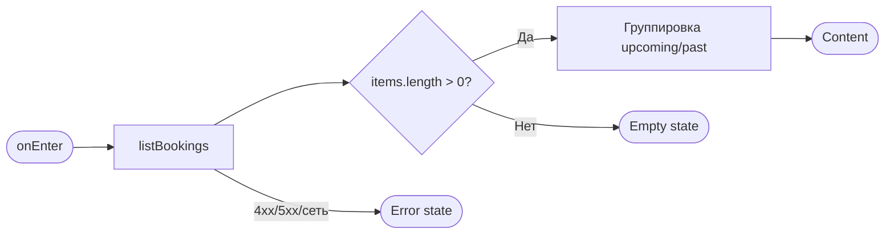
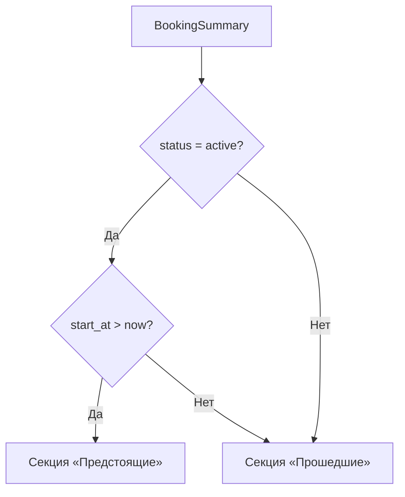
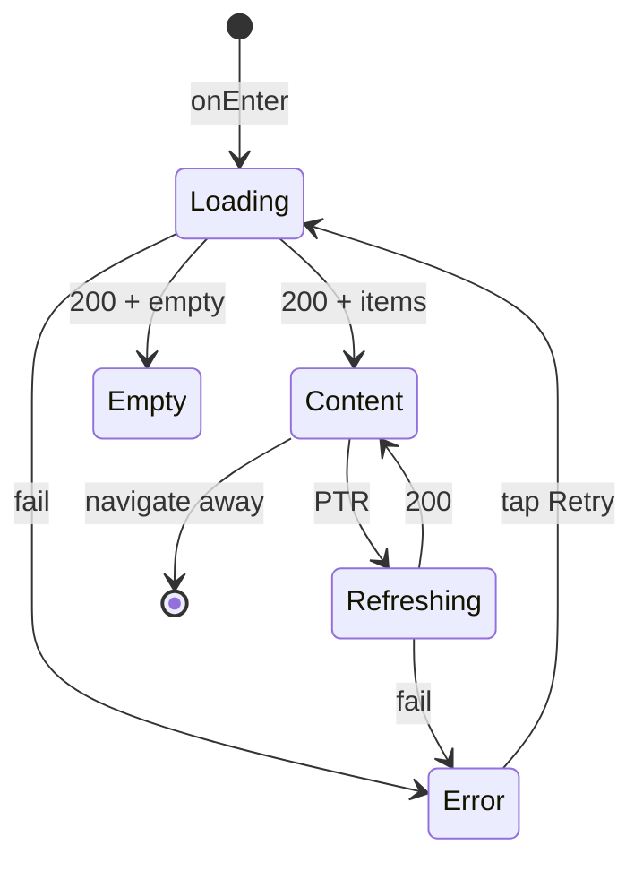

# Мои записи

**ID:** SCR-005  
**Тип:** Экран  
**Домен:** 05. Мои бронирования  
**Приоритет:** Critical  
**Статус:** Актуален  
**Функциональные блоки:** FB-BOOK-001, FB-BOOK-002  
**Зона авторизации:** АЗ  
**Дизайн-макет:** [SCR-005-my-bookings.md](../3-design-brief/SCR-005-my-bookings.md) — версия 0.2

---

## Содержание

- [История изменений](#история-изменений)
- [Обзор](#обзор)
- [Навигация](#навигация)
- [Входные данные](#входные-данные)
- [Применяемые логики](#применяемые-логики)
- [Инициализация](#инициализация)
- [Используемые запросы](#используемые-запросы)
- [Макет экрана](#макет-экрана)
- [Элементы экрана](#элементы-экрана)
- [Состояния экрана](#состояния-экрана)
- [Действия пользователя](#действия-пользователя)
- [Связанные требования](#связанные-требования)
- [Критерии приёмки](#критерии-приёмки)

---

## История изменений

| Релиз | ТЗ | Описание изменений |
|-------|-----|-------------------|
| 1.0.0 | SCR-005-my-bookings.md | Первоначальная документация |

---

## Обзор

Корневой экран вкладки **«Мои записи»** таб-бара. Показывает список броней текущего клиента, разделённый на секции **«Предстоящие»** и **«Прошедшие»**. Каждая карточка — сводка записи со статусом; полные детали и отмена — на [SCR-006](SCR-006-booking-details.md).

### User Story

> Как клиент, я хочу видеть предстоящие и прошедшие записи на мастер-классы,
> чтобы контролировать расписание и быстро открыть детали или записаться снова.

### Бизнес-ценность

- Единая точка контроля над своими бронированиями (FR-12).
- Разделение предстоящих активных и завершённых/отменённых записей снижает когнитивную нагрузку.
- Pull-to-refresh обновляет статусы после отмены клиентом или форс-мажора мастерской.

---

## Навигация

### Входящая (откуда открывается)

| Источник | Триггер | Условие | Передаваемые параметры |
|----------|---------|---------|------------------------|
| Таб-бар | Тап «Мои записи» | Авторизован | — |
| [BS-002](BS-002-booking-success.md) | Тап «Мои записи» | После успешной записи | — |
| [SCR-006](SCR-006-booking-details.md) | «Назад» | — | — |

### Исходящая (куда ведёт)

| Назначение | Триггер | Передаваемые параметры |
|------------|---------|------------------------|
| [SCR-006](SCR-006-booking-details.md) | Тап по карточке | `bookingId` |
| [SCR-002](SCR-002-slot-list.md) | Таб «Занятия» / «Записаться на занятие» (empty) | — |

Таб-бар **виден**. Собственного нижнего CTA нет.

---

## Входные данные

| Название | Тип | Возможные значения | Описание |
|----------|-----|-------------------|----------|
| `selectedSection` | Состояние экрана | `upcoming`, `past` | Активная секция переключателя; по умолчанию `upcoming` |
| `accessToken` | Защищённое хранилище | JWT | Bearer для API |

---

## Применяемые логики

| Логика | Элемент/Триггер | Описание |
|--------|-----------------|----------|
| [LOGIC-008](09_Логики/LOGIC-008_Паттерн-состояний-экрана.md) | Загрузка списка, PTR, ошибки | Паттерн Loading / Content / Empty / Error / Refreshing |
| Группировка списка (§ Элементы) | После `listBookings` | Разделение items на «Предстоящие» / «Прошедшие» по `slot.start_at` и `status` |

---

## Инициализация

### Диаграмма загрузки



### Запросы при открытии

| № | Запрос | Критичный | Зависит от | Условие |
|---|--------|-----------|------------|---------|
| 1 | [listBookings](#listbookings) | Да | — | Всегда |

---

## Используемые запросы

### listBookings

**Тип:** REST  
**Метод:** GET  
**Спецификация:** [bookings/api.yaml](../api/bookings/api.yaml) → `listBookings`

**Триггер:** Инициализация, pull-to-refresh, повтор после Error

**Параметры:**

| Параметр | Тип | Обязательность | Источник | Описание |
|----------|-----|----------------|----------|----------|
| `limit` | integer | Нет | Константа / настройка | Размер страницы; default 20 |
| `offset` | integer | Нет | Пагинация | Смещение; 0 при первой загрузке |
| `status` | array | Нет | — | Не передаётся — все статусы |

**Обработка ответа:**

| Результат | Условие | UI-реакция |
|-----------|---------|------------|
| Загрузка | — | Скелетон карточек ([LOGIC-008](09_Логики/LOGIC-008_Паттерн-состояний-экрана.md)) |
| Успех | `items` не пуст | Группировка → Content |
| Успех | `items` пуст | Empty «У вас пока нет записей» |
| HTTP 401 | — | Переход на SCR-001 |
| HTTP 4xx/5xx | — | Error + «Обновить» |
| Сеть | Нет соединения | Error + «Обновить» |

**Пагинация:** при `meta.offset + items.length < meta.total` — подгрузка следующей страницы при скролле к концу секции (infinite scroll) или кнопка «Загрузить ещё» (решение реализации).

---

## Макет экрана

### Структура

```
┌──────────────────────────────┐
│  Мои записи                  │  ← Header (без «Назад»)
│  [ Предстоящие | Прошедшие ] │  ← Segment control
├──────────────────────────────┤
│  ┌────────────────────────┐  │
│  │ Карточка записи        │  │  ← Scrollable list
│  └────────────────────────┘  │
├──────────────────────────────┤
│  Занятия · Мои записи        │  ← Tab bar
└──────────────────────────────┘
```

### Компоненты

| Комponent | Описание | Обязательность |
|-----------|----------|----------------|
| Segment control | «Предстоящие» / «Прошедшие» | Да |
| BookingCard | Карточка сводки брони | Да |
| StatusBadge | Бейдж статуса | Да |
| Tab bar | Две вкладки АЗ | Да |

---

## Элементы экрана

### 1. Заголовок и переключатель секций

| Элемент | Описание | Источник данных | Валидация | Действие |
|---------|----------|-----------------|-----------|----------|
| Заголовок | «Мои записи» | Статический | — | — |
| «Предстоящие» | Секция активных будущих | Группировка клиента | — | Переключить список |
| «Прошедшие» | Секция прошлых и отменённых | Группировка клиента | — | Переключить список |

**Логика группировки (клиент, после `listBookings`):**

- **Предстоящие:** `status = active` **и** `slot.start_at > now` (сравнение в UTC; `now` — локальные часы устройства, синхронизированные с сервером).
- **Прошедшие:** все остальные — `slot.start_at ≤ now` **или** `status ∈ {cancelled, club_cancelled}` (отменённые с будущим стартом попадают сюда, FR-12).
- **Сортировка предстоящих:** `slot.start_at` по **возрастанию**.
- **Сортировка прошедших:** `slot.start_at` по **убыванию** (свежие сверху).



### 2. Карточка записи

| Элемент | Описание | Источник данных | Валидация | Действие |
|---------|----------|-----------------|-----------|----------|
| Дата и время | «сб, 12 сен · 14:00» | `slot.start_at` | — | → SCR-006 |
| Программа | Название программы | `slot.route.name` | — | — |
| Мастер | «Мастер: {имя}» | `slot.instructor.name` | — | — |
| Места и инвентарь | «N мест · M прокат» / «N место · своё» | `seats_count`, `rental_count` | — | — |
| Итоговая цена | «{price_total} ₽» | `price_total` | — | — |
| Бейдж статуса | Текст по `status` | `status` | — | — |
| Причина отмены | 1–2 строки | `cancellation_reason` | — | — |

**Маппинг бейджей (`status` → UI):**

| `status` (API) | Текст бейджа |
|----------------|--------------|
| `active` | «активна» |
| `cancelled` | «отменена» |
| `club_cancelled` | **«Отменено мастерской»** |

**Формат мест и инвентаря:**

- `own_count = seats_count - rental_count`
- Если `rental_count > 0` и `own_count > 0`: «{seats_count} мест · {rental_count} прокат»
- Если `rental_count = 0`: «{seats_count} место/места · своё»
- Если `rental_count = seats_count`: «{seats_count} мест · прокат»

**Условия отображения:**

- `cancellation_reason` — только при `status = club_cancelled` и непустом значении.
- Карточка кликабельна целиком; тач-зона ≥ 44 pt.

### 3. Empty-состояния

| Элемент | Условие | Текст | Действие |
|---------|---------|-------|----------|
| Глобальный empty | `items` пуст после API | «У вас пока нет записей» | «Записаться на занятие» → SCR-002 |
| Empty «Предстоящие» | Секция пуста, но есть прошедшие | «Нет предстоящих записей» | «Записаться на занятие» → SCR-002 |
| Empty «Прошедшие» | Секция пуста | «Здесь появятся прошедшие занятия» | — |

---

## Состояния экрана

### Таблица состояний

| Состояние | Условие | Отображение |
|-----------|---------|-------------|
| Loading | Первый запрос | Скелетон карточек |
| Content | 200 + data | Список в выбранной секции |
| Empty | 200 + `items` пуст | «У вас пока нет записей» + CTA |
| Empty section | Секция пуста | Текст секции (см. §3) |
| Error | 4xx/5xx/timeout | «Не удалось загрузить…» + «Обновить» |
| Refreshing | PTR поверх Content | Индикатор PTR, список не скрывается |

### Диаграмма переходов



---

## Действия пользователя

| Действие | Элемент | Триггер | Результат |
|----------|---------|---------|-----------|
| Открыть детали | Карточка | Tap | SCR-006 с `bookingId` |
| Сменить секцию | Segment control | Tap | Фильтр локального списка |
| Обновить | Pull-to-refresh | Swipe down | Повтор `listBookings` |
| Записаться | Empty CTA | Tap | SCR-002 (таб «Занятия») |
| Перейти к слотам | Таб «Занятия» | Tap | SCR-002 |

---

## Связанные требования

### Функциональные

| ID | Название | Приоритет |
|----|----------|-----------|
| FR-12 | Список своих бронирований | Must |
| FR-16 | Отображение «Отменено мастерской» | Must |
| FR-18 | Серверный `price_total` | Must |

### Нефункциональные

| ID | Название | Приоритет |
|----|----------|-----------|
| NFR-1 | Mobile-first | Высокий |
| NFR-5 | Только свои данные | Высокий |
| NFR-8 | Данные из API | Средний |

---

## Критерии приёмки

### Позитивные сценарии

| ID | Критерий | Приоритет |
|----|----------|-----------|
| AC-001 | **Дано** у клиента 2 активные будущие и 1 отменённая бронь, **Когда** открыт SCR-005, **Тогда** в «Предстоящие» — 2 карточки с бейджем «активна», в «Прошедшие» — отменённая с соответствующим бейджем | P0 |
| AC-002 | **Дано** бронь `club_cancelled` с `cancellation_reason`, **Когда** карточка в «Прошедшие», **Тогда** бейдж «Отменено мастерской» и текст причины | P0 |
| AC-003 | **Дано** список загружен, **Когда** tap по карточке, **Тогда** переход на SCR-006 с корректным `bookingId` | P0 |
| AC-004 | **Дано** `price_total = 4500`, **Когда** карточка отображается, **Тогда** «4500 ₽» без пересчёта на клиенте | P0 |
| AC-005 | **Дано** нет броней, **Когда** экран открыт, **Тогда** empty «У вас пока нет записей» и CTA на SCR-002 | P0 |

### Негативные сценарии

| ID | Критерий | Приоритет |
|----|----------|-----------|
| AC-N01 | **Дано** ошибка сети, **Когда** открытие экрана, **Тогда** error state и кнопка «Обновить» | P0 |
| AC-N02 | **Дано** HTTP 401, **Когда** запрос списка, **Тогда** переход на SCR-001 | P0 |

### Граничные условия

| ID | Критерий | Приоритет |
|----|----------|-----------|
| AC-E01 | **Дано** активная бронь с `start_at` в прошлом (рассинхрон), **Когда** группировка, **Тогда** карточка в «Прошедшие» | P1 |
| AC-E02 | **Дано** отменённая бронь с будущим `start_at`, **Когда** группировка, **Тогда** карточка только в «Прошедшие», не в «Предстоящие» | P0 |
| AC-E03 | **Дано** PTR во время Content, **Когда** успешный ответ, **Тогда** список обновлён без мигания в Loading | P1 |

---
