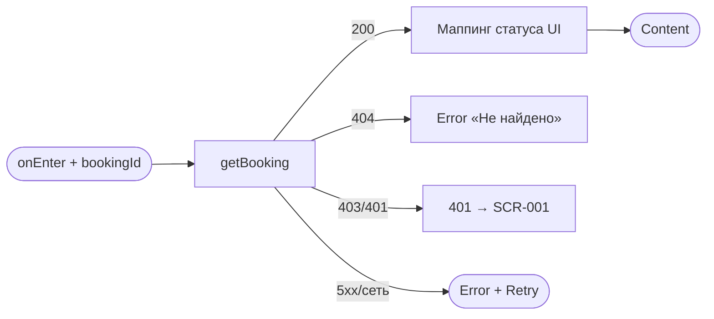
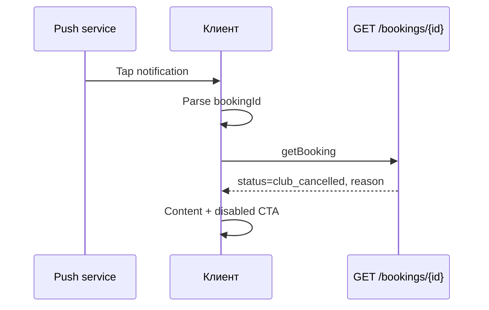

# Детали записи

**ID:** SCR-006  
**Тип:** Экран  
**Домен:** 05. Мои бронирования  
**Приоритет:** Critical  
**Статус:** Актуален  
**Функциональные блоки:** FB-BOOK-003, FB-BOOK-004  
**Зона авторизации:** АЗ  
**Дизайн-макет:** [SCR-006-booking-details.md](../3-design-brief/SCR-006-booking-details.md) — версия 0.2

---

## Содержание

- [История изменений](#история-изменений)
- [Обзор](#обзор)
- [Навигация](#навигация)
- [Входные данные](#входные-данные)
- [Применяемые логики](#применяемые-логики)
- [Инициализация](#инициализация)
- [Используемые запросы](#используемые-запросы)
- [Макет экрана](#макет-экрана)
- [Элементы экрана](#элементы-экрана)
- [Состояния экрана](#состояния-экрана)
- [Действия пользователя](#действия-пользователя)
- [Связанные требования](#связанные-требования)
- [Критерии приёмки](#критерии-приёмки)

---

## История изменений

| Релиз | ТЗ | Описание изменений |
|-------|-----|-------------------|
| 1.0.0 | SCR-006-booking-details.md | Первоначальная документация |

---

## Обзор

Экран **полной информации об одной брони** и единственной точки **инициации отмены** клиентом. Read-only блоки деталей + деструктивная CTA «Отменить» (с подтверждением в [BS-003](BS-003-cancel-confirm.md)). Открывается из списка или по **push deep link** при отмене занятия мастерской (UC-4, FR-19).

Адрес мастерской — **только текст** (`slot.meeting_point`); интерактивная карта вне MVP.

### User Story

> Как клиент, я хочу видеть все детали записи и при необходимости отменить её до начала занятия,
> чтобы планировать визит и понимать последствия отмены.

### Бизнес-ценность

- Единая «точка правды» по брони после push о форс-мажоре (UC-4).
- Защита от случайной отмены через BS-003.
- Запрет повторной записи на слот после `club_cancelled` — только информирование (FR-17).

---

## Навигация

### Входящая (откуда открывается)

| Источник | Триггер | Условие | Передаваемые параметры |
|----------|---------|---------|------------------------|
| [SCR-005](SCR-005-my-bookings.md) | Tap по карточке | — | `bookingId` |
| Push-уведомление | Tap на уведомление | `type = club_cancellation` | `bookingId` |
| Deep link | `glina://bookings/{bookingId}` ([foundations §8.3](../3-design-brief/00-foundations.md#83-deep-links-push--экран)) | Авторизован | `bookingId` |

### Исходящая (куда ведёт)

| Назначение | Триггер | Передаваемые параметры |
|------------|---------|------------------------|
| [BS-003](BS-003-cancel-confirm.md) | «Отменить» (enabled) | `bookingId`, snapshot `Booking` |
| [SCR-005](SCR-005-my-bookings.md) | «Назад» / системный back | — |

Таб-бар **скрыт**.

---

## Входные данные

| Название | Тип | Возможные значения | Описание |
|----------|-----|-------------------|----------|
| `bookingId` | Route param | UUID | Идентификатор брони |
| `accessToken` | Защищённое хранилище | JWT | Bearer для API |

---

## Применяемые логики

| Логика | Элемент/Триггер | Описание |
|--------|-----------------|----------|
| [LOGIC-004](09_Логики/LOGIC-004_Отмена-ранняя-поздняя.md) | CTA «Отменить», BS-003, снеки | Отмена при can_cancel=true |
| [LOGIC-008](09_Логики/LOGIC-008_Паттерн-состояний-экрана.md) | Загрузка, ошибки | Loading / Content / Error |

---

## Инициализация

### Диаграмма загрузки



### Запросы при открытии

| № | Запрос | Критичный | Зависит от | Условие |
|---|--------|-----------|------------|---------|
| 1 | [getBooking](#getbooking) | Да | `bookingId` | Всегда |

---

## Используемые запросы

### getBooking

**Тип:** REST  
**Метод:** GET  
**Спецификация:** [bookings/api.yaml](../api/bookings/api.yaml) → `getBooking`

**Триггер:** Инициализация, возврат из BS-003, Retry, push deeplink

**Параметры:**

| Параметр | Тип | Обязательность | Источник | Описание |
|----------|-----|----------------|----------|----------|
| `bookingId` | UUID (path) | Да | Navigation | ID брони |

**Обработка ответа:**

| Результат | Условие | UI-реакция |
|-----------|---------|------------|
| Загрузка | — | Скелетон блоков |
| Успех | 200 | Content по `status` и `slot.start_at` |
| HTTP 404 | — | Error «Запись не найдена» |
| HTTP 403 | — | Error «Доступ запрещён» |
| HTTP 401 | — | SCR-001 |
| HTTP 5xx / сеть | — | Error + «Обновить» |

---

## Макет экрана

### Структура

```
┌───────────────────────────────┐
│ ←  Детали записи              │
├───────────────────────────────┤
│  [● Статус]                   │
│  Когда / Программа / Адрес    │  ← Scroll
│  Места / Цена / Записано      │
├───────────────────────────────┤
│  Подсказка отмены (опц.)      │
│ [        Отменить         ]   │  ← Fixed CTA
└───────────────────────────────┘
```

---

## Элементы экрана

### 1. Бейдж статуса

| Элемент | Описание | Источник | Условие |
|---------|----------|----------|---------|
| «Активна» | Будущая активная | `status=active`, `start_at > now` | — |
| «Прошедшая» | Занятие началось | `status=active`, `start_at ≤ now` | — |
| «Отменена» | Отмена клиентом | `status=cancelled` | — |
| «Отменено мастерской» | Форс-мажор | `status=club_cancelled` | FR-16 |

### 2. Блоки деталей (read-only)

| Элемент | Источник данных | Примечание |
|---------|-----------------|------------|
| Когда | `slot.start_at` | Локальная зона устройства |
| Программа | `slot.route.name`, тип | — |
| Мастер | `slot.instructor.name` | «Мастер: …» |
| Адрес | `slot.meeting_point` | Текст, без карты |
| Инвентарь | `needs_rental` | «Прокат» / «Своё» |
| Цена | `price_total` | «{N} ₽», read-only |
| Оплата | Статический | «Оплата на месте: наличные или перевод на карту.» |
| Записано | `created_at` | «Записано: …» |
| Отменена | `cancelled_at` | Только если отменена |
| Причина | `cancellation_reason` | Только `club_cancelled` |

### 3. CTA «Отменить»

| Состояние | Условие | UI |
|-----------|---------|-----|
| **Enabled** | `status = active` **и** `can_cancel = true` | Кнопка активна → BS-003 |
| **Disabled** | `slot.start_at ≤ now` | «Занятие уже началось — отменить запись нельзя.» |
| **Disabled** | `status = cancelled` или `can_cancel = false` | «Запись уже отменена» или EC-10 |
| **Disabled** | `status = club_cancelled` | «Занятие отменено мастерской.» + причина; **нет CTA «Записаться снова»** (FR-17) |

**Подсказка правила отмены** (над CTA, только при enabled):

> «Отменить запись можно, если до начала занятия осталось **более 10 минут**.»

### 4. Push deep link (UC-4)

Payload push: `{ "type": "club_cancellation", "bookingId": "<uuid>" }`.



---

## Состояния экрана

| Состояние | Условие | Отображение |
|-----------|---------|-------------|
| Loading | Ожидание `getBooking` | Скелетон |
| Content (активная) | active + future | Детали + enabled «Отменить» |
| Content (прошедшая) | active + past | «Прошедшая» + disabled CTA |
| Content (отменена) | cancelled | Бейдж + `cancelled_at` + disabled |
| Content (мастерская) | club_cancelled | Бейдж + причина + disabled |
| Error | 4xx/5xx | «Обновить» |

### После BS-003 (успешная отмена)

1. BS-003 закрывается.
2. Экран перезагружает `getBooking` или применяет ответ `cancelBooking`.
3. Snackbar по [foundations §6.1](../3-design-brief/00-foundations.md#61-снеки-успеха):
   - `status = cancelled` → «Бронь отменена»
   - `status = cancelled` → «Запись отменена. Место освобождено»

---

## Действия пользователя

| Действие | Элемент | Триггер | Результат |
|----------|---------|---------|-----------|
| Отменить | CTA | Tap (enabled) | BS-003 |
| Назад | Header | Tap | SCR-005 |
| Обновить | Error | Tap | Повтор `getBooking` |

---

## Связанные требования

| ID | Название | Приоритет |
|----|----------|-----------|
| FR-12 | Детали своей брони | Must |
| FR-13 | Отмена до старта | Must |
| FR-14 | Ранняя отмена — места возвращаются | Must |
| FR-14 | Отмена (>10 мин до старта) | Must |
| FR-16 | Отменено мастерской + причина | Must |
| FR-17 | Нет повторной записи на club_cancelled | Must |
| FR-18 | `price_total` с сервера | Must |
| FR-19 | Push → этот экран | Must |

---

## Критерии приёмки

### Позитивные

| ID | Критерий | Приоритет |
|----|----------|-----------|
| AC-001 | **Дано** активная будущая бронь, **Когда** SCR-006 открыт, **Тогда** все блоки деталей + адрес + enabled «Отменить» | P0 |
| AC-002 | **Дано** `club_cancelled` + reason, **Когда** экран открыт (в т.ч. по push), **Тогда** «Отменено мастерской», причина, disabled CTA, нет «Записаться снова» | P0 |
| AC-003 | **Дано** успешная отмена через BS-003 → `cancelled`, **Когда** возврат на SCR-006, **Тогда** снек «Бронь отменена», CTA disabled | P0 |
| AC-004 | **Дано** `can_cancel=false` (≤10 мин), **Тогда** CTA disabled и текст EC-10 | P0 |

### Негативные

| ID | Критерий | Приоритет |
|----|----------|-----------|
| AC-N01 | **Дано** `start_at` в прошлом, active, **Когда** экран открыт, **Тогда** CTA disabled с пояснением | P0 |
| AC-N02 | **Дано** чужой `bookingId`, **Когда** GET, **Тогда** 403 и error state | P0 |

### Граничные

| ID | Критерий | Приоритет |
|----|----------|-----------|
| AC-E01 | **Дано** push с невалидным `bookingId`, **Когда** deeplink, **Тогда** 404 + error | P1 |

---
