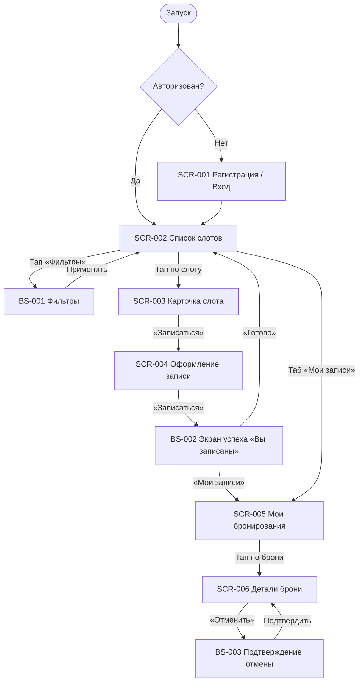

# Фича-лист мобильного приложения «Глина»

> **Этап 5.** Реестр экранов клиентского приложения и доступных на них функций.
> Связующий артефакт между [требованиями](../2-requirements/) и [дизайн-брифами](../3-design-brief/).

**Статус:** Черновик · **Версия:** 0.1 · **Дата:** 2026-07-04

---

## 1. Назначение

**«Глина»** — клиентское мобильное приложение гончарной мастерской для самостоятельной записи
на групповые мастер-классы. Заменяет ручную запись через Instagram Direct и ежедневник,
устраняя двойные брони и переполненные группы.

**Скоуп — только роль «Клиент».** Мастер и владелица (Марина) работают через существующую
инфраструктуру и в приложение **не входят**. Слоты, программы и мастера — **read-only** из API;
оплата — **офлайн** (наличные / перевод), приложение показывает цену и фиксирует запись.

**Источники:**
[Бриф](../0-customer-brief/brief-pottery.md) ·
[Описание домена](../1-elicitation/domain-description.md) ·
[Бизнес-требования](../2-requirements/business-requirements.md) ·
[Функциональные требования](../2-requirements/functional-requirements.md) ·
[Нефункциональные требования](../2-requirements/non-functional-requirements.md) ·
[Use cases](../2-requirements/use-cases.md) ·
[User stories](../2-requirements/user-stories.md) ·
[API (OpenAPI)](../api/redocly.yaml)

---

## 2. Глоссарий

| Термин | Значение |
|--------|----------|
| **Мастер-класс / Слот** | Запланированное групповое занятие: дата/время старта, программа, мастер, всего/свободно мест, цена. |
| **Программа** | Вид занятия: новичковая лепка (потолок **6** мест) или работа на гончарном круге (до **10** кругов). |
| **Прокат** | Выдача инструментов и фартука мастерской клиенту без своего комплекта. |
| **Своё** | Клиент приходит со своими инструментами и фартуком; занимает место в группе. |
| **Запись (бронь)** | Резерв мест на слот: число мест, вариант «своё/прокат», статус. |
| **Отмена клиентом** | Доступна, если до старта **> 10 минут** → место освобождается. При **≤ 10 минут** — заблокирована (EC-10). |
| **Оценка мастера** | 1–5 звёзд после завершённого занятия; повтор запрещён (FR-21). |
| **Лояльность** | Статус / уровень постоянного клиента (FR-22). |
| **Отменено мастерской** | Занятие отменено организатором (форс-мажор); бронь сохраняется со статусом и причиной. |

> **Принцип абстракции.** Лимиты мест и прокатного фонда не хардкодятся в UI — приходят из
> данных слота и программы (`max_seats_per_booking`, `free_seats`, `free_rental_boards`).

---

## 3. Карта навигации

---

## 4. Реестр экранов

| ID | Экран / Шторка | Тип | Назначение | Зона | Приоритет | Требования | Дизайн-бриф |
|----|----------------|-----|------------|------|-----------|------------|-------------|
| **SCR-001** | Регистрация / Вход | Экран | Вход по имени и телефону | НЗ | Critical | FR-1 / US-1 | [SCR-001-registration.md](../3-design-brief/SCR-001-registration.md) |
| **SCR-002** | Список слотов | Экран | Каталог мастер-классов, точка входа в запись | АЗ | Critical | FR-2–FR-4 / UC-3, US-2, US-3 | [SCR-002-slot-list.md](../3-design-brief/SCR-002-slot-list.md) |
| **BS-001** | Фильтры | Bottom Sheet | Фильтрация списка слотов | АЗ | High | FR-4 / US-3 | [BS-001-filters.md](../3-design-brief/BS-001-filters.md) |
| **SCR-003** | Карточка слота | Экран | Полные параметры занятия перед записью | АЗ | Critical | FR-5 / US-4 | [SCR-003-slot-card.md](../3-design-brief/SCR-003-slot-card.md) |
| **SCR-004** | Оформление записи | Экран | Число мест, «своё/прокат», цена, подтверждение | АЗ | Critical | FR-6–FR-11, FR-18 / UC-1, US-5–8, US-11 | [SCR-004-booking.md](../3-design-brief/SCR-004-booking.md) |
| **BS-002** | Подтверждение записи | Экран | Успешная бронь «Вы записаны» | АЗ | High | FR-18 / US-5 | [BS-002-booking-success.md](../3-design-brief/BS-002-booking-success.md) |
| **SCR-005** | Мои бронирования | Экран | Список своих записей | АЗ | Critical | FR-12 / US-9 | [SCR-005-my-bookings.md](../3-design-brief/SCR-005-my-bookings.md) |
| **SCR-006** | Детали брони + отмена | Экран | Детали записи и запуск отмены | АЗ | Critical | FR-13–FR-16 / UC-2, US-10, US-12, US-13 | [SCR-006-booking-details.md](../3-design-brief/SCR-006-booking-details.md) |
| **BS-003** | Подтверждение отмены | Bottom Sheet | Подтверждение отмены | АЗ | High | FR-14 / US-08 | [BS-003-cancel-confirm.md](../3-design-brief/BS-003-cancel-confirm.md) |

> **Зоны:** НЗ — неавторизованная, АЗ — авторизованная.

---

## 5. Сквозные функции (не отдельные экраны)

| Функция | Требования | Описание |
|---------|------------|----------|
| Push при отмене мастерской | FR-19, NFR-9 | Уведомление при форс-мажоре; переход в SCR-006 по тапу |
| Напоминания о записи | FR-20, NFR-10 | Push **~за 2 часа** до занятия (Should, UC-06) |
| Оценка мастера | FR-21 | 1–5 звёзд в истории броней (UC-04) |
| Лояльность | FR-22 | Статус / уровень клиента |
| Паттерн состояний | NFR-1 | Loading → Content → Empty → Error на экранах с API |

---

## 6. Вне MVP (не в реестре)

| Функция | Причина |
|---------|---------|
| Экран профиля / редактирование аккаунта (кроме лояльности) | Не в скоупе домена (только регистрация/вход) |
| Карта маршрута | Не в домене гончарной мастерской |
| Публичный рейтинг мастеров | Не показывается другим клиентам в MVP |
| Онлайн-оплата | Описание домена → «Границы скоупа» |
| CRUD расписания, роли мастера/владельца | Существующая инфраструктура |

---

## 7. Трассировка требований → экраны

| Требование | Экран |
|------------|-------|
| FR-1 | SCR-001 |
| FR-2, FR-3, FR-4 | SCR-002, BS-001 |
| FR-5 | SCR-003 |
| FR-6–FR-11, FR-18 | SCR-004, BS-002 |
| FR-12 | SCR-005 |
| FR-13–FR-16, FR-17 | SCR-006, BS-003 |
| FR-19 | Push → SCR-006 |
| FR-20 | Push (сквозная) |
| UC-1 | SCR-002 → SCR-003 → SCR-004 → BS-002 |
| UC-2 | SCR-005 → SCR-006 → BS-003 |
| UC-3 | SCR-002 + BS-001 |
| UC-4 | Push → SCR-006 |
